# GitHub Workflow Execution Trace

## EVENT: Push to main branch (excluding pkg/istorage)

**Voedger Workflow:** [`ci-pkg-cmd.yml`](ci-pkg-cmd.yml#L3-L9)

- Triggered on: `push` to `main` branch, paths-ignore: `pkg/istorage/**`
- Condition: `github.repository == 'voedger/voedger'` (avoids run on commit to main of a fork)

- [Step 1: Call CI Reuse Go Workflow](ci-pkg-cmd.yml#L11-L25): Calls `untillpro/ci-action/.github/workflows/ci_reuse_go.yml@main` with `test_folder: pkg`, `short_test: true`, `go_race: false`, `ignore_build: true`, `test_subfolders: true` → See [ci_reuse_go.yml details](#ci_reuse_goyml-full-test-suite)

- [Step 2: Build & Push Docker](ci-pkg-cmd.yml#L43-L51): Calls `voedger/voedger/.github/workflows/cd-voedger.yml@main` (condition: `github.repository == 'voedger/voedger'`)

---

## EVENT: Pull Request (excluding pkg/istorage)

**Voedger Workflow:** [`ci-pkg-cmd_pr.yml`](ci-pkg-cmd_pr.yml#L3-L6)

- Triggered on: `pull_request_target`, paths-ignore: `pkg/istorage/**`
- Condition: `github.repository == 'voedger/voedger'`

- [Step 1: Call CI Reuse Go PR Workflow](ci-pkg-cmd_pr.yml#L9-L24): Calls `untillpro/ci-action/.github/workflows/ci_reuse_go_pr.yml@main` with `test_folder: pkg`, `short_test: true`, `go_race: false`, `ignore_build: true`, `test_subfolders: true` → See [ci_reuse_go_pr.yml details](#ci_reuse_go_pryml-pr-test-suite)

- [Step 2: Auto-merge PR](ci-pkg-cmd_pr.yml#L25-L29): Calls `./.github/workflows/merge.yml`
  - [Merge PR](merge.yml#L15-L22): Run [domergepr.sh](#domergeprsh---auto-merge-script) script from ci-action with PR number and branch name

---

## EVENT: Pull Request to .github/workflows

**Voedger Workflow:** [`ci-wf_pr.yml`](ci-wf_pr.yml#L3-L6)

- Triggered on: `pull_request_target`, paths: `.github/workflows/**`

- [Step 1: Auto-merge PR](ci-wf_pr.yml#L9-L12): Calls `voedger/voedger/.github/workflows/merge.yml@main`
  - [Merge PR](merge.yml#L15-L22): Run [domergepr.sh](#domergeprsh---auto-merge-script) script from ci-action with PR number and branch name

---

## EVENT: Daily test suite (scheduled or manual)

**Voedger Workflow:** [`ci-full.yml`](ci-full.yml#L3-L6)

- Triggered on: `workflow_dispatch` or `schedule: cron "0 5 * * *"` (daily at 5 AM UTC)
- Condition: `github.repository == 'voedger/voedger'`

- [Step 1: Call CI Reuse Go Workflow](ci-full.yml#L9-L21): Calls `untillpro/ci-action/.github/workflows/ci_reuse_go.yml@main` with `go_race: true`, `short_test: false`, `ignore_build: true`, `test_subfolders: true` → See [ci_reuse_go.yml details](#ci_reuse_goyml-full-test-suite)

- [Step 2: Notify Failure (if failed)](ci-full.yml#L23-L32): Condition `failure()` - Sets output `failure_url` with workflow run URL

- [Step 3: Create Issue (if failed)](ci-full.yml#L34-L45): Condition `failure()` - Calls `untillpro/ci-action/.github/workflows/create_issue.yml@main` to create issue "Daily Test failed on" with label "prty/blocker"

- [Step 4: Build & Push Docker](ci-full.yml#L50-L58): Calls `voedger/voedger/.github/workflows/cd-voedger.yml@main`
  - [Checkout](cd-voedger.yml#L21-L22): Checkout code
  - [Set up Go](cd-voedger.yml#L24-L28): Go stable version, cache disabled
  - [Build executable](cd-voedger.yml#L30-L38): Configure git for private repos (untillpro, voedger), `go build -o ./cmd/voedger ./cmd/voedger`
  - [Log in to Docker Hub](cd-voedger.yml#L40-L44): Authenticate with Docker Hub credentials
  - [Build and push Docker image](cd-voedger.yml#L46-L52): Build from `./cmd/voedger/Dockerfile`, push as `voedger/voedger:0.0.1-alpha`

---

## EVENT: Issue opened with title starting with cprc or cprelease

**Voedger Workflow:** [`cp.yml`](cp.yml#L3-L5)

- Triggered on: `issues` type `opened`
- Condition: Issue title starts with `cprc` or `cprelease`

- [Step 1: Cherry Pick Commits](cp.yml#L8-L25): Calls `untillpro/ci-action/.github/workflows/cp.yml@main` with `org: voedger`, `repo: voedger`, `team: DevOps_cp`, `user`, `issue`, `issue-title`, `issue-body`

### **Cherry Pick Workflow Substeps**

**CI-Action Workflow:** `untillpro/ci-action/.github/workflows/cp.yml@main`

- [Checkout code](https://github.com/untillpro/ci-action/blob/main/.github/workflows/cp.yml#L36-L40): Checkout main branch with full history for cherry-picking
- [Add comment to issue](https://github.com/untillpro/ci-action/blob/main/.github/workflows/cp.yml#L42-L50): call [add-issue-commit.sh](https://github.com/untillpro/ci-action/blob/main/scripts/add-issue-commit.sh)
  - Validate required environment variables: `repo`, `org`, `issue`, `body`
  - Exit with error if any variable is missing
  - Construct GitHub repository URL: `https://github.com/$org/$repo`
  - Post comment to issue using `gh issue comment` with workflow run URL as body
- [Check Issue](https://github.com/untillpro/ci-action/blob/main/.github/workflows/cp.yml#L52-L85): Verify user permissions
  - Check if user is member of organization `voedger`
  - Check if user is member of team `DevOps_cp`
  - Exit with error if either check fails
- [Determine target branch](https://github.com/untillpro/ci-action/blob/main/.github/workflows/cp.yml#L87-L101): Parse issue title
  - If title starts with `cprc` → target branch is `rc`
  - If title starts with `cprelease` → target branch is `release`
- [Verify branch exists](https://github.com/untillpro/ci-action/blob/main/.github/workflows/cp.yml#L103-L113): Check if target branch exists in remote
- [Install jq](https://github.com/untillpro/ci-action/blob/main/.github/workflows/cp.yml#L115-L116): Install JSON processing tool
- [Parse issue description](https://github.com/untillpro/ci-action/blob/main/.github/workflows/cp.yml#L118-L136): Extract commit SHAs from issue body
  - Clean up formatting (remove dots, commas, extra spaces)
  - Build list of commits to cherry-pick
- [Cherry pick commits](https://github.com/untillpro/ci-action/blob/main/.github/workflows/cp.yml#L138-L149): Apply commits to target branch
  - Configure git user as `upload-robot`
  - Setup git token authentication
  - Run `cp.sh` script to perform cherry-pick
- [Close issue](https://github.com/untillpro/ci-action/blob/main/.github/workflows/cp.yml#L151-L168): Auto-close issue
  - Exception: Do NOT close if title is `cprelease` AND repo is `airs-bp3`
  - call [close-issue.sh](https://github.com/untillpro/ci-action/blob/main/scripts/close-issue.sh)
    - Validate required environment variables: `repo`, `org`, `issue`
    - Exit with error if any variable is missing
    - Construct GitHub repository URL: `https://github.com/$org/$repo`
    - Close issue using `gh issue close` command

**On Failure:**
- [Add comment to issue](https://github.com/untillpro/ci-action/blob/main/.github/workflows/cp.yml#L175-L185): call [add-issue-commit.sh](https://github.com/untillpro/ci-action/blob/main/scripts/add-issue-commit.sh)
  - Validate required environment variables: `repo`, `org`, `issue`, `body`
  - Exit with error if any variable is missing
  - Construct GitHub repository URL: `https://github.com/$org/$repo`
  - Post error comment to issue using `gh issue comment` with error message as body

---

## EVENT: Pull Request to pkg/istorage (storage paths)

**Voedger Workflow:** [`ci-pkg-storage.yml`](ci-pkg-storage.yml#L3-L15)

- Triggered on: `pull_request_target` or `push` to paths: `pkg/istorage/**`, `pkg/vvm/storage/**`, `pkg/elections/**`

- [Step 1: Determine Changes](ci-pkg-storage.yml#L19-L80): Analyze which storage backend files changed
  - For PR: Get changed files from PR API
  - For Push: Compare with previous commit
  - Outputs: `cas_changed`, `amazon_changed`, `others_changed`, `ttlstorage_changed`, `elections_changed`

- [Step 2: Trigger Cassandra Tests (if CAS/TTL/Elections changed)](ci-pkg-storage.yml#L145-L162): Calls `./.github/workflows/ci_cas.yml`
  - Condition: CAS or TTL Storage or Elections files changed AND Amazon files NOT changed
  - See [Cassandra Tests](#event-cassandra-tests) below

- [Step 3: Trigger Amazon Tests (if Amazon/TTL/Elections changed)](ci-pkg-storage.yml#L164-L181): Calls `./.github/workflows/ci_amazon.yml`
  - Condition: Amazon or TTL Storage or Elections files changed AND CAS files NOT changed
  - See [Amazon Tests](#event-amazon-tests) below

- [Step 4: Auto-merge PR](ci-pkg-storage.yml#L183-L195): Calls `./.github/workflows/merge.yml`
  - Condition: Both test jobs succeeded or skipped
  - Runs [domergepr.sh](#domergeprsh---auto-merge-script) script from ci-action

---

## EVENT: Cassandra Tests

**Voedger Workflow:** [`ci_cas.yml`](ci_cas.yml#L1-L8)

- Triggered by: `ci-pkg-storage.yml` when Cassandra/TTL Storage/Elections files change
- [Service: ScyllaDB (Cassandra-compatible) on port 9042](ci_cas.yml#L17-L21)

- [Step 1: Checkout Repository](ci_cas.yml#L24-L25): Checkout code

- [Step 2: Set up Go](ci_cas.yml#L27-L31): Go stable version, cache disabled

- [Step 3: Cache Go Modules](ci_cas.yml#L33-L39): Cache `~/go/pkg/mod` based on `go.sum`

- [Step 4: Run Cassandra Implementation Tests](ci_cas.yml#L41-L45):
  - Working directory: `pkg/istorage/cas`
  - Command: `go test ./... -v -race`
  - Environment: `CASSANDRA_TESTS_ENABLED=true`

- [Step 5: Run Cassandra TTLStorage and Elections Tests](ci_cas.yml#L47-L51):
  - Working directory: `pkg/vvm/storage`
  - Command: `go test ./... -v -race`
  - Environment: `CASSANDRA_TESTS_ENABLED=true`

- [Step 6: Set Failure URL (if failed)](ci_cas.yml#L54-L57): Capture workflow run URL for issue creation

- [Step 7: Create Issue (if failed)](ci_cas.yml#L59-L70): Calls `untillpro/ci-action/.github/workflows/create_issue.yml@main`
  - Title: "Cassandra test failed on"
  - Assignee: `host6`
  - Label: `prty/blocker`

---

## EVENT: Amazon DynamoDB Tests

**Voedger Workflow:** [`ci_amazon.yml`](ci_amazon.yml#L1-L7)

- Triggered by: `ci-pkg-storage.yml` when Amazon/TTL Storage/Elections files change
- Service: Amazon DynamoDB Local on port 8000

- [Step 1: Checkout Repository](ci_amazon.yml#L35-L36): Checkout code

- [Step 2: Set up Go](ci_amazon.yml#L38-L41): Go stable version

- [Step 3: Run Amazon DynamoDB Implementation Tests](ci_amazon.yml#L43-L51):
  - Working directory: `pkg/istorage/amazondb`
  - Command: `go test ./... -v -race`
  - Environment: `DYNAMODB_TESTS_ENABLED=true`, `DYNAMODB_ENDPOINT=http://localhost:8000`

- [Step 4: Run Amazon DynamoDB TTLStorage and Elections Tests](ci_amazon.yml#L53-L61):
  - Working directory: `pkg/vvm/storage`
  - Command: `go test ./... -v -race`
  - Environment: `DYNAMODB_TESTS_ENABLED=true`, `DYNAMODB_ENDPOINT=http://localhost:8000`

- [Step 5: Set Failure URL (if failed)](ci_amazon.yml#L63-L66): Capture workflow run URL for issue creation

- [Step 6: Create Issue (if failed)](ci_amazon.yml#L68-L79): Calls `untillpro/ci-action/.github/workflows/create_issue.yml@main`
  - Title: "Amazon DynamoDB test failed on"
  - Assignee: `host6`
  - Label: `prty/blocker`

---

## EVENT: Issue closed

**Voedger Workflow:** [`linkIssue.yml`](linkIssue.yml#L1-L5)

- Triggered on: `issues` type `closed`

- [Step 1: Link issue to milestone](linkIssue.yml#L12-L17): call [linkmilestone.sh](https://github.com/untillpro/ci-action/blob/main/scripts/linkmilestone.sh)
  - Fetch list of open milestones from repository using GitHub API
  - Check milestone count
  - If exactly 1 milestone exists: link issue to that milestone
  - If 0 milestones: reopen issue and exit with error "No open milestones found"
  - If more than 1 milestone: reopen issue and exit with error "More than one open milestone found"

---

## EVENT: Issue reopened

**Voedger Workflow:** [`unlinkIssue.yml`](unlinkIssue.yml#L1-L5)

- Triggered on: `issues` type `reopened`

- [Step 1: Unlink issue from milestone](unlinkIssue.yml#L12-L17): call [unlinkmilestone.sh](https://github.com/untillpro/ci-action/blob/main/scripts/unlinkmilestone.sh)
  - Clear milestone from issue by setting it to empty string
  - Remove any milestone association from the reopened issue

---

## domergepr.sh - Auto-Merge Script

**Location:** `untillpro/ci-action/scripts/domergepr.sh`

**Purpose:** Automatically merges pull requests that meet specific criteria

### Merge Conditions

The script performs the following checks before merging:

1. [Verify PR Author](merge.yml#L15-L22): Get PR author login
   - Retrieves author information from GitHub API

2. [Check Team Membership](merge.yml#L15-L22): Verify author is in developers team
   - Queries GitHub API for organization teams
   - Checks if author is member of `devs` or `developers` team
   - Exits if author is not from developers team

3. [Check Line Count](merge.yml#L15-L22): Validate PR size
   - Counts additions and deletions
   - Rejects if total changes exceed 200 lines
   - Exits if PR is too large

4. [Update PR Body](merge.yml#L15-L22): Process issue references
   - If PR body contains "Resolves #", appends PR number to reference
   - Converts "Resolves #" to "#" format for proper linking

5. [Merge PR](merge.yml#L15-L22): Perform squash merge
   - Uses `gh pr merge` with `--squash` flag
   - Automatically deletes branch after merge (`--delete-branch`)
   - Uses updated body if issue references were found

### Merge Rejection Reasons

- Author is not member of developers team
- PR changes exceed 200 lines
- Any other validation failure

---

## CI-ACTION Reusable Workflows

When ci-action workflows are called, they execute the following:

### **ci_reuse_go.yml (Full test suite)**

**CI-Action Workflow:** `untillpro/ci-action/.github/workflows/ci_reuse_go.yml@main`

- [Checkout](https://github.com/untillpro/ci-action/blob/main/.github/workflows/ci_reuse_go.yml#L42-L43): Checkout code
- [Set up Go](https://github.com/untillpro/ci-action/blob/main/.github/workflows/ci_reuse_go.yml#L45-L49): Go version 1.24, cache disabled
- [Install TinyGo](https://github.com/untillpro/ci-action/blob/main/.github/workflows/ci_reuse_go.yml#L52-L55): Download and install TinyGo v0.37.0
- [Check PR file size](https://github.com/untillpro/ci-action/blob/main/.github/workflows/ci_reuse_go.yml#L57-L62): If pull_request event, run `checkPR.sh`
- [Cache Go Modules](https://github.com/untillpro/ci-action/blob/main/.github/workflows/ci_reuse_go.yml#L64-L70): Cache `~/go/pkg/mod` based on `go.sum`
- [CI: Run ci-action with parameters](https://github.com/untillpro/ci-action/blob/main/.github/workflows/ci_reuse_go.yml#L72-L83) → See [Phase 1-4 substeps below](#phase-1-initialization--context)
- [Test subfolders](https://github.com/untillpro/ci-action/blob/main/.github/workflows/ci_reuse_go.yml#L85-L92): If `test_subfolders == 'true'`, run `test_subfolders.sh` or `test_subfolders_full.sh` based on `short_test`
- [Check copyright](https://github.com/untillpro/ci-action/blob/main/.github/workflows/ci_reuse_go.yml#L94-L95): Run `check_copyright.sh`
- [Linters](https://github.com/untillpro/ci-action/blob/main/.github/workflows/ci_reuse_go.yml#L97-L100): Run `gbash.sh` for linting

---

### **ci_reuse_go_pr.yml (PR test suite)**

**CI-Action Workflow:** `untillpro/ci-action/.github/workflows/ci_reuse_go_pr.yml@main`

- [Set up Go](https://github.com/untillpro/ci-action/blob/main/.github/workflows/ci_reuse_go_pr.yml#L42-L46): Go version 1.24, cache disabled
- [Install TinyGo](https://github.com/untillpro/ci-action/blob/main/.github/workflows/ci_reuse_go_pr.yml#L49-L52): Download and install TinyGo v0.37.0
- [Checkout](https://github.com/untillpro/ci-action/blob/main/.github/workflows/ci_reuse_go_pr.yml#L54-L58): Checkout PR head commit with full history
- [Check PR file size](https://github.com/untillpro/ci-action/blob/main/.github/workflows/ci_reuse_go_pr.yml#L60-L64): Run `checkPR.sh` to validate PR file size
- [Cancel other workflows](https://github.com/untillpro/ci-action/blob/main/.github/workflows/ci_reuse_go_pr.yml#L66-L72): Run `cancelworkflow.sh` to cancel other running workflows on same branch
- [Cache Go Modules](https://github.com/untillpro/ci-action/blob/main/.github/workflows/ci_reuse_go_pr.yml#L74-L80): Cache `~/go/pkg/mod` based on `go.sum`
- [CI: Run ci-action with parameters](https://github.com/untillpro/ci-action/blob/main/.github/workflows/ci_reuse_go_pr.yml#L82-L93) → See [Phase 1-4 substeps below](#phase-1-initialization--context)
- [Test subfolders](https://github.com/untillpro/ci-action/blob/main/.github/workflows/ci_reuse_go_pr.yml#L95-L98): If `test_subfolders == 'true'`, run `test_subfolders.sh`
- [Check copyright](https://github.com/untillpro/ci-action/blob/main/.github/workflows/ci_reuse_go_pr.yml#L100-L101): Run `check_copyright.sh`
- [Linters](https://github.com/untillpro/ci-action/blob/main/.github/workflows/ci_reuse_go_pr.yml#L103-L106): Run `gbash.sh` for linting

---

## CI-ACTION JavaScript Execution Details

When ci-action workflows execute, they run the following JavaScript logic:

### [Phase 1: Initialization & Context](https://github.com/untillpro/ci-action/blob/main/index.js#L15-L69)

- [**Parse Inputs**](https://github.com/untillpro/ci-action/blob/main/index.js#L15-L37): Extract all configuration parameters
- [**Print Context**](https://github.com/untillpro/ci-action/blob/main/index.js#L57-L69): Log repository, organization, actor, event info

### [Phase 2: Source Code Validation](https://github.com/untillpro/ci-action/blob/main/index.js#L71-L76)

- [**Reject Hidden Folders**](https://github.com/untillpro/ci-action/blob/main/index.js#L72): Validates no unexpected hidden folders (except `.git`, `.github`, `.husky`, `.augment`)
- [**Check Source Files**](https://github.com/untillpro/ci-action/blob/main/index.js#L76): Validates all source files have Copyright in first comment (unless ignored), no LICENSE word if file missing, skips "DO NOT EDIT" files

### [Phase 3: Language Detection & Build](https://github.com/untillpro/ci-action/blob/main/index.js#L78-L147)

- [**Detect Language**](https://github.com/untillpro/ci-action/blob/main/index.js#L78): Checks for `go.mod` → Go project, scans for `.go` files → Go, scans for `.js`/`.ts` → Node.js

#### [IF Go Project](https://github.com/untillpro/ci-action/blob/main/index.js#L79-L147)

- [**Setup Go Environment**](https://github.com/untillpro/ci-action/blob/main/index.js#L88-L93): Configure GOPRIVATE and git credentials for private repositories
- [**go mod tidy**](https://github.com/untillpro/ci-action/blob/main/index.js#L99-L101): If `run-mod-tidy !== "false"`
- [**Build**](https://github.com/untillpro/ci-action/blob/main/index.js#L103-L105): `go build ./...` if `ignore-build !== "true"`
- [**Custom Build Command**](https://github.com/untillpro/ci-action/blob/main/index.js#L142-L144): Execute if provided

#### [IF Node.js Project](https://github.com/untillpro/ci-action/blob/main/index.js#L149-L170)

- [**npm install**](https://github.com/untillpro/ci-action/blob/main/index.js#L155)
- [**npm run build**](https://github.com/untillpro/ci-action/blob/main/index.js#L156)
- [**npm test**](https://github.com/untillpro/ci-action/blob/main/index.js#L157)

### [Phase 4: Publish Release](https://github.com/untillpro/ci-action/blob/main/index.js#L174-L186)

**Condition:** `branchName === mainBranch && publishAsset`

- [**Validate Asset & deployer.url**](https://github.com/untillpro/ci-action/blob/main/publish.js#L53-L57)
- [**Generate Version**](https://github.com/untillpro/ci-action/blob/main/publish.js#L59): Format `yyyyMMdd.HHmmss.SSS` (UTC timestamp)
- [**Prepare Zip**](https://github.com/untillpro/ci-action/blob/main/publish.js#L60): Create zip if directory or not .zip
- [**Create Release & Tag**](https://github.com/untillpro/ci-action/blob/main/publish.js#L64-L70): GitHub API call with version tag
- [**Upload Asset**](https://github.com/untillpro/ci-action/blob/main/publish.js#L85-L90): Upload zipped asset as `${repositoryName}.zip`
- [**Upload deploy.txt**](https://github.com/untillpro/ci-action/blob/main/publish.js#L104-L109): Combine asset URL + deployer.url content
- [**Delete Old Releases**](https://github.com/untillpro/ci-action/blob/main/publish.js#L121-L139): Keep only `publishKeep` releases matching pattern `^\d{8}\.\d{6}\.\d{3}$`
- [**Set Outputs**](https://github.com/untillpro/ci-action/blob/main/index.js#L184-L186): `release_id`, `release_name`, `release_html_url`, `release_upload_url`, `asset_browser_download_url`

---

## External Scripts

Called from `https://raw.githubusercontent.com/untillpro/ci-action/main/scripts/`:

- `add-issue-commit.sh` - Add comment to GitHub issue
- `cp.sh` - Cherry pick commits to target branch
- `close-issue.sh` - Close GitHub issue
- `rc.sh` - Create release candidate branch
- `createissue.sh` - Create new GitHub issue
- `domergepr.sh` - Auto-merge pull request

# GitHub Workflow Execution and Data Flow Diagrams

## 1. Overall Workflow Execution and Data Flow

Shows all GitHub events and how they trigger different workflows with color-coded categories.

```mermaid
graph TD
    subgraph "GitHub Events"
        E1["📌 Push to main<br/>pkg-cmd changes"]
        E2["🔀 PR to pkg-cmd<br/>excluding pkg/istorage"]
        E3["🔀 PR to .github/workflows"]
        E4["⏰ Daily Schedule<br/>5 AM UTC"]
        E5["📋 Issue opened<br/>cprc/cprelease"]
        E6["🔀 PR to pkg/istorage<br/>storage paths"]
        E7["✅ Issue closed"]
        E8["🔄 Issue reopened"]
        E9["▶️ Manual trigger<br/>ctool-integration-test"]
    end

    subgraph "Voedger Workflows"
        W1["ci-pkg-cmd.yml"]
        W2["ci-pkg-cmd_pr.yml"]
        W3["ci-wf_pr.yml"]
        W4["ci-full.yml"]
        W5["cp.yml"]
        W6["ci-pkg-storage.yml"]
        W7["linkIssue.yml"]
        W8["unlinkIssue.yml"]
        W9["ctool-integration-test.yml"]
    end

    subgraph "CI-Action Reusable Workflows"
        CW1["ci_reuse_go.yml"]
        CW2["ci_reuse_go_pr.yml"]
        CW3["cp.yml"]
        CW4["ci_cas.yml"]
        CW5["ci_amazon.yml"]
        CW7["cd-voedger.yml"]
        CW8["merge.yml"]
        CW9["create_issue.yml"]
    end

    subgraph "Voedger Workflows - Storage Tests"
        ST1["ci_cas.yml"]
        ST2["ci_amazon.yml"]
    end

    subgraph "Data Flow & Outputs"
        D1["✓ Tests Pass"]
        D2["✗ Tests Fail"]
        D3["📊 Coverage Report"]
        D4["🐳 Docker Image"]
        D5["🔗 PR Auto-Merge"]
        D6["📝 Issue Comment"]
        D7["🏷️ Milestone Link"]
    end

    E1 --> W1
    E2 --> W2
    E3 --> W3
    E4 --> W4
    E5 --> W5
    E6 --> W6
    E7 --> W7
    E8 --> W8
    E9 --> W9

    W1 --> CW1
    W1 --> CW7
    W2 --> CW2
    W2 --> CW8
    W3 --> CW8
    W4 --> CW1
    W4 --> CW7
    W5 --> CW3
    W6 --> ST1
    W6 --> ST2
    W6 --> CW8
    W7 --> D7
    W8 --> D7

    CW1 --> D1
    CW1 --> D2
    CW1 --> D3
    CW2 --> D1
    CW2 --> D2
    CW2 --> D5
    CW7 --> D4
    CW8 --> D5
    CW3 --> D6
    ST1 --> D1
    ST1 --> D2
    ST2 --> D1
    ST2 --> D2

    D2 --> CW9

    style E1 fill:#e1f5ff
    style E2 fill:#e1f5ff
    style E3 fill:#e1f5ff
    style E4 fill:#fff3e0
    style E5 fill:#f3e5f5
    style E6 fill:#e8f5e9
    style E7 fill:#fce4ec
    style E8 fill:#fce4ec
    style E9 fill:#f1f8e9

    style W1 fill:#b3e5fc
    style W2 fill:#b3e5fc
    style W3 fill:#b3e5fc
    style W4 fill:#ffe0b2
    style W5 fill:#e1bee7
    style W6 fill:#c8e6c9
    style W7 fill:#f8bbd0
    style W8 fill:#f8bbd0
    style W9 fill:#dcedc8

    style CW1 fill:#81d4fa
    style CW2 fill:#81d4fa
    style CW3 fill:#ce93d8
    style CW4 fill:#a5d6a7
    style CW5 fill:#a5d6a7
    style CW7 fill:#ffcc80
    style CW8 fill:#81d4fa
    style CW9 fill:#ce93d8

    style D1 fill:#4caf50
    style D2 fill:#f44336
    style D3 fill:#2196f3
    style D4 fill:#ff9800
    style D5 fill:#9c27b0
    style D6 fill:#00bcd4
    style D7 fill:#673ab7
```

---

## 2. PR to pkg-cmd: Execution and Data Flow

Detailed step-by-step flow showing PR validation, testing, and auto-merge.

---

## 3. PR to pkg/istorage: Storage Tests Execution Flow

Shows conditional logic for storage backend tests (Cassandra and Amazon DynamoDB).

```mermaid
sequenceDiagram
    participant GitHub as GitHub Event
    participant WF as ci-pkg-storage.yml
    participant Detect as Determine Changes
    participant CAS as ci_cas.yml
    participant Amazon as ci_amazon.yml
    participant Merge as merge.yml
    participant Tests as Test Results

    GitHub->>WF: PR to pkg/istorage
    activate WF

    WF->>Detect: Analyze changed files
    activate Detect
    Detect->>Detect: Check CAS files
    Detect->>Detect: Check Amazon files
    Detect->>Detect: Check TTL Storage files
    Detect->>Detect: Check Elections files
    Detect-->>WF: Output: cas_changed,<br/>amazon_changed, etc.
    deactivate Detect

    alt CAS or TTL/Elections changed
        WF->>CAS: Trigger Cassandra Tests
        activate CAS
        CAS->>CAS: Start ScyllaDB service
        CAS->>Tests: Run Cassandra tests
        Tests-->>CAS: ✓ Pass or ✗ Fail
        CAS-->>WF: Test Results
        deactivate CAS
    end

    alt Amazon or TTL/Elections changed
        WF->>Amazon: Trigger Amazon Tests
        activate Amazon
        Amazon->>Amazon: Start DynamoDB Local
        Amazon->>Tests: Run Amazon tests
        Tests-->>Amazon: ✓ Pass or ✗ Fail
        Amazon-->>WF: Test Results
        deactivate Amazon
    end

    alt Both tests passed or skipped
        WF->>Merge: Call merge.yml
        activate Merge
        Merge->>Merge: Run domergepr.sh
        Merge-->>WF: ✓ PR Merged
        deactivate Merge
    else Tests failed
        WF->>WF: Create failure issue
    end

    WF-->>GitHub: ✓ Workflow Complete
    deactivate WF
```

---

## 4. Daily Test Suite: Execution and Data Flow

Shows the complete daily workflow with testing, vulnerability checks, and Docker build.

