# Voedger GitHub Workflows

## Workflows Overview

| Workflow | Trigger | Purpose |
|----------|---------|---------|
| `ci.yml` | Push to main (excl. pkg/istorage) | Run CI tests, build Docker image |
| `ci_pr.yml` | PR (excl. pkg/istorage) | Run CI tests, auto-merge |
| `ci-wf_pr.yml` | PR to .github/workflows | Auto-merge workflow changes |
| `ci-full.yml` | Daily 5 AM UTC / manual | Full test suite with race detector |
| `ci-pkg-storage.yml` | Push/PR to pkg/istorage paths | Run storage backend tests |
| `ci_cas.yml` | Called by ci-pkg-storage | Cassandra/ScyllaDB tests |
| `ci_amazon.yml` | Called by ci-pkg-storage | Amazon DynamoDB tests |
| `cp.yml` | Reusable workflow | Cherry pick commits |
| `linkIssue.yml` | Issue closed | Link issue to milestone |
| `unlinkIssue.yml` | Issue reopened | Unlink issue from milestone |
| `merge.yml` | Reusable workflow | Auto-merge PR |
| `cd-voedger.yml` | Reusable workflow | Build and push Docker image |
| `ctool-integration-test.yml` | Manual | Integration tests for ctool |

---

## CI-Action Workflows Used

Voedger calls these reusable workflows from [untillpro/ci-action](https://github.com/untillpro/ci-action):

### ci.yml

Main CI workflow for Go projects.

```yaml
uses: untillpro/ci-action/.github/workflows/ci.yml@main
with:
  short_test: "true"     # Run short tests only
  go_race: "false"       # Enable race detector
  install_tinygo: "true" # Install TinyGo
secrets:
  reporeading_token: ${{ secrets.REPOREADING_TOKEN }}
```

**What it does:**
1. Detects Go language
2. Checks hidden folders
3. Checks bash script headers
4. Checks copyright notices
5. Validates go.mod (no local replaces)
6. Runs tests
7. Runs linters (golangci-lint)
8. Runs vulnerability check (govulncheck)

### ci_pr.yml

PR-specific CI workflow with additional checks.

```yaml
uses: untillpro/ci-action/.github/workflows/ci_pr.yml@main
with:
  short_test: "true"
  running_workflow: "CI pkg-cmd PR"  # Cancel duplicates
  go_race: "false"
  install_tinygo: "true"
secrets:
  reporeading_token: ${{ secrets.REPOREADING_TOKEN }}
```

**Additional checks:**
- Cancel duplicate running workflows
- Check PR file size limits

### create_issue.yml

Create issues on test failure.

```yaml
uses: untillpro/ci-action/.github/workflows/create_issue.yml@main
with:
  repo: "voedger/voedger"
  assignee: "host6"
  name: "Daily Test failed on"
  body: ${{ needs.notify_failure.outputs.failure_url }}
  label: "prty/blocker"
secrets:
  personaltoken: ${{ secrets.PERSONAL_TOKEN }}
```

### checkout-and-setup-go (Composite Action)

Used by storage tests and CD workflow.

```yaml
uses: untillpro/ci-action/checkout-and-setup-go@main
```

Auto-detects Go version from go.work/go.mod.

---

## CI-Action Scripts Used

Scripts called from `https://raw.githubusercontent.com/untillpro/ci-action/main/scripts/`:

| Script | Used By | Purpose |
|--------|---------|---------|
| `domergepr.sh` | merge.yml | Auto-merge PR (check team, size, squash merge) |
| `add-issue-commit.sh` | cp.yml | Add comment to GitHub issue |
| `cp.sh` | cp.yml | Cherry pick commits to branch |
| `close-issue.sh` | cp.yml | Close GitHub issue |
| `linkmilestone.sh` | linkIssue.yml | Link issue to milestone |
| `unlinkmilestone.sh` | unlinkIssue.yml | Remove milestone from issue |

---

## Workflow Details

### Push to main (ci.yml)

1. Calls `untillpro/ci-action/.github/workflows/ci.yml@main`
   - short_test: true, go_race: false, install_tinygo: true
2. Calls `cd-voedger.yml` to build Docker image

### PR (ci_pr.yml)

1. Calls `untillpro/ci-action/.github/workflows/ci_pr.yml@main`
2. Calls `merge.yml` for auto-merge

### Daily Tests (ci-full.yml)

1. Calls `untillpro/ci-action/.github/workflows/ci.yml@main`
   - go_race: true, short_test: false (full tests)
2. On failure: Creates issue via `create_issue.yml`
3. Calls `cd-voedger.yml` to build Docker image

### Storage Tests (ci-pkg-storage.yml)

1. Determines which files changed (CAS, Amazon, TTL, Elections)
2. Triggers `ci_cas.yml` or `ci_amazon.yml` based on changes
3. Auto-merges via `merge.yml` if tests pass

### Auto-Merge (merge.yml)

Runs `domergepr.sh` which:
- Verifies PR author is in developers team
- Checks PR size (< 200 lines)
- Processes "Resolves #" references
- Squash merges with branch deletion

---

## Cassandra Tests (ci_cas.yml)

- Triggered by: `ci-pkg-storage.yml` when Cassandra/TTL Storage/Elections files change
- Service: ScyllaDB (Cassandra-compatible) on port 9042
- Runs tests in `pkg/istorage/cas` and `pkg/vvm/storage`
- On failure: Creates issue via `create_issue.yml`

## Amazon DynamoDB Tests (ci_amazon.yml)

- Triggered by: `ci-pkg-storage.yml` when Amazon/TTL Storage/Elections files change
- Service: Amazon DynamoDB Local on port 8000
- Runs tests in `pkg/istorage/amazondb` and `pkg/vvm/storage`
- On failure: Creates issue via `create_issue.yml`

## Issue Milestone Workflows

### linkIssue.yml (Issue closed)

Links closed issue to milestone using `linkmilestone.sh`.

### unlinkIssue.yml (Issue reopened)

Unlinks issue from milestone using `unlinkmilestone.sh`.

---

# Workflow Diagrams

## 1. Overall Workflow Execution and Data Flow

Shows all GitHub events and how they trigger different workflows with color-coded categories.

```mermaid
graph TD
    subgraph "GitHub Events"
        E1["📌 Push to main<br/>pkg-cmd changes"]
        E2["🔀 PR to pkg-cmd<br/>excluding pkg/istorage"]
        E3["🔀 PR to .github/workflows"]
        E4["⏰ Daily Schedule<br/>5 AM UTC"]
        E5["📋 Issue opened<br/>cprc/cprelease"]
        E6["🔀 PR to pkg/istorage<br/>storage paths"]
        E7["✅ Issue closed"]
        E8["🔄 Issue reopened"]
        E9["▶️ Manual trigger<br/>ctool-integration-test"]
    end

    subgraph "Voedger Workflows"
        W1["ci.yml"]
        W2["ci_pr.yml"]
        W3["ci-wf_pr.yml"]
        W4["ci-full.yml"]
        W5["cp.yml"]
        W6["ci-pkg-storage.yml"]
        W7["linkIssue.yml"]
        W8["unlinkIssue.yml"]
        W9["ctool-integration-test.yml"]
    end

    subgraph "CI-Action Reusable Workflows"
        CW1["ci.yml"]
        CW2["ci_pr.yml"]
        CW3["cp.yml"]
        CW7["cd-voedger.yml (local)"]
        CW8["merge.yml (local)"]
        CW9["create_issue.yml"]
    end

    subgraph "Voedger Workflows - Storage Tests"
        ST1["ci_cas.yml"]
        ST2["ci_amazon.yml"]
    end

    subgraph "Data Flow & Outputs"
        D1["✓ Tests Pass"]
        D2["✗ Tests Fail"]
        D3["📊 Coverage Report"]
        D4["🐳 Docker Image"]
        D5["🔗 PR Auto-Merge"]
        D6["📝 Issue Comment"]
        D7["🏷️ Milestone Link"]
    end

    E1 --> W1
    E2 --> W2
    E3 --> W3
    E4 --> W4
    E5 --> W5
    E6 --> W6
    E7 --> W7
    E8 --> W8
    E9 --> W9

    W1 --> CW1
    W1 --> CW7
    W2 --> CW2
    W2 --> CW8
    W3 --> CW8
    W4 --> CW1
    W4 --> CW7
    W5 --> CW3
    W6 --> ST1
    W6 --> ST2
    W6 --> CW8
    W7 --> D7
    W8 --> D7

    CW1 --> D1
    CW1 --> D2
    CW1 --> D3
    CW2 --> D1
    CW2 --> D2
    CW2 --> D5
    CW7 --> D4
    CW8 --> D5
    CW3 --> D6
    ST1 --> D1
    ST1 --> D2
    ST2 --> D1
    ST2 --> D2

    D2 --> CW9

    style E1 fill:#e1f5ff
    style E2 fill:#e1f5ff
    style E3 fill:#e1f5ff
    style E4 fill:#fff3e0
    style E5 fill:#f3e5f5
    style E6 fill:#e8f5e9
    style E7 fill:#fce4ec
    style E8 fill:#fce4ec
    style E9 fill:#f1f8e9

    style W1 fill:#b3e5fc
    style W2 fill:#b3e5fc
    style W3 fill:#b3e5fc
    style W4 fill:#ffe0b2
    style W5 fill:#e1bee7
    style W6 fill:#c8e6c9
    style W7 fill:#f8bbd0
    style W8 fill:#f8bbd0
    style W9 fill:#dcedc8

    style CW1 fill:#81d4fa
    style CW2 fill:#81d4fa
    style CW3 fill:#ce93d8
    style CW7 fill:#ffcc80
    style CW8 fill:#81d4fa
    style CW9 fill:#ce93d8

    style D1 fill:#4caf50
    style D2 fill:#f44336
    style D3 fill:#2196f3
    style D4 fill:#ff9800
    style D5 fill:#9c27b0
    style D6 fill:#00bcd4
    style D7 fill:#673ab7
```



---

## 2. PR to pkg-cmd: Execution and Data Flow

Detailed step-by-step flow showing PR validation, testing, and auto-merge.


---

## 3. PR to pkg/istorage: Storage Tests Execution Flow

Shows conditional logic for storage backend tests (Cassandra and Amazon DynamoDB).

```mermaid
sequenceDiagram
    participant GitHub as GitHub Event
    participant WF as ci-pkg-storage.yml
    participant Detect as Determine Changes
    participant CAS as ci_cas.yml
    participant Amazon as ci_amazon.yml
    participant Merge as merge.yml
    participant Tests as Test Results

    GitHub->>WF: PR to pkg/istorage
    activate WF

    WF->>Detect: Analyze changed files
    activate Detect
    Detect->>Detect: Check CAS files
    Detect->>Detect: Check Amazon files
    Detect->>Detect: Check TTL Storage files
    Detect->>Detect: Check Elections files
    Detect-->>WF: Output: cas_changed,<br/>amazon_changed, etc.
    deactivate Detect

    alt CAS or TTL/Elections changed
        WF->>CAS: Trigger Cassandra Tests
        activate CAS
        CAS->>CAS: Start ScyllaDB service
        CAS->>Tests: Run Cassandra tests
        Tests-->>CAS: ✓ Pass or ✗ Fail
        CAS-->>WF: Test Results
        deactivate CAS
    end

    alt Amazon or TTL/Elections changed
        WF->>Amazon: Trigger Amazon Tests
        activate Amazon
        Amazon->>Amazon: Start DynamoDB Local
        Amazon->>Tests: Run Amazon tests
        Tests-->>Amazon: ✓ Pass or ✗ Fail
        Amazon-->>WF: Test Results
        deactivate Amazon
    end

    alt Both tests passed or skipped
        WF->>Merge: Call merge.yml
        activate Merge
        Merge->>Merge: Run domergepr.sh
        Merge-->>WF: ✓ PR Merged
        deactivate Merge
    else Tests failed
        WF->>WF: Create failure issue
    end

    WF-->>GitHub: ✓ Workflow Complete
    deactivate WF
```



---

## 4. Daily Test Suite: Execution and Data Flow

Shows the complete daily workflow with testing, vulnerability checks, and Docker build.


