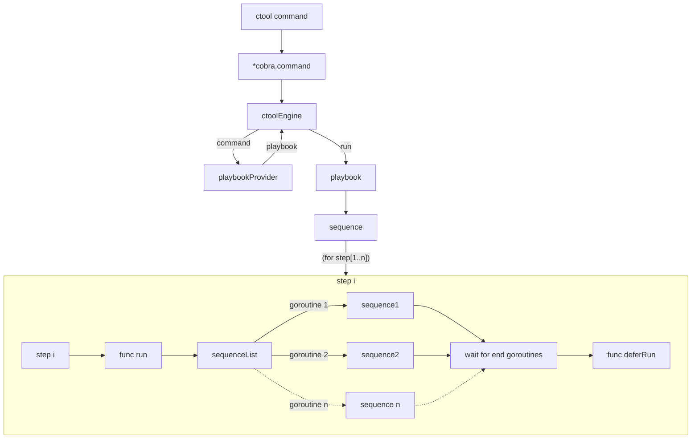
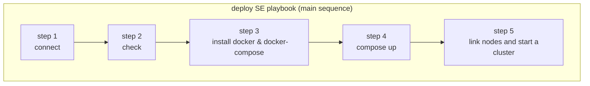
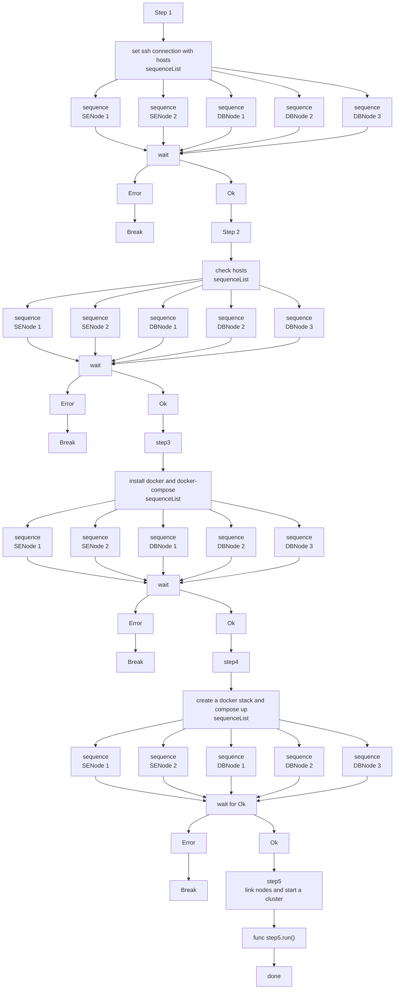

# Быстрый старт

**Развернуть кластер [Heeus Community Edition (CE)](https://github.com/heeus/heeus-design#community-edition-ce)
на удаленном хосте 5.255.255.55**:

    $ ctool deploy CE root ./root.key 5.255.255.55

**Развернуть кластер [Heeus Community Edition (CE)](https://github.com/heeus/heeus-design#community-edition-ce) на
локальном хосте**:

    $ ctool deploy CE

**Развернуть кластер [Heeus Standart Edition (SE)](https://github.com/heeus/heeus-design#standart-edition-se)
на пяти удаленных хостах (5.255.255.56, 5.255.255.57, 5.255.
255.58, 5.255.
255.58, 5.255.255.58) и расположением БД в трех дата центрах (dc1, dc2, dc3):**

    $ ctool deploy SE user ./root.key 5.255.255.56 5.255.255.57 dc1:5.255.255.58 dc2:5.255.255.59 dc3:5.255.255.60

**Переместить узел кластера Heeus с хоста 5.255.255.56 на хост 5.255.255.60:**

    $ ctool relocate user> ./root.key 5.255.255.56 5.255.255.60

То же самое, но с указанием дата центра:

    $ ctool relocate user> ./root.key dc1:5.255.255.56 dc1:5.255.255.60

# Общая информация

Утилита **Ctool** прозволяет развертывать и в дальнейшем изменять конфигурацию кластера **Heeus** двух типов:

- [Heeus Community Edition (CE)](https://github.com/heeus/heeus-design#community-edition-ce)
- [Heeus Standart Edition (SE)](https://github.com/heeus/heeus-design#standart-edition-se)

Кластер **Heeus CE** развертывается на одном хосте (сервере).

Кластер **Heeus SE** развертывается строго на пяти хостах (серверах). Два узла кластера при этом содержат приложение
Heeus и имеют роль **SENode**, три остальных имеют роль **DBNode** и на них располагается СУБД Scylla

# Требования к хостам (серверам) для развертывания на них кластера Heeus

- Сервера должны быть "чистыми", содержащими ОС (Ubuntu) без установленного дополнительного софта. Соблюдение данного
  требования позволить использовать конфигурацию компонентов кластера с настройками "по-умолчанию". Пользователь
  ничего не должен конфигурировать.
- Все компоненты кластера Heeus устанавливаются в Docker-контейнерах. Допускается наличие на хосте заранее установленного Docker'а, но только требуемой версии. Если Docker не установлен,
  то он будет установлен автоматически. Такое же требование предъявляется и к утилите Docker Compose.
- На всех хостах должен быть заведен один и тот же пользователь. И использоваться один и тот же SSH-ключ для подключения.

# Развертывание кластера

Для развертывания кластера Heeus используется команда **deploy**.

В результате выполнения команды **deploy** в текущей папке создается файл **cluster.json**, содержащий параметры конфигурации
кластера и признак успешного его развертывания. Последующий вызов команды **deploy** анализирует наличие и
контент данного файла.

    cluster.json - содержит данные о конфигурации кластера и признак успешного
                   развертывания кластера данной конфигурации.

Также при каждом выполнении **deploy** в текущей папке создается папка с именем, содержащим текущие дату и время и имя
команды **deploy**

    YYYYMMDDHHNN-deploy   

В папке располагается файл **deploy.log**, содержащий подробный лог:

    deploy.log - подробный лог операций по развертыванию кластера.

Кластер [Heeus Community Edition](https://github.com/heeus/heeus-design#community-edition-ce) развертывается на
одном хосте, соответственно, команда **deploy** будет выглядеть следующим
образом:

    $ ctool deploy CE [имя пользователя] [файл с SSH-ключом] [IP-адрес хоста]

например

    $ ctool deploy CE root ./root.key 5.255.255.55

Для локальной установки **CE** нужно выполнить **deploy CE** без дополнительных аргументов:

    $ ctool deploy CE

Кластер [Heeus Standart Edition (SE)](https://github.com/heeus/heeus-design#standart-edition-se) развертывается
строго на пяти хостах (серверах).

Команда **deploy** для кластера **Heeus SE** будет выглядеть так:

    $ ctool deploy SE [имя пользователя] [файл с SSH-ключом] SENode1_addr SENode2_addr DBNode1_addr DBNode2_addr DBNode3_addr

Например:

    $ ctool deploy SE root ./root.key 5.255.255.56 5.255.255.57 dc1:5.255.255.58 dc2:5.255.255.59 dc3:5.255.255.60

Для назначения роли хостам кластера **Heeus SE** важен порядок их следования в списке аргументов команды **deploy**. Первые
два
из указанных хостов будут иметь роль **SENode**, остальные три будут иметь роль **DBNode**.

Адреса хостов для узлов **DBNode** могут содержать имя дата центра в виде прификса через двоеточие. Если адрес хоста не
содержит имя дата центра, то он принадлежит к последнему из указанных дата центров. Если дата центр не указан нигде,
то это означает, что все узлы **DBNode** расположены в одном дата центре.

# Изменение конфигурации кластера

Конфигурации кластеров **Heeus** имеют жесткие требования по количеству задействованных хостов. Для **CE** - это
всегда один хост с узлом **CENode**. Для **SE** - это всегда два хоста с узлами **SENode** и три хоста с узлами **DBNode**.

При таком подходе изменение конфигурации подразумевает только операцию переноса узлов кластера с одного
хоста на другой.

Не зависимо от типа кластера и роли узла на хосте, перенос узла с текущего хоста на новый выполняется командой **relocate**:

    $ ctool relocate [имя пользователя] [файл с SSH-ключом] [IP-адрес текущего хоста] [IP-адрес нового хоста] 

Если хост имеет роль **DBNode**, то его адрес может содержать префикс с именем дата центр через двоеточие.

Например:

    $ ctool relocate root ./root.key dc1:5.255.255.56 dc1:5.255.255.60

Также при каждом выполнении **relocate** в текущей папке создается папка с именем, содержащим текущие дату и время и имя
команды **relocate**

    YYYYMMDDHHNN-relocate   

В папке располагается файл **relocate.log**, содержащий подробный лог:

    relocate.log - подробный лог операций по переносу узла кластера на новый хост.

При удачном выполнении команды **relocate** обновленная конфигурация кластера записывается в файл **cluster.json**.

    cluster.json - содержит данные о конфигурации кластера и признак успешного
                   развертывания кластера данной конфигурации.

                             

# Технический дизайн

Каждой команде утилиты ctool соответствует сценарий ее выполнения **playbook**

Сценарий **playbook** содержит последовательность шагов **sequence**

Каждый шаг **step** содержит (всё или выборочно из списка):

- функцию выполнения **run**
- список последовательностей шагов **sequenceList**
- завершающую функцию **deferRun**

Алгоритм выполнения шага **step**  step.execute:

1. вызывается функция **run**
2. параллельно запускаются на выполнение, каждая в своей горутине, последовательности шагов **sequence** из списка
**sequenceList**
3. ожидание завершения работы горутин
4. вызывается функция **deferRun**

Каждый шаг **step** логически объединяет определенный набор действий, который можно считать этапом выполнения команды.
Шаг **step** имеет описание **descriptions** и индекс **idx**. Таким образом, выполнение каждой последовательности шагов
**sequence** можно сопровождать "простым" логом с отображением прогресса её выполнения. В случае включенной опции **verbose** логирование выполнения шага может быть подробным.

Сценарии **playbook** связываются с соответствующими командами и регистрируются в поставщике **playbookProvider**

Выполнением команд занимается объект **ctoolEngine**.

Алгоритм выполнения команд **ctool** объектом **ctoolEngine**:

1. получает команду (*cobra.Command)
2. запрашивает у **playbookProvider** зарегистрированный для команды сценарий выполнения **playbook**
3. запускает **playbook** на выполнение playbook.run, передав ему необходимый набор callback функций (или других механизмов) для мониторинга и логирования процесса выполнения сценария.

Если выполнение сценария нештатно прерывается, то **ctoolEngine** может возобновить его работу с определенного шага, опираясь на статус его предыдущего выполнения. При возобновлении работы сценария надо понимать, что он может содержать шаги, обязательные к выполению даже, если при предыдущей работе они были выполнены (например, установка ssh-соединения). Такие шаги должны быть выполнены повторно.

Структура сценариев **playbook** позволяет обеспечить следующие принципы:

- Шаги **step** в рамках одной последовательности **sequence** всегда выполняются последовательно друг за другом. 
- Каждая последовательность шагов **sequence** выполняется в отдельной горутине. Соответственно последовательности **sequence** из списка **sequenceList** выполняются параллельно друг другу.
- Шаг **step**, содержащий список последовательностей **sequenceList**, будет завершен только после завершения работы всех последовательностей из списка.
- Ошибка при выполнении очередного шага прерывает выполнение последовательности с ошибкой.

При таком подходе сценарий может параллельно выполняться на нескольких узлах кластера, при этом **ctoolEngine**, будет централизовано вести лог сценария и отслеживать его статус выполнения.

**Выполнение команды ctool**

Схема $ ctool deploy SE 

Комманда upgrade

  - версия ctool линкуется из файла version;
  - при запуске ctool структура кластера зачитывается из cluster.json для сравнеия весий ctool, ActualClusterVersion и DesiredClusterVersion;
  - если в cluster.json есть незавершенная команда и DesiredClusterVersion отличается от версии ctool, то работа ctool прекращается с сообщением о небходимости установки ctool версии DesiredClusterVersion для завершения команды;
  - если в cluster.json ActualClusterVersion старше чем версия ctool, то работа ctool прекращается с сообщением о необходимости установки ctool версии ActualClusterVersion для продолжения работы;
  - если в cluster.json ActualClusterVersion не пустая и она младше, чем версия ctool, то выводится сообщение о необходимости выполнения команды upgrade. Любые другие команды, изменяющие конфигурацию кластера, можно будет выполнять только после удачного завершения команды upgrade;
  - алгоритм выпопления команды upgrade аналогичен алгоритму команды init. Upgrade производит развертывание кластера поверх развернутого ранее. Эта операция переустанавливает, если это необходимо, docker стеки. Пользовательские данные не затрагиваются. 
