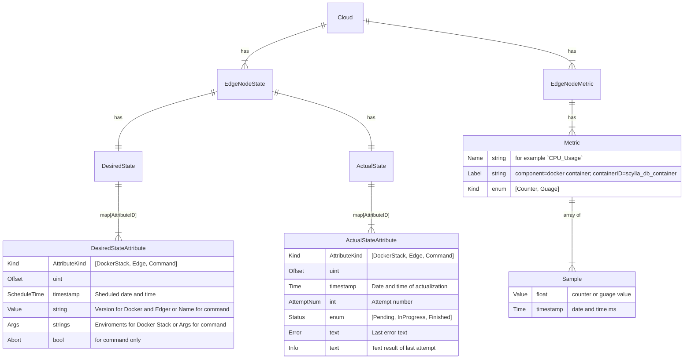
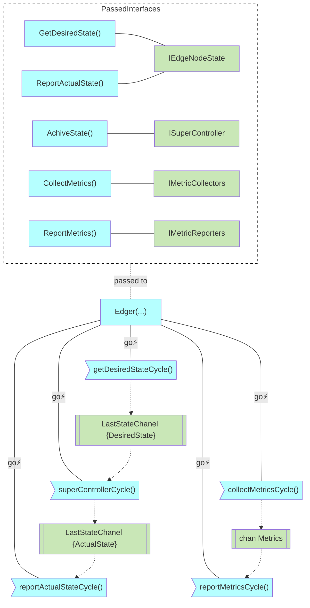
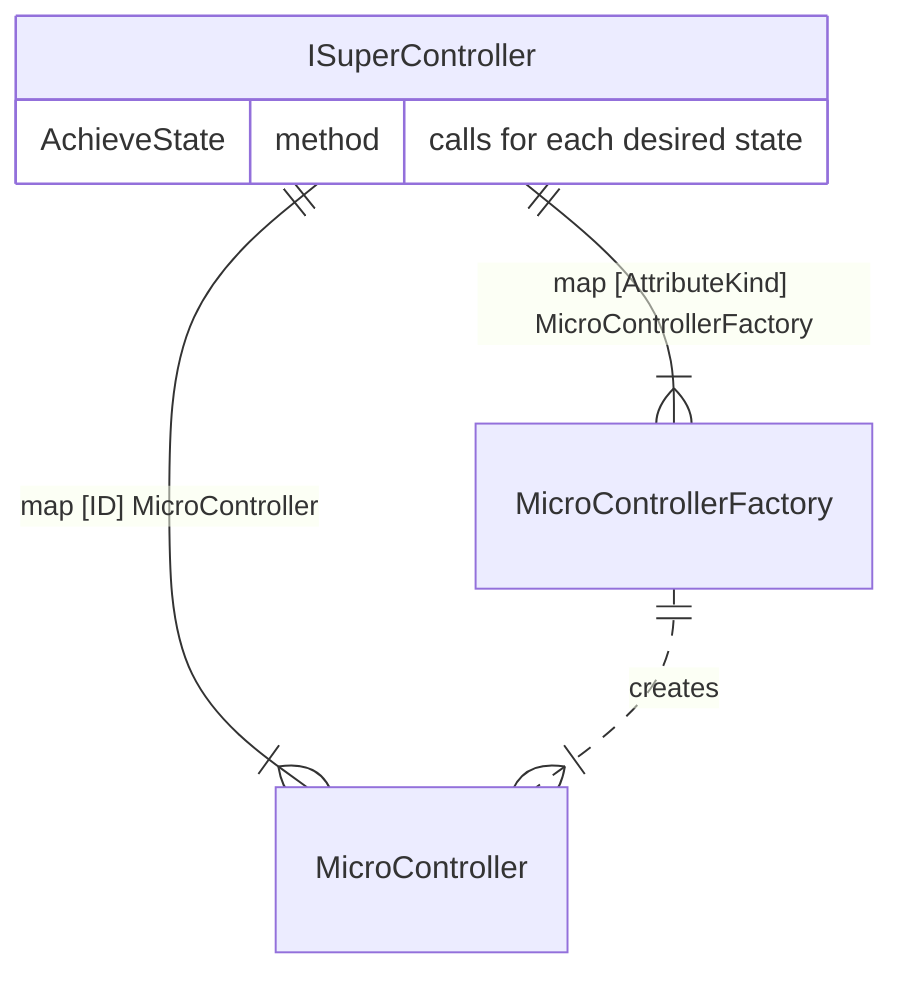

# Technical Design

- [Node State](#node-state)
- [Goroutines](#goroutines)

# Node State

# Goroutines

# SuperController

SuperController.AchieveState() called from edger superCycle:
- for every new desired state,
- for each unreached desired state after a configurable time interval (AchieveAttemptInterval)

# Save/restore SuperController state

- Restore is initialized in mctrls.New() (ISuperController constructor)
- SuperController.AchieveState() saves last achieved state
