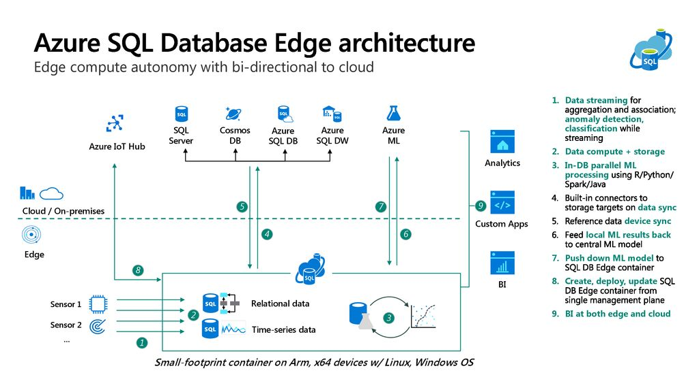
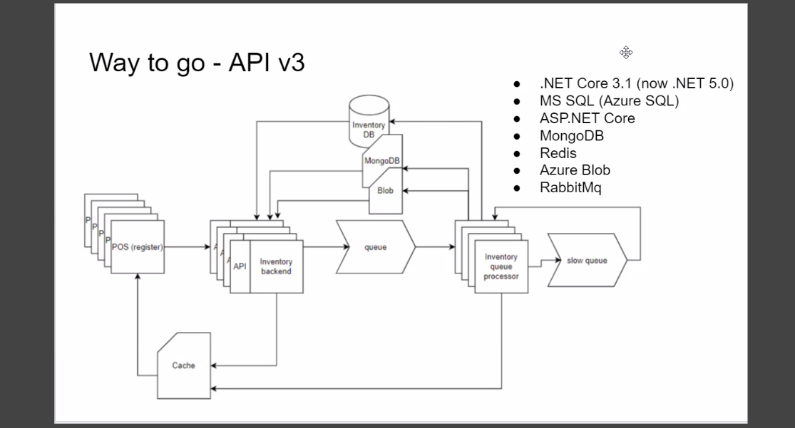
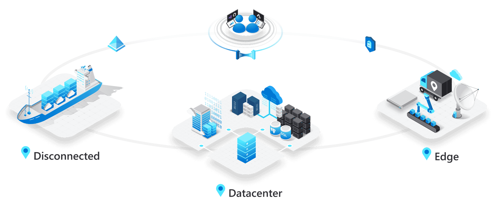
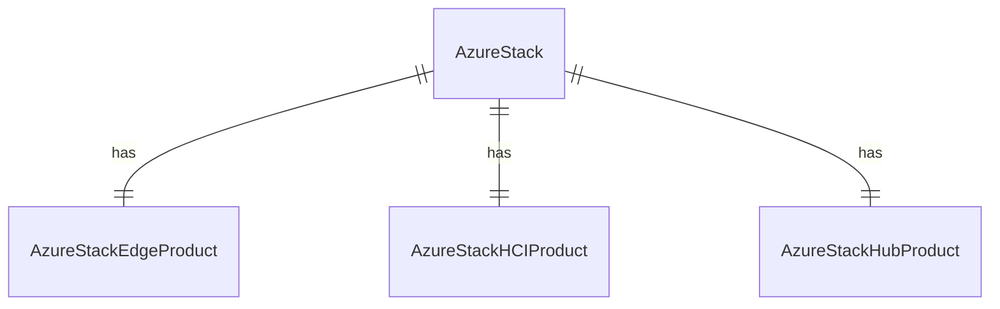
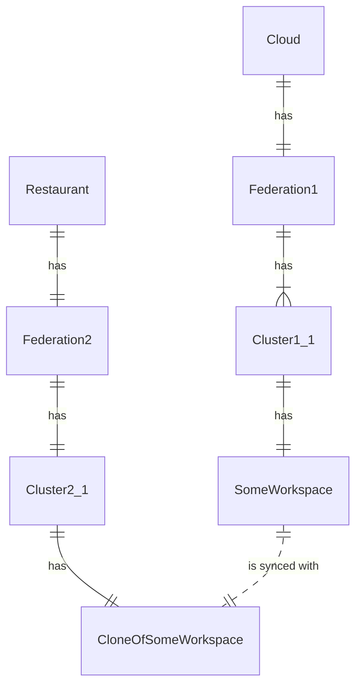
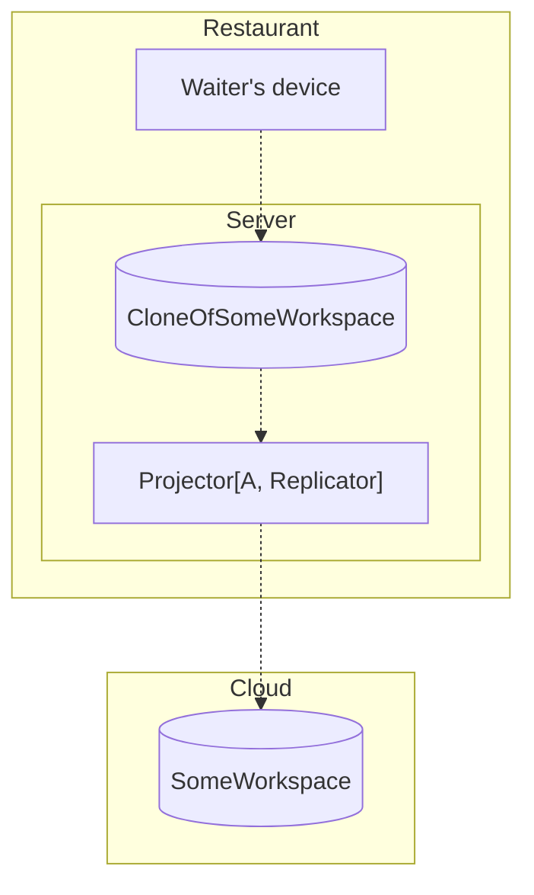
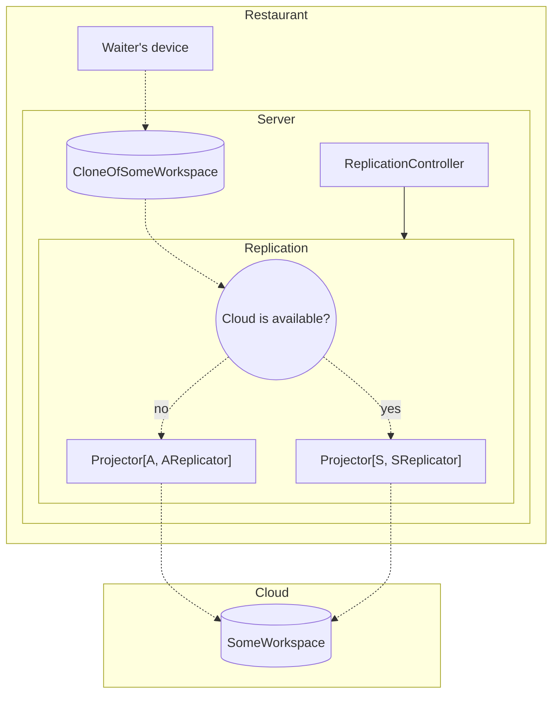

## Edge Computing Industry Review

Motivation:

- [Investigate possible LocalStorage design](https://dev.heeus.io/launchpad/#!24906)
- unTill Air: [A&D: Local Storage](https://dev.untill.com/projects/#!625849)
  - As a restaurant owner I want my devices to work with local storage so that my restaurant can survive Internet outage

## Edge Computing

[wiki: Edge Computing](https://en.wikipedia.org/wiki/Edge_computing)
- Edge computing is a distributed computing paradigm that brings computation and data storage closer to the sources of data
- This is expected to improve response times and save bandwidth
- It is an architecture rather than a specific technology

- > The term is often used synonymously with "fog computing"
- > Fog computing[1][2] or fog networking, also known as fogging,[3][4] is an architecture that uses edge devices to carry out a substantial amount of computation (edge computing), storage, and communication locally and routed over the Internet backbone.

## HPE CEO predicts edge computing will be ‘the next big opportunity for us’

- Oct 26, 2022, https://www.edgeir.com/hpe-ceo-predicts-edge-computing-will-be-the-next-big-opportunity-for-us-20221026

- In fact, edge computing is “the next big opportunity for us,” Neri said in a recent interview.
- “It’s a big market opportunity because not only is the market expanding, but we are entering new segments of the market with new offers as a part of our edge-to-cloud strategy,” stated Neri in a Yahoo Finance Live interview.
- With these factors combined, the company expects significant growth over the next three years in the $250 billion edge computing market

## Azure IoT Edge и SQL Edge

Azure IoT Edge

Azure + SQL Edge

Azure + SQL Edge, detailed

(!!!) Note that Azure did not help Dejavoo to develop system faster then 1.5. year

References:
- [Azure IoT Edge и SQL Edge: перенос облачных нагрузок на «наземные» устройства](https://habr.com/ru/company/quarta/blog/516432), Кварта Технологии, habr, 30.05.2020
- [Fascinating news: SQL server Edge for IoT Edge](https://vishvvas.wordpress.com/2020/05/30/fascinating-news-sql-serve-edge-for-iot-edge/), 25.08.2020
- [How an IoT Edge device can be used as a gateway](https://learn.microsoft.com/en-us/azure/iot-edge/iot-edge-as-gateway), Microsoft, 2022

## Azure Stack

> Extend Azure services and capabilities to your environment of choice—from the datacenter to edge locations and remote offices—with Azure Stack. Build, deploy, and run hybrid and edge computing apps consistently across your IT ecosystem, with flexibility for diverse workloads.
>
> [Azure Stack](https://azure.microsoft.com/en-us/products/azure-stack), Microsoft

**Azure Stack HCI**: This is a hyper convergent solution combining several products:

- Equipment from Microsoft's certified OEM partner.
- Windows Server 2019 Datacenter operating system.
- Windows Admin Center software.
- Microsoft Azure services if necessary.

**Azure Stack Hub**: Azure Stack Hub broadens Azure to let you run apps in an on-premises environment and deliver Azure services in your datacenter.

**Azure Stack Edge**: Purpose-built hardware-as-a-service with Azure Stack Edge
- Run your applications at the edge close to the data
- Transfer data efficiently and easily between the cloud and edge

# Possible technical design

## Cloned Workspaces

## Asymmetrical Asynchronous Replication

- Data is replicated one direction
- Data is replicated asynchronously

Pros
- Easier to implement

Cons
- Potential data loss if Server goes down (since replication is async)

## Asymmetrical Synchronous Replication

- Data is replicated one direction
- Data is replicated synchronously

Pros
- No data loss if SReplicator is working

Cons
- Harder to implement
  - Switching between AReplicator and SReplicator - very tricky
