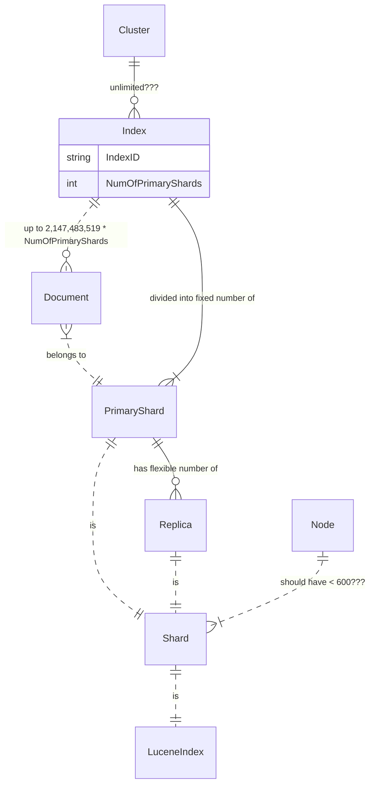
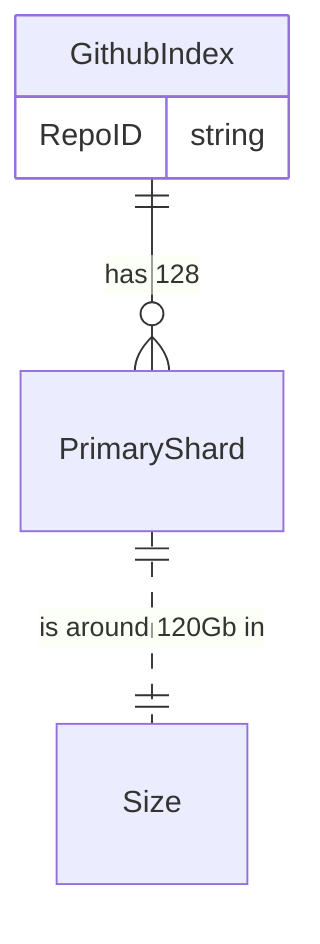

# ELK Basics

Motivation
- dev.heeus.io: [ELK Basics](https://dev.heeus.io/launchpad/#!26205)

# Content

- [ELK Concepts](#main-elk-concepts)
  - [Github](#github-as-example)
  - [ELK Index](#elk-index)
  - [Shards](#shards)
  - [Nodes](#nodes)
  - [Documents](#documents)
- [Shard allocation across Nodes](#shard-allocation-across-nodes)  
- [Cluster health](#cluster-health)
  - [Find problematic indices](#find-problematic-indices)
  - [Waiting for green status](#waiting-for-green-status)
  - [ELK on one Node](#elk-on-one-node)
  - [Recovery](#recovery)

- [Multi-Tenancy with Elasticsearch and OpenSearch](#multi-tenancy-with-elasticsearch-and-opensearch)
- [Dashboards](#dashboards)
- [Licensing Restrictions](#licensing-restrictions)
---
# Main ELK Concepts



**Github as an example:**



- https://www.elastic.co/customers/github
- In GitHub's main Elasticsearch cluster, they have about 128 shards, with each shard storing about 120 gigabytes each.
- To optimize search within a single repository, GitHub uses the Elasticsearch [routing parameter](https://www.elastic.co/guide/en/elasticsearch/reference/current/mapping-routing-field.html) based on the repository ID. "That allows us to put all the source code for a single repository on one shard," says Pease. "If you're on just a single repository page, and you do a search there, that search actually hits just one shard. Those queries are about twice as fast as searches from the main GitHub search page."
- Search in partucular repo:
   - Use repoID as routing field

## ELK Index

- Each Index can have up to 2,147,483,519 Documents (ref. LUCENE-5843)
- Each index can be split into multiple shards
- Each Elasticsearch shard is a separate Lucene index.
- In a single cluster, you can define as many indexes as you want.

## Shards

- Each index can be split into multiple shards
- An index can also be replicated zero (meaning no replicas) or more times.
- Once replicated, each index will have primary shards (the original shards that were replicated from) and replica shards (the copies of the primary shards).
- The number of Primary Shards in an Index is fixed at the time that an index is created
   - In Elasticsearch > 5.0 You can change the number of shards for an existing index using the _shrink and _split APIs, however this is not a trivial task and pre-planning for the correct number of shards is the optimal approach.
- The number of replica shards may be up to the maximum value(total number of nodes-1)
- A document [is routed](https://www.elastic.co/guide/en/elasticsearch/reference/current/mapping-routing-field.html) to a particular shard in an index using the following formulas:
   - routing_factor = num_routing_shards / num_primary_shards
      - num_routing_shards - virtual shards like virtual nodes in cassandra
      - num_primary_shards - real shards in indices
   - shard_num = (hash(_routing) % num_routing_shards) / routing_factor
- Recommended Primary Shard size < 40Gb

## Nodes

- Each Node should have not more than 600 Shards (https://discuss.elastic.co/t/how-many-indices-can-be-created/140226)
- Replica shard is never allocated on the same Node as the original/primary shard that it was copied from

## Documents

A document [is routed](https://www.elastic.co/guide/en/elasticsearch/reference/current/mapping-routing-field.html) to a particular shard in an index using the following formulas:

```javascript
routing_factor = num_routing_shards / num_primary_shards
shard_num = (hash(_routing) % num_routing_shards) / routing_factor
```

- The default _routing value is the document’s _id. Custom routing patterns can be implemented by specifying a custom routing value per document
```javascript
PUT my-index-000001/_doc/1?routing=user1&refresh=true 
{
  "title": "This is a document"
}

GET my-index-000001/_doc/1?routing=user1 
```

- With a good hash function, the data will distribute itself roughly equally (short of a pathological distribution of document IDs). 
   - The hash function that used by elastic (murmur3) has good distribution qualities. 
   - Hash function used for routing so that server always know which shard a document is in given the document ID and the number of shards in the index. This is why you can not change the number of shards with the exception of shrinking the number of shards to a divisor of the original number of shards.
  
___
# How to index very big log
- Split log into parts (interval between two dates - month, week)
- create separate index for every interval
- if you need query on all parts - execute parallel and aggregate result

---
# Shard allocation across Nodes

- ShardsAllocator figures out where to place shards
   - The ShardsAllocator is an interface in Elasticsearch whose implementations are responsible for shard placement. When shards are unassigned for any reason, ShardsAllocator decides on which nodes in the cluster to place them.
   - ShardsAllocator engages to determine shard locations in the following conditions:
      - Index Creation – when you add an index to your cluster (or restore an index from snapshot), ShardsAllocator decides where to place its shards. When you increase replica count for an index, it decides locations for the new replica copies.
   - Node failure – if a node drops out of the cluster, ShardsAllocator figures out where to place the shards that were on that node.
   - Cluster resize – if nodes are added or removed from the cluster, ShardsAllocator decides how to rebalance the cluster.
   - Disk high water mark – when disk usage on a node hits the high water mark (90% full, by default), Elasticsearch engages ShardsAllocator to move shards off that node.
   - Manual shard routing – when you manually route shards, ShardsAllocator also moves other shards to ensure that the cluster stays balanced.
   - Routing related setting updates — when you change cluster or index settings that affect shard routing, such as allocation awareness, exclude or include a node (by ip or node attribute), or filter indexes to include/exclude specific nodes.
- Shard placement strategy can be broken into two stage
   - which shard to act on
   - which target node to place it at
- The default Elasticsearch implementation, BalancedShardsAllocator, divides its responsibilities into three major part
   - allocate unassigned shards
   - move shards
   - rebalance shards


---
# Cluster health

An Elasticsearch cluster may consist of a single node with a single index. Or it may have a hundred data nodes, three dedicated masters, a few dozen client nodes  —all operating on a thousand indices (and tens of thousands of shards).

No matter the scale of the cluster, you’ll want a quick way to assess the status of your cluster. The Cluster Health API fills that role. You can think of it as a 10,000-foot view of your cluster. It can reassure you that everything is all right, or alert you to a problem somewhere in your cluster.

Let’s execute a cluster-health API and see what the response looks like:

```http request
GET _cluster/health
```

```json lines
{
   "cluster_name": "elasticsearch_heeus",
   "status": "green",
   "timed_out": false,
   "number_of_nodes": 1,
   "number_of_data_nodes": 1,
   "active_primary_shards": 10,
   "active_shards": 10,
   "relocating_shards": 0,
   "initializing_shards": 0,
   "unassigned_shards": 0
}
```
The most important piece of information in the response is the status field. The status may be one of three values:
- green
   - All primary and replica shards are allocated. Your cluster is 100% operational.
- yellow
   - All primary shards are allocated, but at least one replica is missing. No data is missing, so search results will still be complete. However, your high availability is compromised to some degree. If more shards disappear, you might lose data. Think of yellow as a warning that should prompt investigation.
- red
   - At least one primary shard (and all of its replicas) is missing. This means that you are missing data: searches will return partial results, and indexing into that shard will return an exception.
                                            
## Find problematic indices

One day everything goes wrong:
```json lines
{
   "cluster_name": "elasticsearch_heeus",
   "status": "red",
   "timed_out": false,
   "number_of_nodes": 8,
   "number_of_data_nodes": 8,
   "active_primary_shards": 90,
   "active_shards": 180,
   "relocating_shards": 0,
   "initializing_shards": 0,
   "unassigned_shards": 20
}
```
We see that we do not have all the nodes in operation (suppose there were 10 of them) and we have a total of 20 out shards. This information is not enough to make a decision to restore functionality, and we need to ask cluster-health for a little more information by using the level parameter:
```http request 
GET _cluster/health?level=indices 
```
request result 
```json lines

{
   "cluster_name": "elasticsearch_heeus",
   "status": "red",
   "timed_out": false,
   "number_of_nodes": 8,
   "number_of_data_nodes": 8,
   "active_primary_shards": 90,
   "active_shards": 180,
   "relocating_shards": 0,
   "initializing_shards": 0,
   "unassigned_shards": 20
   "indices": {
      "v1": {
         "status": "green",
         "number_of_shards": 10,
         "number_of_replicas": 1,
         "active_primary_shards": 10,
         "active_shards": 20,
         "relocating_shards": 0,
         "initializing_shards": 0,
         "unassigned_shards": 0
      },
      "v2": {
         "status": "red", 
         "number_of_shards": 10,
         "number_of_replicas": 1,
         "active_primary_shards": 0,
         "active_shards": 0,
         "relocating_shards": 0,
         "initializing_shards": 0,
         "unassigned_shards": 20 
      },
      "v3": {
         "status": "green",
         "number_of_shards": 10,
         "number_of_replicas": 1,
         "active_primary_shards": 10,
         "active_shards": 20,
         "relocating_shards": 0,
         "initializing_shards": 0,
         "unassigned_shards": 0
      },
      And more and more...
   }
}
```
We can now see that the v2 index is the index that has made the cluster red. And all 20 unassigned shards are from this index.
                              
## Waiting for green status


You can specify a wait_for_status parameter, which will only return after the status is satisfied. For example:
```http request
GET _cluster/health?wait_for_status=green
```
- This call will block (not return control to your program) until the cluster-health has turned green, meaning all primary and replica shards have been allocated.
- Useful for automate create indices in cluster (when add documents to indices immediately after creating an index - possible index has not been fully initialized so quickly)

## ELK on one Node

Elasticsearch will never assign a replica to the same node as the primary shard, so if you only have one node it is perfectly normal and expected for your cluster to indicate yellow.  If you feel better about it being green, then change the number of replicas on each index to be 0.
                                                                                             
```json lines
PUT /index-name/_settings
{
    "index" : {
        "number_of_replicas" : 0
    }
}
```

## Recovery

If a primary shard fails then  master promotes one of the active in-sync replicas to become the new primary. 
- If there are currently no active in-sync replicas then it waits until one appears, and your cluster health reports as RED. 
   - However, if all the in-sync copies of your data permanently lost this not can be done: you have by definition lost data.
   - And now we have shard in corrupted state. 
      - Ideally we would want to bring it back to life and run a reindex on the missing documents.
      - To bring it back to life, we had to run this following command:
  ```json lines
  PUT/_cluster/reroute
  {
  "commands": [
     {
      "allocate_empty_primary": {
      "index": "index_name_masked",
      "shard": 0,
      "node": "*.*.*.*",
      "accept_data_loss": true
      }
    } 
  ]
  }
    ```    
 
---   
# Multi-Tenancy with Elasticsearch and OpenSearch

[Multi-tenancy](https://blog.bigdataboutique.com/2022/11/multi-tenancy-with-elasticsearch-and-opensearch-c1047b) refers to having multiple users or clients (e.g. tenants) with disparate sets of data stored within the same Elasticsearch cluster. The main reason for wanting to keep multiple tenants on one single cluster is to reduce infrastructure complexity, and keep costs lower by sharing resources. Of course, that is not always the best, or even a possible solution - for example when data is sensitive, or isolation is required for other reasons such as compliance. Below different implementation method proper multi-tenant in EL.
- Silos Method - Exclusive indices per tenant
   - pros 
   - You don’t have to worry about things like field mapping collisions
   - Data purges can be done by simply deleting all indices with condition in the name.
   - Simple set different security and management policy.
   - cons 
   - potentially too many indexes for cluster resources
   - many small indexes 
- Pool Method - Shared indices between tenants(Elasticsearch has a feature called filtered aliases that allows you to use an alias on a subset of the data within indices. You can use a filtered alias to, for example, give you all the data within a group of indices where “tenant ID” equals “CompanyA”.) 
   - the pros are obvious - resources economy
   - cons
   - mapping problem (same names used by different users)
   - large numbers of fields within index
   - same sharding and replication for all
   - High cardinality and, as a result, low cache efficiency
- Hybrid Method - One Pool and then some Silos
   - Tenants use shared indices with filtered aliases to isolate the respective data
   - Field names are managed internally by combining similar fields between tenants.
   - cons
      - Very complex from implementation and support 
                                     
___
# Dashboards

- Kibana
   - pros
large community
advance visualisation and analytics options
provide dashboard and reporting (have elastic query builder)
   - cons
      - Very cumbersome and difficult
      - High resource requirements
      - Some features may require a paid subscription to access
- ElasticVue
   - pros
      - lightweight and simple/easy to use
      - Intuitive data exploration and visualisation
      - Open source with no licensing restrictions
   - cons
      - Limited functionality compared to Kibana
      - Relative new platform with smaller community and support
        
___
# Logstash is needed?

- Logstash
  - Cannot be used in cluster mode
  - If you need deduplicate - use unique id for elastic doc

___            
# [Licensing Restrictions](https://dattell.com/data-architecture-blog/opensearch-vs-elasticsearch/)
- OpenSearch, is free under the Apache License, Version 2.0. This license is an extremely permissive license, under which users can modify, distribute, and sublicense the original code. No restrictions are set on the original code except that the source code contributors cannot be held liable by end users for any reason.
- Elasticsearch, with ELv2 and SSPL, you’ll need to be careful what your product does. For instance, the SSPL states “If you make the functionality of the Program or a modified version available to third parties as a service, you must make the Service Source Code available via network download to everyone at no charge…” That’s a real concern for companies using Elasticsearch as part of their product(s).
Elasticsearch [licensing FAQ](https://www.elastic.co/pricing/faq/licensing)
                          
