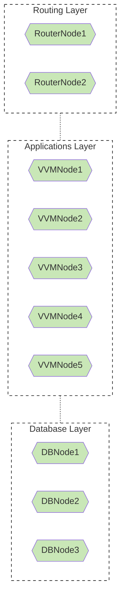
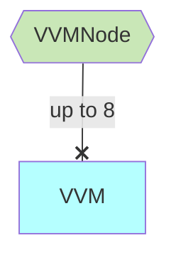
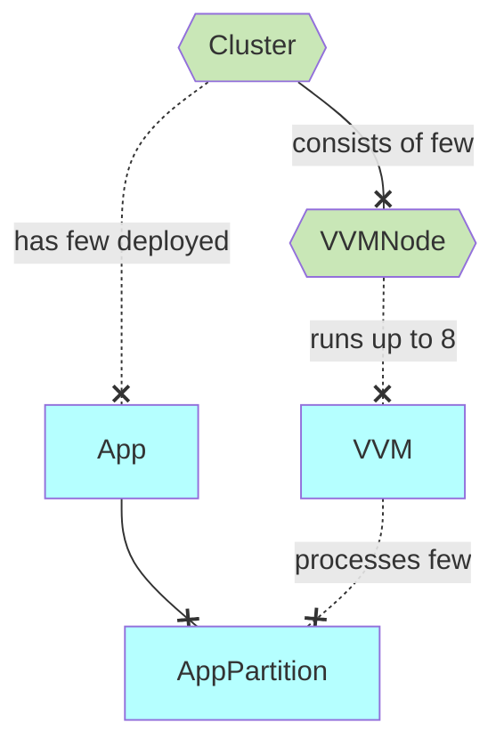

# Some ideas about EE Design

Motivation
- heeus.io: [About Heeus EE design](https://dev.heeus.io/launchpad/#!26633)
  - Deliver PaaS in a short time (so that potential customers can try the product)
  - Allow potential customers to upload application with fixed and small number of Partitions/Query Processors

TOC
- [Requests kinds](#requests-kinds)
- [Node kinds](#node-kinds)
- [VVVMNode](#vappnode)
- [Scheduling](#scheduling)
    - [Scheduling: Init cluster](#scheduling-init-cluster)
    - [Scheduling: Deploy app](#scheduling-deploy-app)
    - [Scheduling: Scale cluster](#scheduling-scale-cluster)

## Requests kinds

1. Commands
2. Queries
3. BLOBs-related requests

This article is focused on Commands and Queries.

## Node kinds

- RouterNode: Узлы маршрутизации
- VVMNode: Узлы виртуальных машин
- DBNode: Узлы базы данных

**Naive design**
- Use swarm
- For `N` VVMNodes create `N` VVMNodeService swarm services
- If VVMNodeN goes down then swarm runs VVMNodeServiceN on another node
- Problem: VVMNode can have 100% resources (CPU/RAM) overload

## VVM

Why 8 VVMs per VVMNode?

[Cassandra Virtual Nodes](https://docs.datastax.com/en/cassandra-oss/3.0/cassandra/architecture/archDataDistributeDistribute.html):

> - Prior to Cassandra 1.2, you had to calculate and assign a single token to each node in a cluster
> - Each token determined the node's position in the ring and its portion of data according to its hash value.
> - In Cassandra 1.2 and later, each node is allowed many tokens
> - The new paradigm is called **virtual nodes (vnodes)**
> - Vnodes allow each node to own a large number of small partition ranges distributed throughout the cluster
> - Vnodes also use consistent hashing to distribute data but using them doesn't require token generation and assignment
>
> Note: DataStax recommends using 8 vnodes (tokens). Using 8 vnodes distributes the workload between systems with a ~10% variance and has minimal impact on performance.

> It is no longer recommended to assign 256 as it was for a number of years since large values impact the performance of nodes and operations such as repairs ([link](https://community.datastax.com/questions/4966/what-is-the-maximum-vnodes-per-node.html)).

Ideas
- Cassandra VNode => VVM
- Each VVM is a swarm service
- If VVMNode goes down swarm runs VVM-s on another VVMNodes
- If cluster has 9 VVMNodes then to handle one-node-crash each node should have reserved ~ 1/8 of CPU/Memory resources, 5 VVMNodes => 1/4 resources, 3 VVMNodes => 1/2 resources

## Scheduling

### Assumptions

- Definition: `CommandProcessor` throughput is `T` kbit/s
- `T` is specific for every cluster
- `T` depends, among other things, on the Database layer latency
- For a stretched cluster it will be higher than for a non-stretched one
- AppPartition_ComputingPower = k0 * T * ( k1 * NumQueryProcessors + k2 * NumProjectors )

Problems
- BLOBs
- Lazy Projectors

### Init cluster

- Create 8 swarm services, each service runs `voedger.VVM` image
  - Each service has 1 replica
  - Each service has assigned VVMID
  - Each service has equal CPU/Memory resources

### Deploy app

**Developer**:

- Calculate number of AppPartitions
  - One of the factors: Command Processor throughput is `T` kbit/s
- Design AppPartition
  - NumQueryProcessors: fixed yet, say, 10
  - CacheSize, MB (can also be fixed, say, 10 MB)
- Create a Deployment Descriptor with the calculated number of AppPartitions
- Upload the Deployment Descriptor to the Cluster

**Cluster Scheduler**:

- Assign each AppPartition to a randomly selected VVVNodeID which satisfies AppPartition requirements

### Scheduling: Scale cluster

- If there are too many AppPartitions per VVM then increase number of VVMs
- If there are too many VVMs per VVMNode then increase number of VVMNodes

## Problems

- Cassadra Wide Partition problem
  - Solution: FoundationDB ???
  - FoundationDB problem: space used by App?
  - FoundationDB problem: removing application can take a lot (for Cassandra we just removes keyspace)
