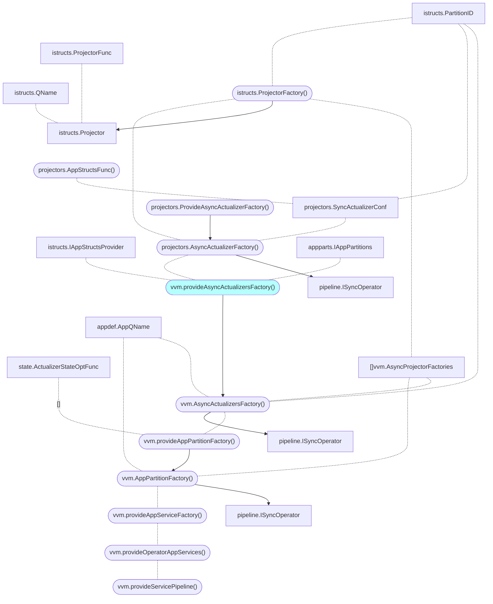

# IAppPartitions + async actualizers 

https://github.com/voedger/voedger/issues/1464

## Context

- [vvm.provideAsyncActualizersFactory()](https://github.com/voedger/voedger/blob/43469aef2ed4878dfa3cb7dca304c87350547a8d/pkg/vvm/wire_gen.go#L518)
- vvm.provideOperatorAppServices()
  - forks appServices per apps
  - [appsAmount]appServices



## Analysis


- istructsmem.AppConfigType
```go
type AppConfigType struct {
  ...
	syncProjectorFactories  []istructs.ProjectorFactory
	asyncProjectorFactories []istructs.ProjectorFactory
	cudValidators           []istructs.CUDValidator
	eventValidators         []istructs.EventValidator
  ...
}
```  
- iextengine.IExtensionEngineFactories: `map[appdef.ExtensionEngineKind]IExtensionEngineFactory`
- iextengine.IExtensionEngineFactory: `New(ctx context.Context, packages []ExtensionPackage, config *ExtEngineConfig, numEngines int) ([]IExtensionEngine, error)`
- iextengine.ExtensionPackage
```go
type ExtensionPackage struct {
	QualifiedName  string
	ModuleUrl      *url.URL
	ExtensionNames []string
}

type IExtensionIO interface {
	istructs.IState
	istructs.IIntents
	istructs.IPkgNameResolver
}

type IExtensionEngine interface {
	SetLimits(limits ExtensionLimits)
	Invoke(ctx context.Context, extName ExtQName, io IExtensionIO) (err error)
	Close(ctx context.Context)
}
```
- istructs.Projector: `Func func(event IPLogEvent, state IState, intents IIntents) (err error)`
- Projector example: invite.provideAsyncProjectorApplyCancelAcceptedInviteFactory

## Proposal

### Projectors shall be accessible through ExtEngineKind_BuiltIn

- `istructs.IState.PLogEvent() IPLogEvent`
- state: sync projectors: Put event
- state: async projectors: Put event
- IAppPartition(s)
```go
type IAppPartitions interface {
	// Adds new application or update existing.
	//
	// If application with the same name exists, then its definition will be updated.
	DeployApp(name appdef.AppQName, def appdef.IAppDef, perPartitionEngines [cluster.ProcessorKind]int, numPartitions int)

```
- Use `IAppPartition.Invoke` in async actualizer
  - Wire: Register all projectors in `iextenginebuiltin.ProvideExtensionEngineFactory`
    - Wrapper around istructs.Projector that gets IPLogEvent and passes to istructs.Projector
  - `appparts.NewWithEngines(engfacts iextengine.IExtensionEngineFactories)`
  - IAppPartition.Invoke
```go
type IAppPartition interface {
	Invoke(qname istructs.QName, state istructs.IState, intents istructs.IIntents) (err error)
}  	
```
  - Use `Invoke()` in async actualizer
  - Use `Invoke()` in `IAppPartition.DoSyncActualizer`

### Migrate to Actualizers Processors

- ???
