## Top-level sections

- [Operations Concepts](#operations-concepts)
- [Development Concepts](#development-concepts)
- [Editions](#editions)
- [Detailed design](#detailed-design)


## Notation

Notation based on:
- [ArchiMate](https://en.wikipedia.org/wiki/ArchiMate) (/ˈɑːrkɪmeɪt/ AR-ki-mayt; originally from Architecture-Animate), open and independent enterprise architecture modeling language
- [Entity–relationship model](https://en.wikipedia.org/wiki/Entity%E2%80%93relationship_model), describes interrelated things of interest in a specific domain of knowledge

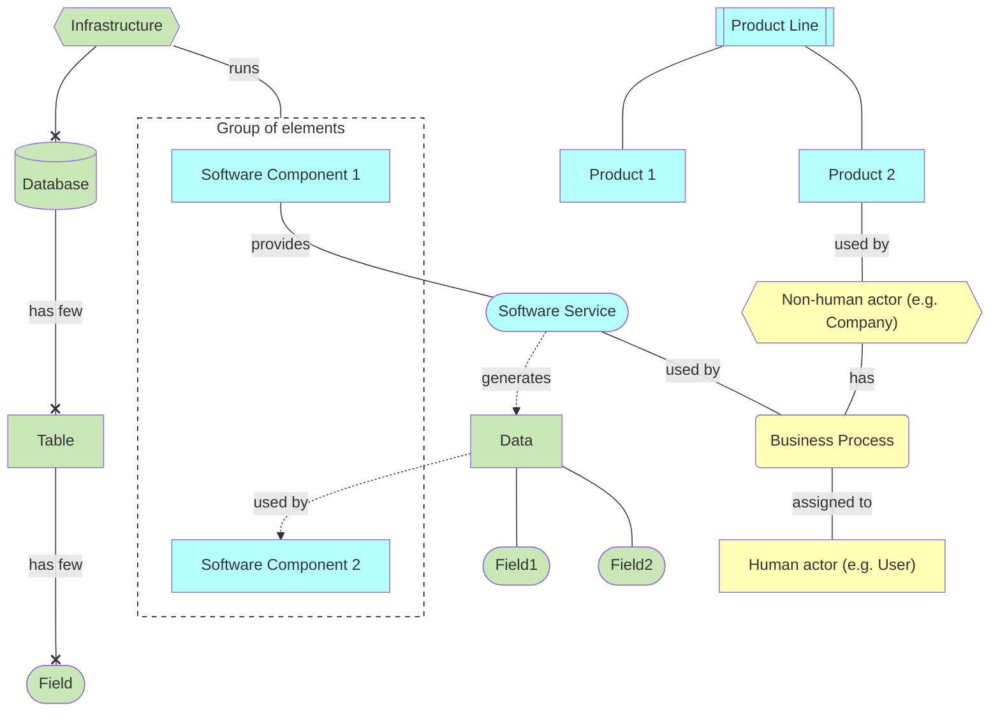

## Roles & Services

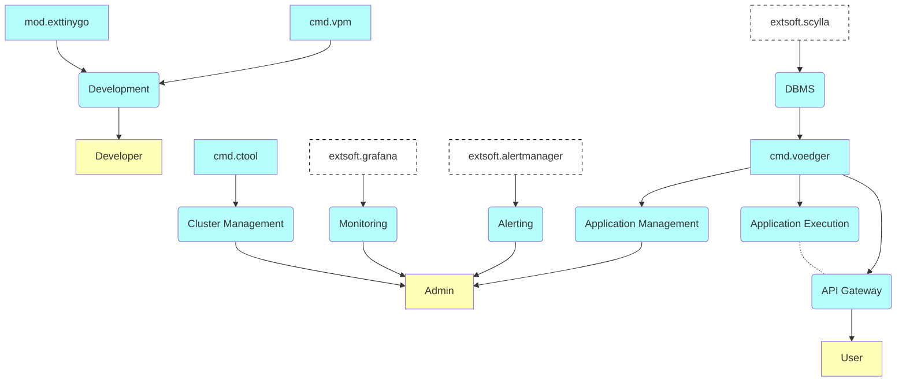


## Operations Concepts

### Federation

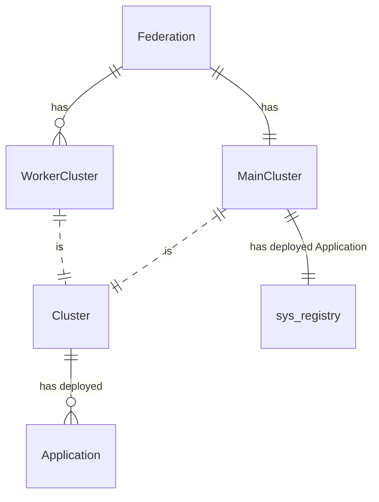

### Cluster

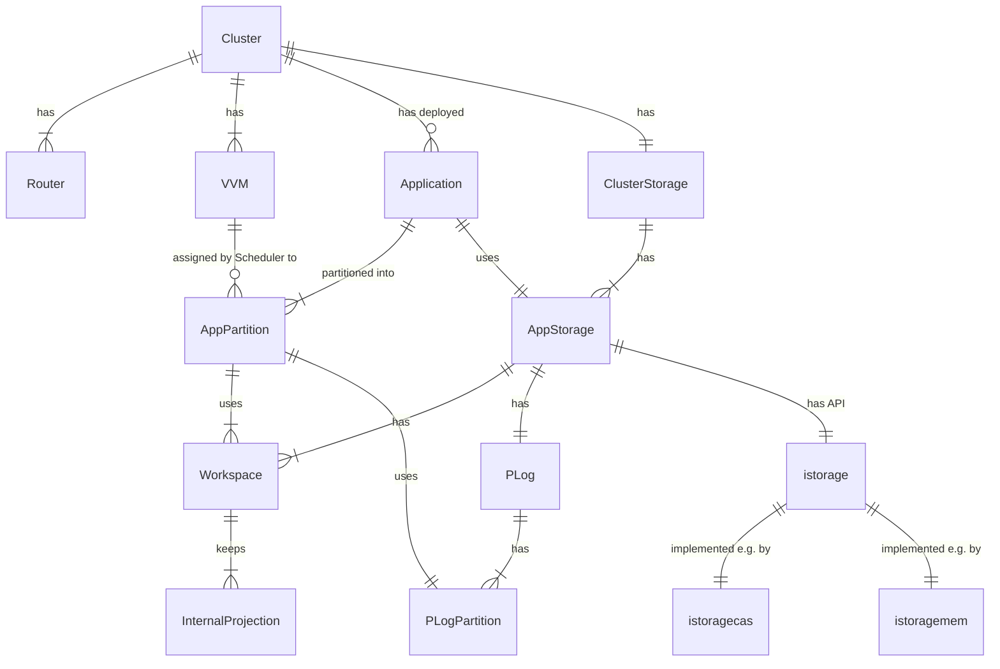
### VVM: Execute assigned AppPartition

| Old term      | New term|
| ----------- | ----------- |
| IAppStructsProvider      | IAppPartitions       |
| IAppStructs   | IAppPartition      |

#### Processors


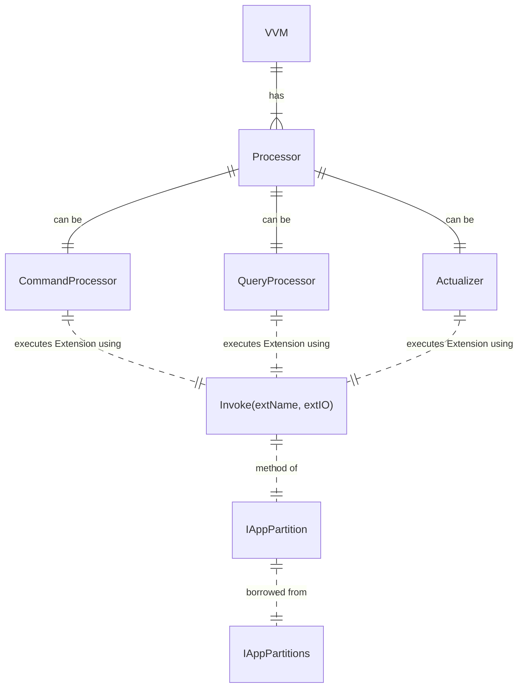


#### Borrow IAppPartition

```go
type IAppPartitions interface {
    ...
    Borrow(qpp AppQName, part PartitionID, procKind ProcessorKind) (IAppPartition, error)
    ...
}
```

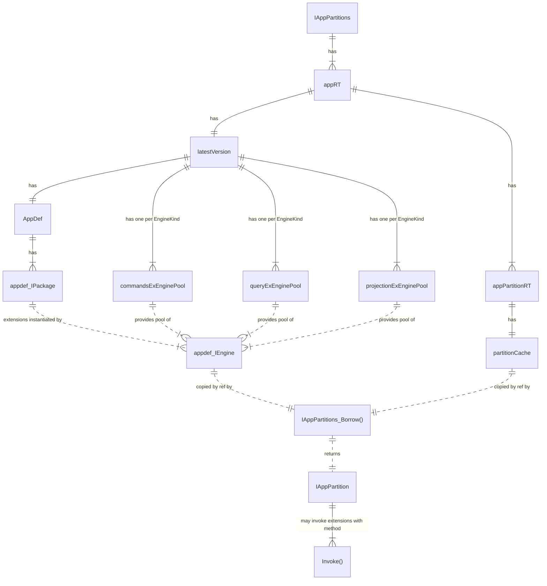

#### Construct Pools of Extension Engines
interfaces:
```go
// Builtin engines factory
type IExtensionEngineFactories interface {
  QueryFactory(appdef.ExtensionEngineKind) IExtensionEngineFactory
}

IExtensionEngineFactory {
  // LocalPath is a path package data can be got from
  // packageNameToLocalPath is not used for ExtensionEngineKind_BuiltIn
  New(packageNameToLocalPath map[string]string, numEngines int) []IExtensionEngine
}

type IExtensionEngineFactories map[appdef.ExtensionEngineKind]IExtensionEngineFactory

type ExtQName struct {
    PackageName string // Fully qualified package name
    ExtName string
}

type IExtensionEngine interface {
    Invoke(ctx context.Context, extName ExtQName, io IExtensionIO) (err error)
}

type BuiltInExtFunc func(io ExtensionIO) error
type BuiltInExtFuncs map[ExtQName]BuiltInExtFunc // Provided to construct factory of engines
```

An instance of IExtensionEngineFactories is provided to apppartsctl.New().

#### Execute Extentions
```go
type IAppPartition interface {
    // Processor constructs and provides ExtensionIO
    Invoke(extensionName QName, io IExtensionIO) (err error)
}
```

### Event Sourcing & CQRS

**Event Sourcing**

- Event Sourcing is a design pattern where all changes to the application state are stored as a sequence of events

> Event Sourcing ensures that all changes to application state are stored as a sequence of events.
>
> [Martin Fowler: Event Sourcing](https://martinfowler.com/eaaDev/EventSourcing.html)
> 

- Storing a log of all events provides an "natural" **audit trail** (журнал аудита, контрольный журнал) ([link](https://arkwright.github.io/event-sourcing.html#audit-trail))
- Partitioning PLog into PLogPartition provides horizontal **scalability**

**CQRS**

- CQRS (Command and Query Responsibility Segregation) is a design pattern where different data models are used for writes (by Commands) and reads (by Queries)
- Implementing CQRS in your application can maximize its **performance, scalability, and security** ([CQRS pattern, learn.microsoft.com](https://learn.microsoft.com/en-us/azure/architecture/patterns/cqrs))

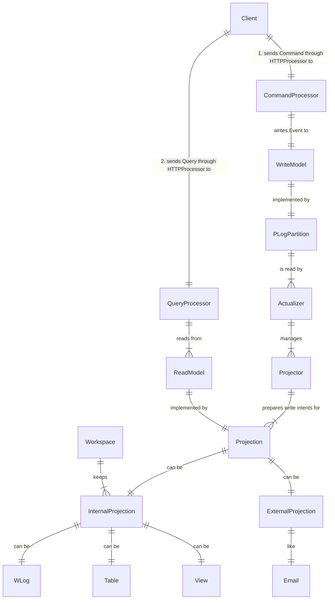

### Extensions

#### Principles

- Extensions extend Core functionality
  - Расширения расширяют функциональность ядра
- Extensions can be loaded/updated/unloaded dynamically
  - But BuiltIn Extensions

#### Extension Engines
- Extension Engine: Движок расширения
- ??? Does DockerExtensionEngine need memory?

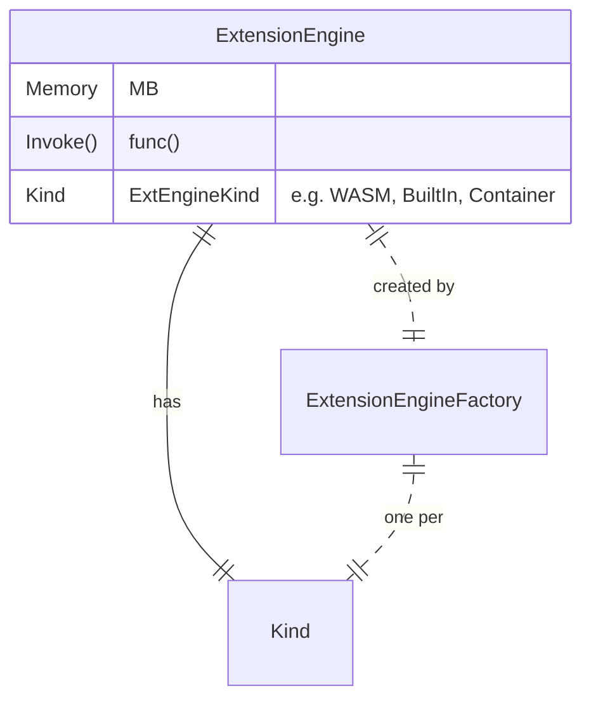

### Bus

#### Bus principles

- Limit number of concurrent requests: maxNumOfConcurrentRequests
  - Example: million of http connections but 1000 concurrent requests
  - "ibus.ErrBusUnavailable" (503) is returned if the number of concurrent requests is exceeded
- Sender and Receiver both respect timeouts: readWriteTimeout
  - E.g. 5 seconds, by (weak) analogy with FoundationDB, Long-running read/write

#### Bus Nodes
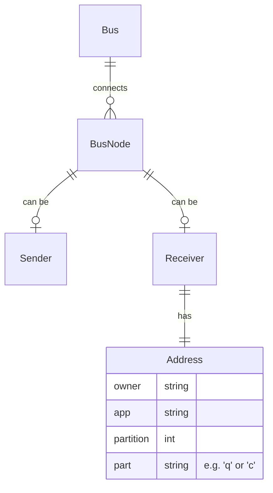

#### Some known Bus Nodes
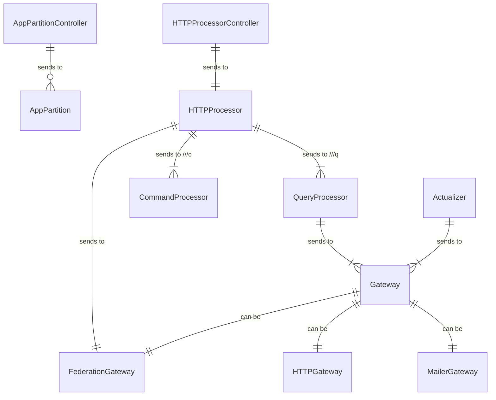
#### See also
- [Bus detailed design](https://github.com/heeus/core/tree/main/ibus)
- [Bus](#bus)

### Edge Computing

[redhat.com An Architect's guide to edge computing essentials](https://www.redhat.com/architect/edge-computing-essentials)

- Edge computing (периферийные вычисления, граничные вычисления) is a distributed computing pattern (модель распределенных вычислений). Computing assets on a very wide network are organized so that certain computational and storage devices that are essential to a particular task are positioned close to the physical location where a task is being executed
- Edge computing is definitely a thing in today's technical landscape. The market size for edge computing products and services has more than doubled since 2017. And, according to the statistics site, Statista, it's projected to explode by 2025. (See Figure 1, below)

[tadviser.ru: https://www.tadviser.ru/](https://www.tadviser.ru/index.php/%D0%A1%D1%82%D0%B0%D1%82%D1%8C%D1%8F:%D0%9F%D0%B5%D1%80%D0%B8%D1%84%D0%B5%D1%80%D0%B8%D0%B9%D0%BD%D1%8B%D0%B5_%D0%B2%D1%8B%D1%87%D0%B8%D1%81%D0%BB%D0%B5%D0%BD%D0%B8%D1%8F_(Edge_computing%))

- Выступая на конференции Open Networking Summit в Бельгии в сентябре 2019 года руководитель сетевых проектов Linux Foundation Арпит Джошипура (Arpit Joshipura) заявил, что периферийные вычисления станут важнее облачных к 2025 году.

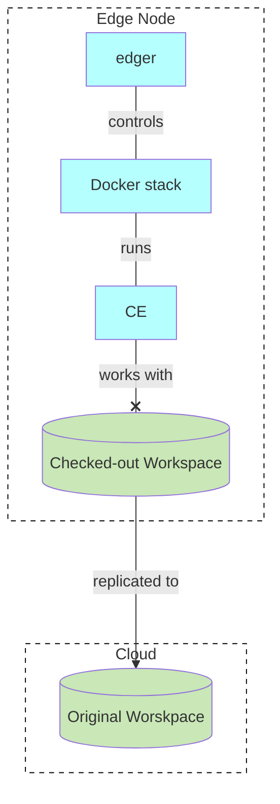
- [Detailed design](edge/README.md)


## Development Concepts

### Schemas

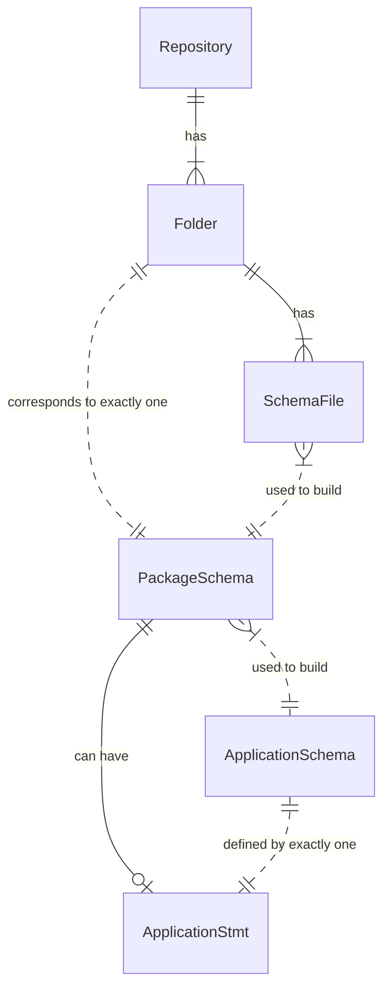

### Example of ApplicationStmt
- **Package name**: last part of the package path or alias from the IMPORT statement

```sql
IMPORT SCHEMA 'github.com/untillpro/untill' AS air;
IMPORT SCHEMA 'github.com/untillpro/airsbp';

-- Only one APPLICATION statement allowed per package and per application
APPLICATION bp3 (
  -- "sys" is always used in any application
  USE air;  -- name or alias. This actually identifies package in QNames of the app
  USE airsbp; 
)
```

## Editions

|             | CE          |SE          |Enterprise  |
| ----------- | ----------- |----------- |----------- |
| Federation  | Yes         |Yes         |Yes         |
| Router      | 1           |1           |Many        |
| VM          | 1           |1           |Many        |
| HA          | No          |Yes         |Yes         |
| Scalability | No          |No          |Yes         |

### Community Edition (CE)

Principles

- Node can run other software, unlike the SE (all nodes must be clean)
- Docker
  - So we won't support FreeBSD as a host OS
  - Reason: We beleive (paa) that FreeBSD is for things like routers
- Scylla as a ClusterStorage  
  - Reason: We do not want to learn how to operate bbolt
- Scylla is also containerized
  - Reason: [The cost of containerization is within 10%](https://scylladb.medium.com/the-cost-of-containerization-for-your-scylla-a24559d17d01), so ok

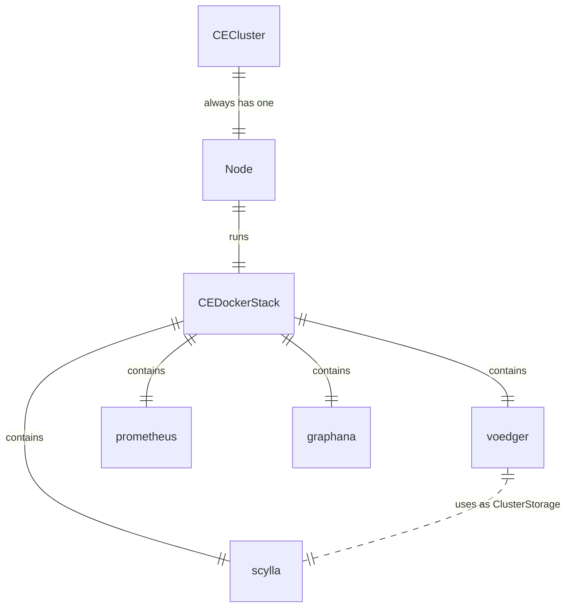

### Standart Edition (SE)

ref. [se/README.md](se/README.md)

### Enterprise Edition (EE)

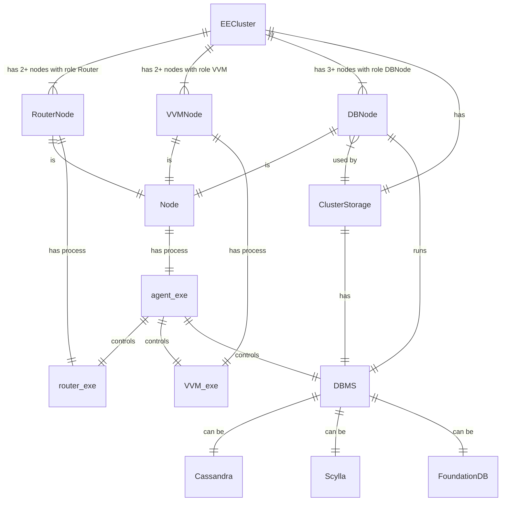

## Detailed design

Functional Design

- [Orchestration](orchestration/README.md)
- [Workspaces](workspaces/README.md)
- [Edge Computing](edge/README.md)

Non-Functional Reqiurements, aka Quality Attributes, Quality Requirements, Qualities

- [Consistency](consistency)
- Security
  - Encryption: [HTTPS + ACME](https-acme)
  - [Authentication and Authorization (AuthNZ)](authnz)
- TBD: Maintainability, Perfomance, Portability, Usability ([ISO 25010](https://iso25000.com/index.php/en/iso-25000-standards/iso-25010), System and software quality models)

Technical Design

- [Bus](https://github.com/heeus/core/tree/main/ibus)
- [State](state/README.md)
- [Command Processor](commandprocessor/README.md)
- [Query Processor](queryprocessor/README.md)
- [Projectors](projectors/README.md)
- [Storage](storage/README.md)

## Misc

DevOps

- [Building](building)

Previous incompatible versions

- [Prior 2023-09-13](https://github.com/voedger/voedger/blob/7f9ff095d66e390028abe9037806dcd28bde5d9e/design/README.md)
