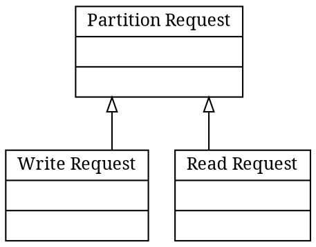
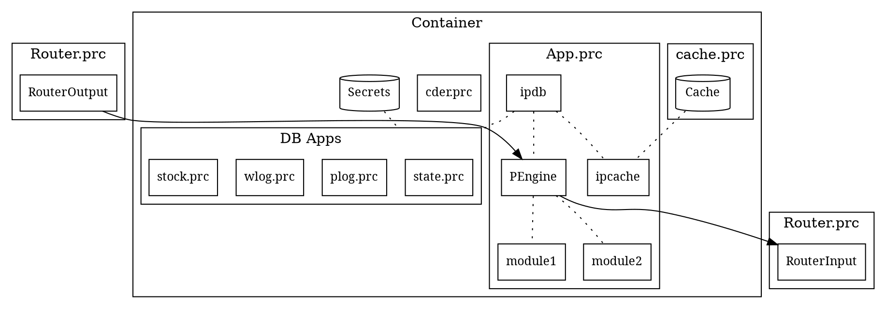
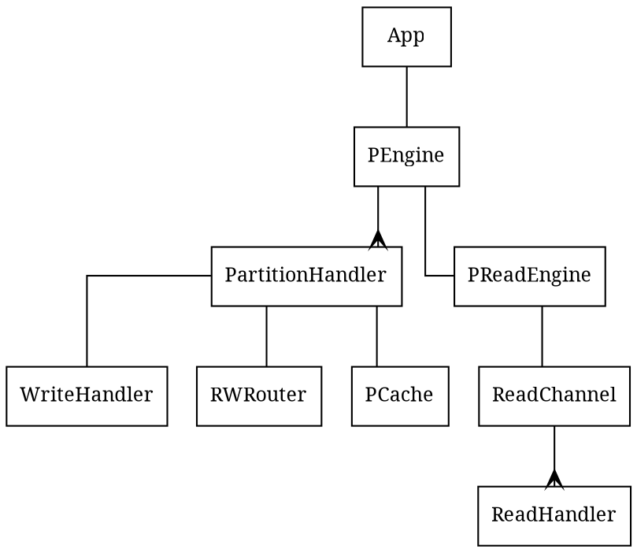
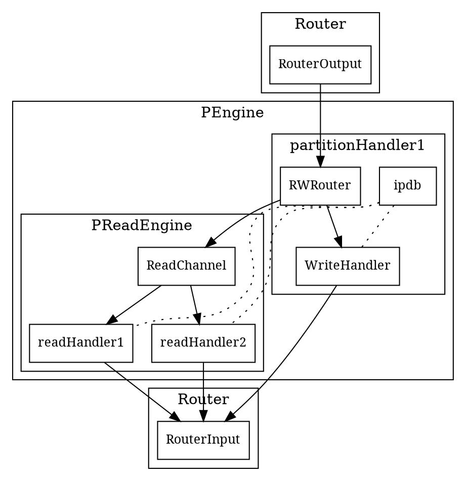

# Partition Request Class Diagram

- Partition Request: `Запрос к разделу`

# App Container Structure

- `cache.prc`
  - Separate process allows to update `App.prc`
  - Shared mem (with `App`) gives the best speed
  - Unix sockets gives simplicity

# PEngine Structure

# PEngine Dataflow

