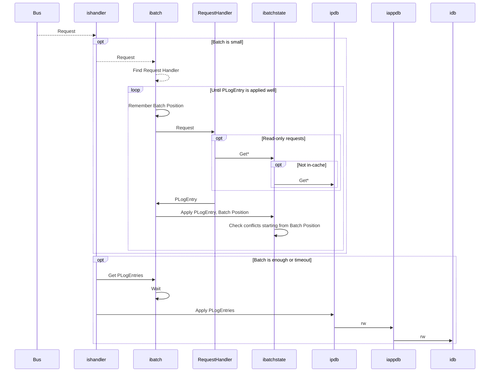

# Request Handling

```mermaid
sequenceDiagram
    participant B as Bus
    participant SH as ishandler
    participant BaH as ibatch
    participant RH as RequestHandler
    participant BaDB as ibatchstate
    participant PDB as ipdb
    participant iappdb as iappdb
    participant idb as idb


    B -->> SH: Request
    opt Batch is small
        SH-->> BaH: Request
        BaH-->> BaH: Find Request Handler
        loop Until PLogEntry is applied well
            BaH->> BaH: Remember Batch Position
            BaH->> RH: Request
            opt Read-only requests
                RH ->> BaDB: Get*
                opt Not in-cache
                    BaDB ->> PDB: Get*
                end
            end
            RH ->> BaH: PLogEntry
            BaH ->> BaDB: Apply PLogEntry, Batch Position
            BaDB ->> BaDB: Check conflicts starting from Batch Position

        end

    end
    opt Batch is enough or timeout
        SH->> BaH: Get PLogEntries
        BaH->>BaH: Wait
        SH->> PDB: Apply PLogEntries
        PDB ->> iappdb: rw
        iappdb ->> idb: rw
    end

```

# Recovering

- During recovering PLogEntries are read and re-applied

