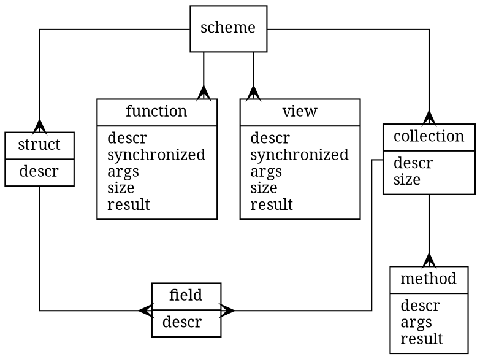

- `structs` and `collections` are in same namespace
- `method`: is a function with ID as a first implicit parameter
- `synchronized`: true/false
- `size`: `none`, `one`, `tiny`, `small`, `huge`
  - `none` for structures which do not represent `collections`
    - If `size` is not `none` struct gets implicit field `ID`
  - `one` and `tiny`: entire collection can be read by `synchronized` functions
  - `one`, `tiny`, `small`: entire collection can be read by `parallel` functions
  - `huge`
    - allowed for `views` only
    - is not possible to get entire collection at all