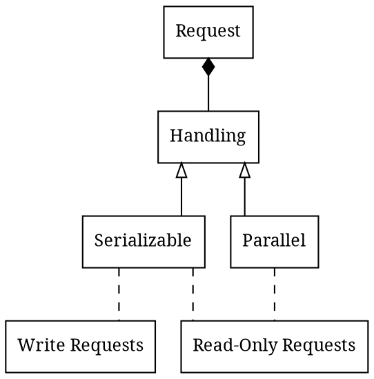

# Requests Handling

- `Serializable` is applied for Partition
- `Serializable Handling` leads to `Serializable Isolation`

# Glossary

- `Serializable Handling`: Последовательная обработка
- `Consistency`: Согласованность
- `Strong consistency`: Сильная согласованность
  - After the update completes, any subsequent access (by A, B, or C) will return the updated value
  - После завершения обновления любой последующий доступ к данным вернет обновленное значение
  - Such requests must be handled in a tiny time
- `Weak consistency`: Слабая согласованность
  - The system does not guarantee that subsequent accesses will return the updated value
  - Система не гарантирует, что последующие обращения к данным вернут обновленное значение
  - Weak consistency requests can be handled in long time

# Links

- https://habr.com/ru/post/100891/
- https://www.allthingsdistributed.com/2008/12/eventually_consistent.html
