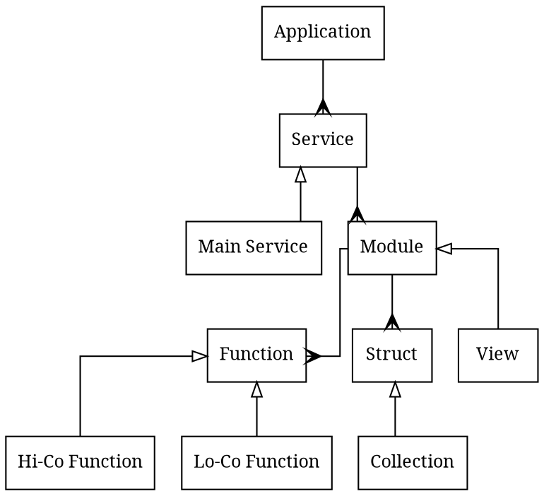
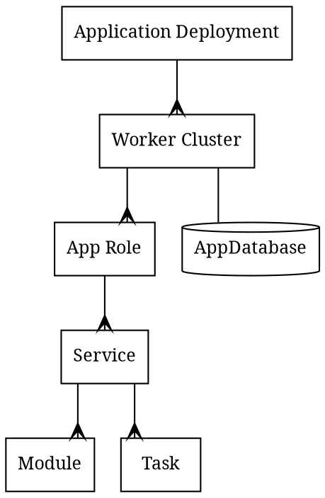
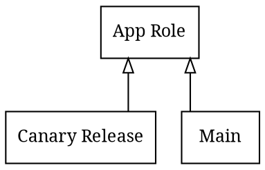
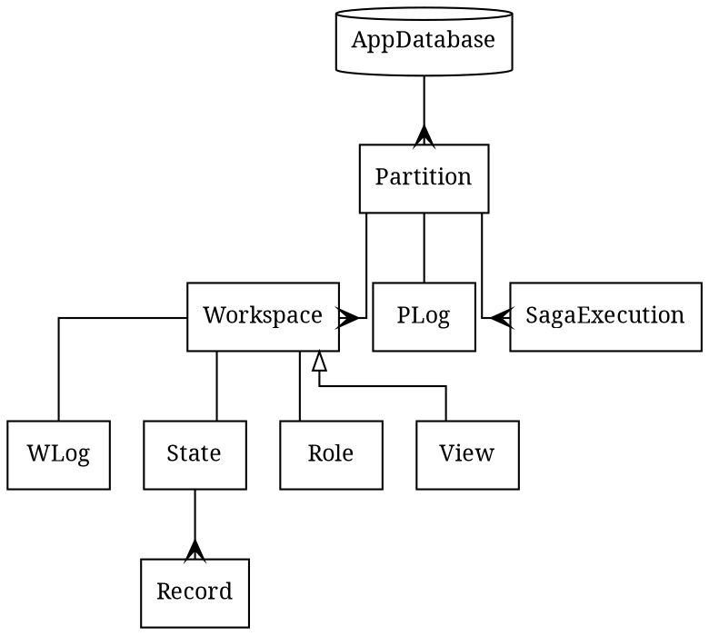

# Application

- Only `Main Service` may have Hi-Co functions
- Normal service can modify only Projections
- Views are Projections which are managed by heeus
- `Hi-Co` - High Consistency
  - Only Hi-Co functions can modify database
- `Lo-Co` - Low Consistency
  - Lo-Co functions are read-only

# Application Deployment

## Application Roles

- `Main` role - application role requests are routed to by default
- Roles are needed for `Canary Releases`
  - https://martinfowler.com/bliki/CanaryRelease.html
- Each role has its own set of workspaces

# Application Database

