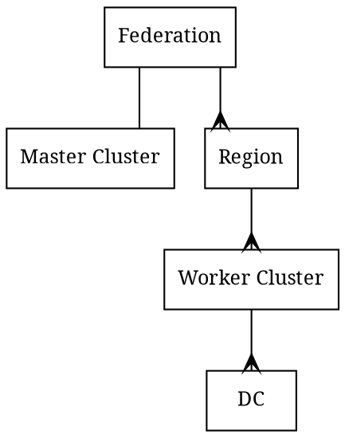
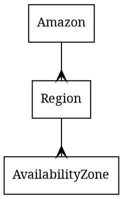

# Federation

- Client requests go to clusters (Master or Worker)
- Cluster can span few datacenters
  - AKA `Stretched cluster`
  - See also links in [ha.md](ha.md)

# Amazon

- Each Region is completely independent
- Each Availability Zone is isolated, but the Availability Zones in a Region are connected through low-latency links

|  Amazon | Heeus     |
|:-------:|:---------:|
| Amazon     |Federation |
| Region     |Region     |
| Avail. Zone| Cluster   |

# Links

- https://docs.aws.amazon.com/AWSEC2/latest/UserGuide/using-regions-availability-zones.html

