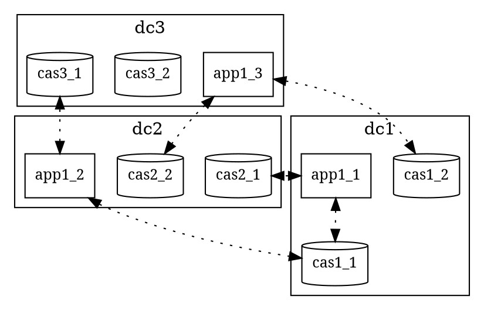
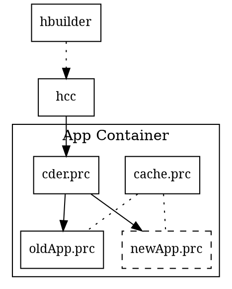
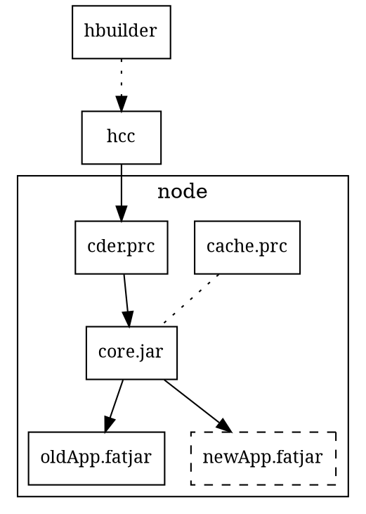
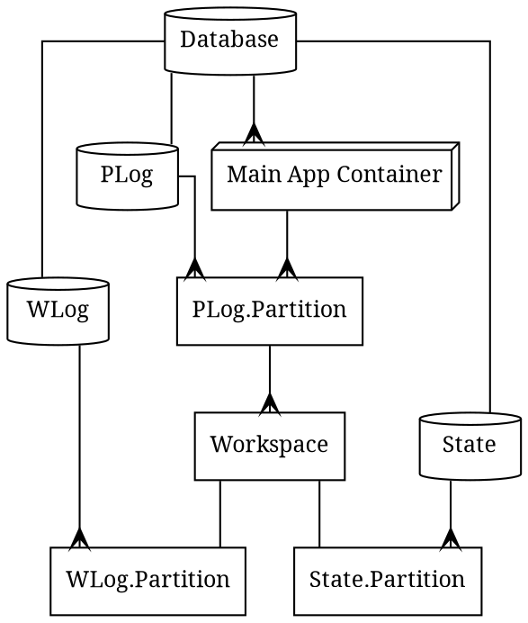
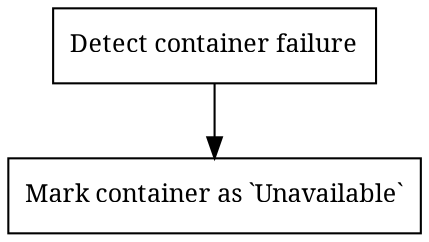
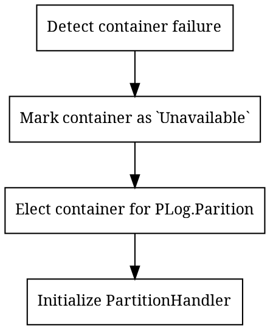

# Datacenter HA

# App Update

- Zero Downtime
    - Clients do not get server errors (e.g. 503)
    - Latency growth MUST be minimized
- Persistent Cache

- cache.prc is a separate process which shares cache memory with apps
- Own memory manager
  - https://github.com/couchbase/go-slab 

## App Update: Java

- Cache can be inside `core.jar`, but  will be lost during core.jar update

# Node/Container Failure

## Distributed Request Handling

## Partitioned  Request Handling

# Links 

- [Дешевле, надежнее, проще / Александр Христофоров (Одноклассники)](https://youtu.be/Hs2txKgnpAk?t=130)
- [Maintaining Consistency Across Data Centers(Randy Fradin, BlackRock) | Cassandra Summit 2016](https://www.slideshare.net/DataStax/maintaining-consistency-across-data-centers-randy-fradin-blackrock-cassandra-summit-2016)
  - Maintaining Consistency Across Data Centers or: How I Learned to Stop Worrying About WAN Latency Randy Fradin BlackRock
  - Challenge 1: Latency With all that latency on each operation, isn’t performance terrible? 
  - Actually, this wasn’t such a problem: 
  - 10ms+ latency per operation is acceptable for many apps 
  - Minimize use of sequential operations 
  - High throughput still achievable

