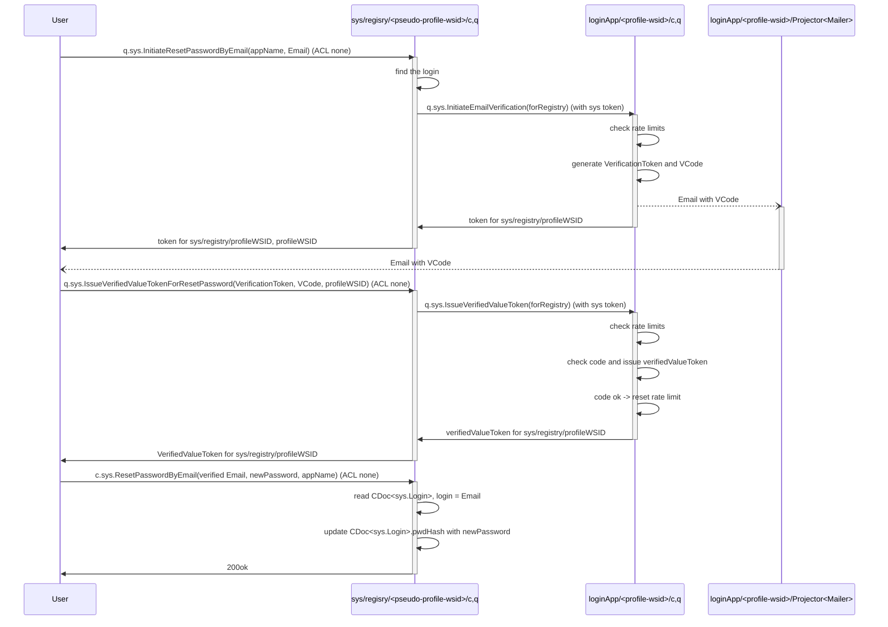

## Motivation
- As a user I want to reset password so that I can continue working with my account

## Principles
- password reset operation is secured by 6-digit verification code sent to the email
- code is correct -> it is possible to reset password for an unlimited amount of times
- code is wrong -> tries amount is limited to 3 times per hour per profile
- passord is reset for `CDoc<sys.Login>`, not for `CDoc<sys.UserProfile>`
- `c.sys.ResetPasswordByEmail` has no rate limits

## Functional design
- `sys/registry/pseudoProfileWSID/q.sys.InitiateResetPasswordByEmail`
  - null auth
  - `loginApp/profileWSID/q.sys.InitiateEmailVerification` is called under the hood with `forRegistry` mark with system auth
- `sys/refgistry/pseudoProfileWSID/q.sys.IssueVerifiedValueTokenForResetPassword`
  - null auth
  - `loginApp/profileWSID/q.sys.IssueVerfiedValueToken` is called under the hood with `forRegistry` mark with system auth
- `sys/registry/pseudoProfileWSID/c.sys.ResetPasswordByEmail`
  - null auth

## Technical design
Notes:
- `c.sys.ResetPasswordByEmail` called at pseudo profile because `CDoc<sys.Login>` is located there
- `q.sys.InitiateEmailVerification` should be called at login's app:
  - profileWSID exists at the login's app
  - we call `sys/registry/profileWSID/q.sys.InitiateEmailVerification`
  - we should get "workspace not inizalized error" **but** we do not because query processor currently does not checks that
  - we got "workspace is not initialized error" when `c.sys.SendEmailVerification` because command processor checks that
  - conclusion - should call `loginApp/profileWSID/q.sys.InitiateEmailVerification`
- `q.sys.IssueVerifiedValueToken` should also be called at loginApp because it accepts a token issued for `loginApp`, not for `sys/registry`

## Limitations
- //TODO issued Principal Tokens are kept valid after password reset
- //TODO works only if Login == Email
- //TODO it is possible to reset password for an unlimited amount of times when the verified value token is still valid (10 minutes)
- //TODO WSID where the token is using must  be the same the token is issued for. To be done in [Check WSID on Verified Field value apply](https://dev.heeus.io/launchpad/#!25720)

## Appendix: Best practices
### Google
- account with phone (not confirmed) and an alternative email
  - never logged in
    - via alternative email
      - enter the alternative email
        - wrong -> error
      - 6-digit code is sent to the alternative email
      - wrong code enter for 3 times -> "Too many retires. Try again later"
    - via phone
      - asked the telephone number
          -  wrong -> error
      -  6-digit code is sent via SMS
      -  3 times entered wrong -> Too many retries. Try again later
      -  "I don't have my phone" button pressed
          - enter the alternative email
            - wrong -> error
          - 6-digit code is sent to the email
          - Try another way button pressed -> "You did not provided enough info to restore".
  - logged in, then logged out
    - "Forgot password" button pressed
    - "Try anoter way" button pressed
    - "You could change the password because you have already log in on this device". Suggested to enter a new password w\o any codes
- account w\o phone and alternative email
  - "forgot password" pressed for the account that has neither phone nor alternative email -> "failed to ensured that it is your account". Impossible reset the password.

### Amazon
- aked for 6-digit code sent to the email, then suggested to enter a new password
- wrong code entered for 10 times -> stop to ask the code, back to the form with email input box. I.e. the sent code becomes obsoleted after 10 tries.
