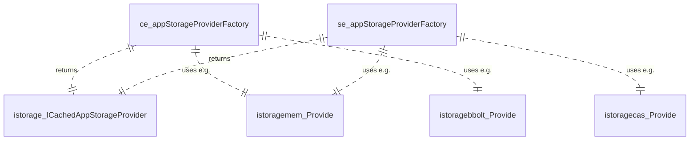

### Abstract
As a Heeus Architect I want to have a clear description of how, where and from Heeus CE and SE are built

### Components
```mermaid
erDiagram
Heeus_CE_artifact ||..|| heeus_ce_repo : "built in"
Heeus_SE_artifact ||..|| heeus_se_repo : "built in"
heeus_ce_repo ||..|| ce_main : has
ce_main ||..|| ce_appStorageProviderFactory : passes
ce_appStorageProviderFactory ||..|| core_cmd_ce-se_CLI : to


heeus_se_repo ||..|| se_main : has
se_main ||..|| se_appStorageProviderFactory : passes
se_appStorageProviderFactory ||..|| core_cmd_ce-se_CLI : to
core_cmd_ce-se_CLI ||..|| WiredServer: wires
```


