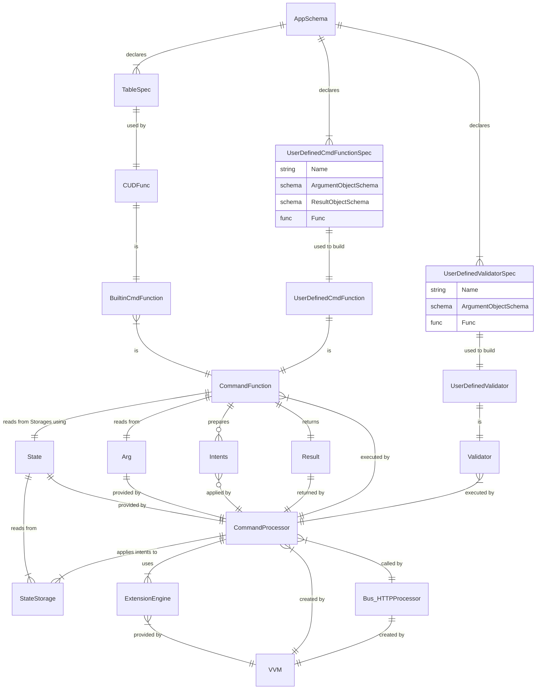

# Command Processor
## Architecture

## Notes
- Command Function can only generate IIntents of one type (CUDs).
- `cuds: [...]` is not a part of ANY command anymore
- `c.sys.CUD` is not available anymore as a separate function

## Rest API
- Every App's Table is represented by separate Rest API resource which internally executes sys.CUD command:
    - POST `/api/rest/<wsid>/<table_qname>`
        - batch operations supported: request is a Record OR array of Records;
        - record may include child records;
    - GET `/api/rest/<wsid>/<table_qname>/<id>`
        - a Record with it's child records is returned (ex. CDoc);
    - PATCH `/api/rest/<wsid>/<table_qname>/<id>`
        - record may include child records;
- Every App's Command represented by separate Rest API resource
    - POST `/api/rest/<wsid>/<cmd_qname>`

