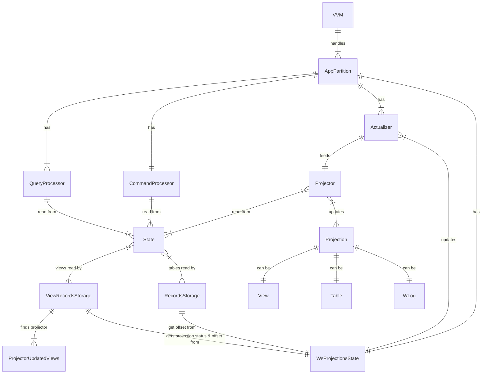

## Abstract

Consistency handling design

## Motivation
One of the main challenges in CQRS systems is eventual consistency of the Read Model.
[Microsoft Azure Documentation](https://learn.microsoft.com/en-us/azure/architecture/patterns/cqrs):

> Eventual consistency. If you separate the read and write databases, the read data may be stale. The read model store must be updated to reflect changes to the write model store, and it can be difficult to detect when a user has issued a request based on stale read data.

Scenarios:

- Client wants to read ASAP, consistency doesn't matter
  - Examples:
    - Read dashboard figures
    - Read journal (WLog) for building reports
- Client wants to read the data which reflects the last operation made by Client
  - New operations from other clients can be seen
  - Examples:
    - Read transaction history after making an order or payment (not used atm)
- Client wants the data snapshot
  - Examples:
    - Read the BO state
    - Read the TablesOverview
- Read by [Projectors](./inv-projector-reads.md)
- Read by [Command Functions](./inv-cmdfunction-reads.md) and Validators

### Literature review

Based on [inv-articles-consistency.md](inv-articles-consistency.md)

## Terms
- Consistency (Согласованность)
    - Explains when the Model reflects changes made by command
    - Объясняет в какой момент модель отобразит изменения в результате выполнения команды
- [Write model](../README.md#event-sourcing--cqrs) in Heeus
    - Represented by PLogPartition
    - Strongly consistent (строго согласована): you are guaranteed that the data is up-to-date imediately after [command is handled](https://10consulting.com/2017/10/06/dealing-with-eventual-consistency/)
- [Read Model](../README.md#event-sourcing--cqrs) in Heeus
    - Represented by the set of [Internal Projections](../projectors/README.md#terms): Views, Records, WLog
    - Eventually consistent (Согласована в конечном итоге): you are guaranteed that the Read Model will be (sometime) updated by Projectors with the events from PLogPartition
- Event Offset, Offset (Смещение события)
    - Uniquiely identifies the event
- Projection version, Version
    - The offset of the last event, applied to the projection
- Last offset
    - Offset of the last event, handled by Command Processor

## Principles
- Read operations support `Isolation Level` as the tool for working with the eventual consistency of the Read Model
- The following isolation levels are supported by Heeus for reading operations:

|       Isolation Level     |  Projection Versions  |  Same Projection Versions* | Same Rows Versions |
| ------------------------- | --------------------- | -------------------------- | ------------------ |
|   Read Uncommitted        |         Any           |             No             |         No         |
|   Read Committed          |     >= Offset**       |             No             |         Yes        |
|   Snapshot                |     >= Offset**       |             Yes            |         Yes        |

*When the result combines data from more than one projection

**Offset - specified by read operation (or the last offset if not specified)

- Isolation levels in components:
    - QueryProcessor: isolation level defined by request, one of:
        - Read Uncommitted (default)
        - Read Committed
        - Snapshot
    - Actualizer
        - Always reads from own Projection with "Read Uncommited"
        - Always reads from other Projections with "Read Committed" with the offset = `current event offset`.
    - Command Processor
        - Read from Projections with "Read Committed" with the offset = `previous event offset`.

## Concepts

- AppPartition has `WsProjectionsState` component which keeps the current statuses and versions of workspace projections.
    - Status of the projection (idle, raw, active) is needed to provide [Lazy Projections](../projectors/lazy-projections.md).
AppPartition
- Intents for projections are applied in batches, One batch per workspace. The projection versions are increased in the same batch. Version in `WsProjectionsState` is updated when the intents are applied for this workspace.

### WsProjectionsState: Architecture

### Common
- WsProjectionsState is used by State to:
    - Provide the requested Isolation Level for Read operations;
    - Start initializing [Lazy Projections](../projectors/lazy-projections.md);

### Query Processor
- Isolation Level specified by header `Isolation-Level`. Possible values:
    - `read-uncommitted`
    - `read-committed[;offset]`
    - `snapshot[;offset]`
- Configures State to use the Isolation Level, as specified in request
- Error 503 when reading from inconsistent projection

### Projectors & Actualizers

- All actualizers are asynchronous
- Projector's attempt to read from inconsistent projection throws Error 503;
- Actualizer updates WsProjectionsState(Status[IDLE, RAW, ACTIVE], WlogOffset) when the intents and projections offsets are flushed
- WsProjectionsState is used by Actualizer to:
    - Handle idempotency out of the box (do not feed event if it has been already fed);
- Projector declares:
    - Which VIEWS it updates. This is needed to find out projection state in WsProjectionsState by the View QName, State is going to read from (`ProjectorUpdatedViews`).
    - Which VIEWS it reads from. This is needed to avoid concurrent reads. Example:
        - Projector1 reads from V2, updates V1
        - Projector2 reads from V1, updates V2
        - This causes deadlock, because reading from V2 requires V2 to be updated by the same event, which cannot be done until reading from V1 is done.

### Command Processor
- Command Processor always reads with Isolation Level "Read Commited", and offset = last WLog Offset, means that the projection must be updated with previous event for this workspace.
- If a projection is not consistent, 503 is thrown immediately.
- Commands Processor do not inserts records. It only saves validated `CUDs` in the event (a special CUD storage?). The records are inserted/updated by system-defined projector.

## All Actualizers are Asynchronous
A new notification mechanism between CP and AA, ref. https://github.com/heeus/inv-wasm/tree/master/20220828-sync-projectors

## See Also
- [Isolation levels in SQL Server](https://www.sqlservercentral.com/articles/isolation-levels-in-sql-server)
- [Understanding the isolation levels](https://learn.microsoft.com/en-us/sql/connect/jdbc/understanding-isolation-levels?view=sql-server-ver16)
- [Query Processor](../queryprocessor/)
