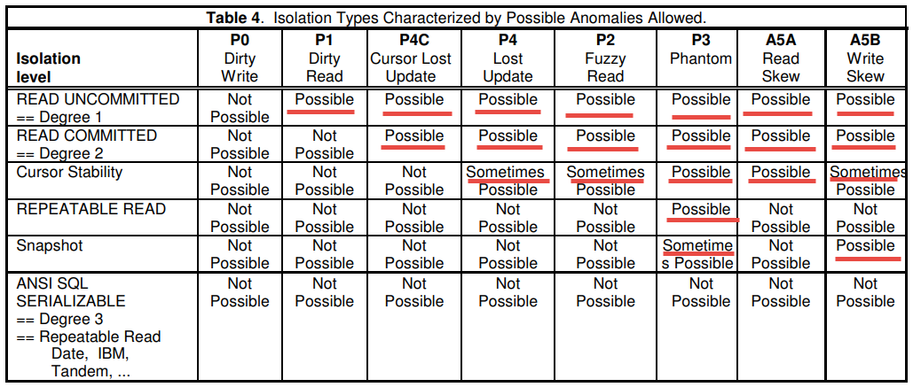
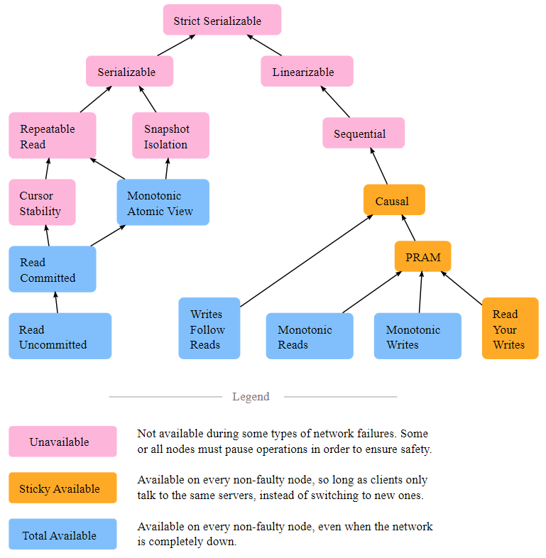

## Consistency, Isolation and Transactions in Heeus

Heeus design uses CQRS design pattern where different data models are used for writes (by Commands) and reads (by Queries) ([HEEUSCQRS](../README.md#event-sourcing--cqrs)).

Microsoft states [[MSFTCQRS](https://docs.microsoft.com/en-us/azure/architecture/patterns/cqrs)] that one of the challenges in CQRS systems is eventual consistency of the Read Model:

> Eventual consistency. If you separate the read and write databases, the read data may be stale. The read model store must be updated to reflect changes to the write model store, and it can be difficult to detect when a user has issued a request based on stale read data
>
> Microsoft, CQRS pattern

This paper:

- Defines User Stories to be satisfied
- Analyzes existing literature about Consistency and Isolation
- Defines terms
- Proposes the way for handling Transactions, Consistency and Isolation in Heeus

## Content

- [User Stories](#user-stories)
- [Literature](#literature)
  - [ANSI SQL-92](#ansi-sql-92)
  - [A Critique of ANSI SQL Isolation Levels](#a-critique-of-ansi-sql-isolation-levels)
  - [Prof. Abadi: Introduction to Transaction Isolation Levels](#prof-abadi-correctness-anomalies-under-serializable-isolation)
  - [Prof. Abadi: Correctness Anomalies under Serializable Isolation](#prof-abadi-correctness-anomalies-under-serializable-isolation)
  - [Consistency levels in Azure Cosmos DB](#consistency-levels-in-azure-cosmos-db)
  - [jepsen.io: Consistency Models](#jepsenio-consistency-models)

## User Stories

We beleive that User is interested in the following scenarious:

**Read ASAP**, consistency doesn't matter
- Client not always see its own writes or wites from other clients
- Examples: 
  - Read dashboard figures
  - Read journal (WLog) for building reports

**Read fresh data**
- Client sees its own writes and writes from other clients which happened before the read transaction stared
  - Note that exact clocks synchronization is impossible
- Client sees writes which commited during read transaction
- In fact this is ANSI READ COMMITED as defined in [ANSISQLCRIT]
- Examples: 
  - Read transaction history after making an order or payment (not used atm)

**Read data snapshot**
- Examples:
  - Read the BO state
  - Read the TablesOverview (//FIXME Why we need a snapshot here?)
  - Read a complex document which consists of many records
    - ? Supported by KV-driver since such documents must be kept in one partition
  - Data enrichment (join with classifiers)
  - Backup


## Literature

Draft literature overview has been done earlier in [MGINVART](inv-articles-consistency.md), next sections analyzes in more details:

- [ANSISQL92](https://www.contrib.andrew.cmu.edu/~shadow/sql/sql1992.txt), [ANSI X3.135-1992, American National Standard for Information Systems — Database Language — SQL, November, 1992]
- [ANSISQLCRIT](https://arxiv.org/ftp/cs/papers/0701/0701157.pdf), A Critique of ANSI SQL Isolation Levels, Jun 1995, Microsoft Research
- [ABAISO](http://dbmsmusings.blogspot.com/2019/05/introduction-to-transaction-isolation.html), D. Abadi, Introduction to Transaction Isolation Levels, blogspot.com, May 2019
- [ABACASER](https://dbmsmusings.blogspot.com/2019/06/correctness-anomalies-under.html), D. Abadi, Correctness Anomalies Under Serializable Isolation, blogspot.com, June 2019
- [COSMOS](https://learn.microsoft.com/en-us/azure/cosmos-db/consistency-levels), Microsoft, Consistency levels in Azure Cosmos DB, 2022, microsoft.com
- [JEPSEN](https://jepsen.io/consistency), Consistency Models, jepsen.io, 2022

## ANSI SQL-92

Source: [[ANSISQL92]](https://www.contrib.andrew.cmu.edu/~shadow/sql/sql1992.txt), ANSI X3.135-1992, American National Standard for Information Systems — Database Language — SQL, November, 1992.

The isolation level specifies the kind of phenomena that can occur during the execution of concurrent SQL-transactions. The following phenomena are possible:
```
         1) P1 ("Dirty read"): SQL-transaction T1 modifies a row. SQL-
            transaction T2 then reads that row before T1 performs a COMMIT.
            If T1 then performs a ROLLBACK, T2 will have read a row that was
            never committed and that may thus be considered to have never
            existed.

         2) P2 ("Non-repeatable read"): SQL-transaction T1 reads a row. SQL-
            transaction T2 then modifies or deletes that row and performs
            a COMMIT. If T1 then attempts to reread the row, it may receive
            the modified value or discover that the row has been deleted.

         3) P3 ("Phantom"): SQL-transaction T1 reads the set of rows N
            that satisfy some <search condition>. SQL-transaction T2 then
            executes SQL-statements that generate one or more rows that
            satisfy the <search condition> used by SQL-transaction T1. If
            SQL-transaction T1 then repeats the initial read with the same
            <search condition>, it obtains a different collection of rows.
```

Table 9, "SQL-transaction isolation levels and the three phenomena" specifies the phenomena that are possible and not possible for a given isolation level.
```
         _Level__________________P1_________P2_________P3_______________________
        | READ UNCOMMITTED     | Possible | Possible | Possible                 |
        |                      |          |          |                          |
        | READ COMMITTED       | Not      | Possible | Possible                 |
        |                      | Possible |          |                          |  
        |                      |          |          |                          |  
        | REPEATABLE READ      | Not      | Not      | Possible                 |
        |                      | Possible | Possible |                          |
        |                      |          |          |                          |
        | SERIALIZABLE         | Not      | Not      | Not Possible             |
        |                      | Possible |Possible  |                          |
```

> - The execution of concurrent SQL-transactions at isolation level SERIALIZABLE is guaranteed to be serializable
> - A **serializable execution** is defined to be an execution of the operations of concurrently executing SQL-transactions that produces the same effect as some serial execution of those same SQL-transactions

(!!!) Is is curious that standart claims:
```
         Significant new features are:
         ...
         15)Support for transaction consistency levels
         ...
```

But "consistency levels" further are not mentioned.

## A Critique of ANSI SQL Isolation Levels

Source: [[ANSISQLCRIT](https://arxiv.org/ftp/cs/papers/0701/0701157.pdf)], A Critique of ANSI SQL Isolation Levels, Jun 1995, Microsoft Research, 
- Science paper by Microsoft, Sybase, UMass (University of Massachusetts Amherst)

**Phenomenon** and **anomalies**:

> The concept of a phenomenon is not explicitly defined in the ANSI specifications, but the specifications suggest that phenomena are action subsequences that may lead to anomalous (perhaps nonserializable) behavior. 

Phenomena/anomalies which are prevented by isolation are shown using notation described in [ANSISQLCRIT]:

> Histories consisting of reads, writes, commits, and aborts can be written in a shorthand notation: “w1[x]” means a write by transaction 1 on data item x (which is how a data item is “modified’), and “r2[x]” represents a read of x by transaction 2. Transaction 1 reading and writing a set of records satisfying predicate P is denoted by r1[P] and w1[P] respectively. Transaction 1’s commit and abort (ROLLBACK) are written “c1” and “a1”, respectively. 

Phenomena defined by [ANSISQL92] are called "anomalies":

- **A1**: w1[x]...r2[x]...(a1 and c2 in either order)
- **A2**: r1[x]...w2[x]...c2...r1[x]...c1
- **A3**: r1[P]...w2[y in P]...c2...r1[P]...c1

The broad interpretations of anomalies are suggested, extra phenomenon are added and the paper argues that this is "a must":

- P0 (Dirty Write)
- P1 (Dirty Read)
- P2 (Fuzzy or  Non-Repeatable Read)
- P3 (Phantom)
- P4 (Lost Update)
- P4C (Cursor Lost Update)
- A5A (Read Skew)
- A5B (Write Skew)

### P0 (Dirty Write)

> w1[x]...w2[x]...(c1 or a1)

> One reason why Dirty Writes are bad is that they can violate database consistency. For example consider the history w1[x]...w2[x]...w2[y]...c2...w1[y]...c1. T1's changes to y and T2's
to x both “survive”. If T1 writes 1 in both x and y while T2 writes 2, the result will be x=2, y=1 violating x = y. 


### P1 (Dirty Read)

> A1: w1[x]...r2[x]...(a1 and c2 in either order)

> P1: w1[x]...r2[x]...(c1 or a1)

> Consider history H1, involving a $40 transfer between bank balance rows x and y, [x=50, y=50]: 

> H1: r1[x=50]...w1[x=10]...r2[x=10]...r2[y=50]...c2...r1[y=50]...w1[y=90]...c1 

- T2 gets an incorrect balance of 60, which never existed: [x=50, y=50]...w1[x=10]...r2[x=10]...r2[y=50]
- History is non-serializable (interesting claim)
- History does not contain any phenomena from [ANSISQL92]
  - A1 requres abort
  - A2 requres double read
  - A3 requires set operation

### P2 (Fuzzy or  Non-Repeatable Read)

> A2: r1[x]...w2[x]...c2...r1[x]...c1

> P2: r1[x]...w2[x]...(c1 or a1)

> Similar arguments show that P2 should be taken as the ANSI intention rather than A2. A history that discriminates these two interpretations is:

> H2: r1[x=50]...r2[x=50]...w2[x=10]...r2[y=50]...w2[y=90]...c2...r1[y=90]...c1

- T1 gets an incorrect balance of 140: [x=50, y=50]...r1[x=50]...w2[y=90]...r1[y=90]
- H2 is non-serializable 
- History does not contain any phenomena from [ANSISQL92]

### P3 (Phantom)

> A3: r1[P]...w2[y in P]...c2...r1[P]...c1

> P3: r1[P]...w2[y in P]...(c1 or a1)

- Same rationale as for P2
- w2[y in P]: insert, delete an element which satisfies the P condition, or update an element so that it satisfies the P condition

### P4 (Lost Update)

> r1[x=1]...w2[x=10]...w1[x=1+1]...c1

> However, forbidding P2 also precludes P4, since w2[x] comes after r1[x] and before T1 commits or aborts. Therefore the anomaly P4 is useful in distinguishing isolation levels intermediate in strength between READ COMMITTED and REPEATABLE READ.
- READ COMMITTED << Cursor Stability << REPEATABLE READ 
  - `<<` means "weaker" (prevents less anomalies)
- We beleive an example is incorrect since Dirty Write occurs here, should be: r1[x=1]...w2[x=10]...c2...w1[x=1+1]...c1
  - See also discussion [here](https://stackoverflow.com/questions/72850415/isolation-level-difference-between-dirty-write-and-lost-update)


### P4C (Cursor Lost Update)

> rc1[x=1]...w2[x=10]...w1[x=1+1]...c1

- Prevented by non-ANSI Cursor Stability
  - Pros: _short duration lock_ rather then _long duration lock_
- Only value under cursor is protected
- Perhaps should be: rc1[x=1]...w2[x=10]...c2...w1[x=1+1]...c1
  - Otherwise Dirty Write occurs
- Note that this is possible: rc1[x]...rc1[y]...w2[x]...c2...w1[y]...c1

### A5A (Read Skew)

> r1[x]...w2[x]...w2[y]...c2...r1[y]...(c1 or a1)

- Incosistent pair x,y read by T1

> Clearly neither A5A nor A5B could arise in histories where P2 is precluded, since both A5A and A5B have T2 write a data item that has been previously read by an uncommitted T1. Thus,  henomena A5A and A5B are only useful for distinguishing isolation levels that are below REPEATABLE READ in strength.

### A5B (Write Skew)

> r1[x]...r2[y]...w1[y]...w2[x]...(c1 and c2 occur)

- Incosistent pair x,y written by T1 and T2
- E.g. 
  - constraint x*2 <= y
  - r1[x=3]...r2[y=4]...w1[y=6]...w2[x=2]...c1...c2...[x=2,y=6]


### Isolation Types



Strange things:

- Perhaps it is wrong that A5B is possible within Cursor Stability
- Note that according to this table Snapshot sometimes allows P3 (Phantom) whereas [ANSISQLCRIT] also claims that:
> Perhaps most remarkable of all, Snapshot Isolation has no phantoms (in the strict sense of the ANSI definitions A3)
- The clue may be is that A3 is defined as `r1[P]...w2[y in P]...c2...r1[P]...c1` but the phenomenon to be prevented is (P3):
  - r1[P]...w2[y in P]...(c1 or a1)
- But then P2 should also be "Sometimes Possible"?


## Prof. Abadi: Introduction to Transaction Isolation Levels

Source: [[ABAISO](http://dbmsmusings.blogspot.com/2019/05/introduction-to-transaction-isolation.html)], D. Abadi, Introduction to Transaction Isolation Levels, blogspot.com, May 2019
- Daniel Abadi is the Darnell-Kanal Professor of Computer Science at University of Maryland, College Park
- He is best-known for the development of the storage and query execution engines of the C-Store (column-oriented database) prototype, which was commercialized by Vertica and eventually acquired by Hewlett-Packard in 2011, for his HadoopDB research on fault tolerant scalable analytical database systems which was commercialized by Hadapt and acquired by Teradata in 2014, and deterministic, scalable, transactional, distributed systems such as Calvin which is currently being commercialized by Fauna

> **Database isolation** refers to the ability of a database to allow a transaction to execute as if there are no other concurrently running transactions (even though in reality there can be a large number of concurrently running transactions). The overarching goal is to prevent reads and writes of temporary, aborted, or otherwise incorrect data written by concurrent transactions.

> The key point for our purposes is that we are defining **“perfect isolation”** as the ability of a system to run transactions in parallel, but in a way that is equivalent to as if they were running one after the other. In the SQL standard, this perfect isolation level is called **serializability**.

Notes:

- Preventing ALL anomalies is NOT enough, e.g. Snapshot Isolation prevents all [ANSISQL92] anomalies
- **Perfect Isolation** does NOT require that "earlier" concurrent transaction should be "earlier" in equivalent serial execution

## Prof. Abadi: Correctness Anomalies Under Serializable Isolation

Source: [[ABACASER](https://dbmsmusings.blogspot.com/2019/06/correctness-anomalies-under.html)], D. Abadi, Correctness Anomalies Under Serializable Isolation, blogspot.com, June 2019

> In the good old days of having a “database server” which is running on a single physical machine, serializable isolation was indeed sufficient, and database vendors never attempted to sell database software with stronger correctness guarantees than SERIALIZABLE. However, **as distributed and replicated database systems have started** to proliferate in the last few decades, **anomalies and bugs have started to appear** in applications even when running over a database system that guarantees serializable isolation. As a consequence, database system vendors **started to release systems with stronger correctness guarantees than serializable isolation**, which promise a lack of vulnerability to these newer anomalies. In this post, we will discuss several well known **bugs and anomalies in serializable distributed database systems**, and modern correctness guarantees that ensure avoidance of these anomalies. 


[YB] give the following definition of the One Copy Serializability (1SR):

> The **One Copy Serializability** [7] is the highest correctness criterion for replica control protocols... In order to achieve this correctness criterion, it is required that interleaved execution of transactions on replicas be equivalent to serial execution of those transactions on one copy of a database.

[ABACASER] introduces new anomalies which can be found even in 1SR-systems and attribute them as follows:

> The next few sections describe some forms of time-travel anomalies that occur in distributed and/or replicated systems, and the types of application bugs that they may cause.

Two of these anomalies, though, may occur even in Heees CE with storage backed by bboltdb driver, therefore we do not link these anomalies  solely with "distributed and/or replicated systems"

### Immortal Write

> ru: Бессмертная Запись

Anomaly:
- Real-time: w1[x=Daniel]...c1...w2[x=Danny]...c2...w3[x=Danger]...c3
- Serial order: w1[x=Daniel]...w3[x=Danger]...w2[x=Danny]
  - w3 goes back in time (time-travel, анахронизм, anachronism)

Notes:
- Can be caused by async replication AND Unsynchronized Clock problem
- System can decide to do that due to other reasons, since this does not violate serializability guarantee
- When the “Danny” transaction and/or the other name-change transactions also perform a read to the database as part of the same transaction as the write to the name, the ability to time-travel without violating serializability becomes much more difficult. But for **“blind write” transactions** such as these examples, time-travel is **easy to accomplish**.

### Stale Read

> ru: Несвежее Чтение

Anomaly:
- Real-time: w1[x=50]...с1...w2[x=0]...c2...r3...c3
- Serial order: w1[x=50]...r3[x=50]...w2[x=0]
  - r3 goes back in time (time-travel)

Reasons:
1. Async replication (distributed)
2. Unsynchronized Clock problem (distributed)
3. Projection update delay (single node)
4. System can decide to do that due to other reasons

### Causal Reverse

> ru: Обратная Причинность, "реверс козла"

Anomaly (exchange x and y):
- Real-time: [x=1000000, y=0]...r1[x, y]...w2[x=0]...c2...w3[y=1000000]...c3...с1
- Serial order: w3[y=1000000]...r1[x=1000000, y=1000000]...w2[x=0]

"Real-life" scenario:
  - User has 1000000 on accountx and 0 on accounty
  - User gets 1000000 cash from accountx
  - User puts 1000000 cash to accounty

One example of a distributed database system that allows the causal reverse is CockroachDB (aka CRDB):
- CockroachDB partitions a database such that each partition commits writes and synchronously replicates data separately from other partitions
- Each write receives a timestamp based on the local clock on one of the servers within that partition
- In general, it is impossible to perfectly synchronize clocks across a large number of machines, so CockroachDB allows a maximum clock skew for which clocks across a deployment can differ
- It is possible in CockroachDB for a transaction to commit, and a later transaction to come along (that writes data to a different partition), that was caused by the earlier one (that started after the earlier one finished), and still receive an earlier timestamp than the earlier transaction.
- This enables a read (**in CockroachDB’s case, this read has to be sent to the system before the two write transactions**) to potentially see the write of the later transaction, but not the earlier one

### Preventing Serial Anomalies

[ABACASER] gives the following classification of serializable systems.

> In distributed and replicated database systems, this additional guarantee of “no time travel” on top of the other serializability guarantees is non-trivial, but has nonetheless been accomplished by several systems such as FaunaDB/Calvin, FoundationDB, and Spanner. This high level of correctness is called **strict serializability**

**Strong Session Serializable** systems guarantee strict serializability of transactions within the same session, but otherwise only one-copy serializability
- Implementation example: "Sticky session", all requests routed to the same node

**Strong Write Serializable** systems guarantee strict serializability for all transactions that insert or update data, but only one-copy serializability for read-only transactions
- Implementation example: Read-only replica systems where all update transactions go to the master replica which processes them with strict serializability

**Strong Partition Serializable** systems guarantee strict serializability only on a per-partition basis
- Data is divided into a number of disjoint partitions
- Within each partition, transactions that access data within that partition are guaranteed to be strictly serializable
- (!!!) But otherwise, the system only guarantees one-copy serializability

|System Guarantee|Dirty read|Non-repeatable read|Phantom Read|Write Skew|Immortal write|Stale read|Causal reverse|
|--- |--- |--- |--- |--- |--- |--- |--- |
|READ UNCOMMITTED|Possible|Possible|Possible|Possible|Possible|Possible|Possible|
|READ COMMITTED|-|Possible|Possible|Possible|Possible|Possible|Possible|
|REPEATABLE READ|-|-|Possible|Possible|Possible|Possible|Possible|
|SNAPSHOT ISOLATION|-|-|-|Possible|Possible|Possible|Possible|
|SERIALIZABLE / ONE COPY SERIALIZABLE / STRONG SESSION SERIALIZABLE|-|-|-|-|Possible|Possible|Possible|
|STRONG WRITE SERIALIZABLE|-|-|-|-|-|**Possible**|-|
|STRONG PARTITION SERIALIZABLE|-|-|-|-|-|-|**Possible**|
|STRICT SERIALIZABLE|-|-|-|-|-|-|-|

N/B:
- Almost "triangle matrix" but STRONG WRITE/PARTITION SERIALIZABLE
- Read Skew phenomenon excluded for some reason

## Consistency levels in Azure Cosmos DB

Source: [[COSMOS](https://learn.microsoft.com/en-us/azure/cosmos-db/consistency-levels)], Microsoft, Consistency levels in Azure Cosmos DB, 2022, microsoft.com
- [Уровни согласованности в Azure Cosmos DB](https://learn.microsoft.com/ru-ru/azure/cosmos-db/consistency-levels)
- (!!!) https://github.com/MicrosoftDocs/azure-docs.ru-ru/blob/live/articles/cosmos-db/consistency-levels.md

Сonsistency levels:

- Strong (Сильная)
- Bounded staleness ([baʊndɪd ˈsteɪlnəs], Запаздывание, Ограниченное устаревание, Ограниченная несвежесть)
- Session (Сеанс, Сессионная)
- Consistent prefix ([kənˈsɪstənt ˈpriːfɪks], Согласованный префикс)
- Eventual (Итоговая, Светлое будущее)

### Strong Consistency

- The reads are guaranteed to return the most recent committed version of an item
- A client never sees an uncommitted or partial write.


### Bounded Staleness Consistency

It is kind of "eventual consistency" with limited "eventuality".

- The reads might lag behind writes by at most "K" versions (that is, "updates") of an item or by "T" time interval, whichever is reached first
- Bounded staleness offers total global order outside of the "staleness window"
- Bounded staleness is frequently chosen by globally distributed applications that expect low write latencies but require total global order guarantee. 
- When a client performs read operations within a region that accepts writes, the guarantees provided by bounded staleness consistency are identical to those guarantees by the strong consistency


### Session Consistency

In session consistency, within a single client session reads are guaranteed to honor:

- consistent-prefix
- monotonic reads 
- monotonic writes
- read-your-writes
- write-follows-reads
- ref. [JEPSEN](https://jepsen.io/consistency) for some definitions

This assumes a single "writer" session or sharing the session token for multiple writers


### Consistent Prefix Consistency

> This guarantee says that if a sequence of writes happens in a certain order, then anyone reading those writes will see them appear in the same order.
> 
> [[CLEPP]  Martin Kleppmann, Designing Data-Intensive Applications](https://ebrary.net/64710/computer_science/consistent_prefix_reads)


### Eventual Consistency


## jepsen.io: Consistency Models

Source: [[JEPSEN](https://jepsen.io/consistency)], Consistency Models, jepsen.io, 2022
- > Jepsen is an effort to improve the safety of distributed databases, queues, consensus systems, etc. We maintain an open source software library for systems testing, as well as blog posts and conference talks exploring particular systems’ failure modes
- > [2020-12-23](https://jepsen.io/analyses/scylla-4.2-rc3): Together with the ScyllaDB team, we found seven problems in Scylla, including lightweight transaction (LWT) split-brain in healthy clusters due to a.) incomplete row hashcodes and b.) multiple problems with membership changes. We also identified incomplete or inaccurate documentation, including claims that non-LWT operations were isolated and atomic, and undocumented rules about what kinds of membership operations were legal. Scylla has corrected almost all of these errors via patches and documentation; remaining cases of split-brain appear limited to concurrent membership changes.


[](https://jepsen.io/consistency)

On the left:

- > `x` is a transactional model: operations (usually termed “transactions”) can involve several primitive sub-operations performed in order
- > It is also a multi-object property: operations can act on multiple objects in the system
- > `x` does not impose any real-time, or even per-process constraints. If process A completes write w, then process B begins a read r, r is not necessarily guaranteed to observe w. 

On the right:

- > `x` is a single-object model, but the scope of “an object” varies. Some systems provide linearizability on individual keys in a key-value store; others might provide linearizable operations on multiple keys in a table, or multiple tables in a database—but not between different tables or databases, respectively
- `x` impose some real-time constraints

We can come up with definitions:
- **Isolation**: preventing concurrent transactions execution anomalies
- **Consistency**: preventing serial execution anomalies
  - Remember about "equivalent"

Suddenly (isolation):

- > Read uncommitted is a consistency model which **prohibits dirty writes**, where two transactions modify the same object concurrently before committing
- > Note that read uncommitted **does not impose any real-time constraints**. If process A completes write `w`, then process B begins a read `r`, `r` is not necessarily guaranteed to observe `w`
  - > In fact, a process can fail to observe its own prior writes, if those writes occurred in different transactions
- > Read uncommitted can be totally available: in the presence of network partitions, every node can make progress
  -> See "pathological orderings"
- > Like serializability, read uncommitted allows pathological orderings. For instance, a read uncommmitted database can always return the empty state for any reads, by appearing to execute those reads at time 0. It can also discard write-only transactions by reordering them to execute at the very end of the history, after any reads. Operations like increments can also be discarded, assuming the result of the increment is never observed. Luckily, most implementations don’t seem to take advantage of these optimization opportunities
- Read Commited can see only few effects from previous transaction


### Read Uncommited

- > Read uncommitted is a consistency model which **prohibits dirty writes**, where two transactions modify the same object concurrently before committing
- > P0 (Dirty Write): w1(x)...w2(x)
- > (!!!) Read uncommitted can be totally available: in the presence of network partitions, every node can make progress
- > (!!!) Note that read uncommitted **does not impose any real-time constraints**. If process A completes write `w`, then process B begins a read `r`, `r` is not necessarily guaranteed to observe `w`
- > (!!!) In fact, a process can fail to observe its own prior writes, if those writes occurred in different transactions.
- > (!!!) Like serializability, read uncommitted allows pathological orderings. For instance, a read uncommmitted database can always return the empty state for any reads, by appearing to execute those reads at time 0. It can also discard write-only transactions by reordering them to execute at the very end of the history, after any reads. Operations like increments can also be discarded, assuming the result of the increment is never observed. Luckily, most implementations don’t seem to take advantage of these optimization opportunities.
- ??? Why transaction sees its own writes?

### Read Commited

- > Read committed is a consistency model which strengthens read uncommitted by preventing dirty reads
- > P1 (Dirty Read): w1(x)...r2(x)
- > Read committed can be totally available
- > Note that read committed **does not impose any real-time constraints**...

### Monotonic Atomic View

- > Monotonic atomic view is a consistency model which strengthens read committed by preventing transactions from observing some, but not all, of a previously committed transaction’s effects. Once a write from transaction T1 is observed by transaction T2, then all effects of T1 should be visible to T2. 
- > Monotonic atomic view can be totally available
- > However, it **does not impose any real-time, or even per-process constraints**...

### Cursor Stability

- > Cursor stability is a consistency model which strengthens read committed by preventing lost updates. It introduces the concept of a cursor, which refers to a particular object being accessed by a transaction. Transactions may have multiple cursors. When a transaction reads an object using a cursor, that object cannot be modified by any other transaction until the cursor is released, or the transaction commits
- rc1[x=1]...w2[x=10]...w1[x=1+1]...c1 ([ANSISQLCRIT])
- > Cursor stability cannot be totally available; in the presence of network partitions, some or all nodes may be unable to make progress.
- > However, it **does not impose any real-time, or even per-process constraints**... 

### Repeatable Read

- > Repeatable read is closely related to serializability, but unlike serializable, it allows phantoms: if a transaction T1 reads a predicate, like "the set of all people with the name “Dikembe”, then another transaction T2 may create or modify a person with the name “Dikembe” before T1 commits. Individual objects are stable once read, but the predicate itself may not be
- > P2 (Fuzzy Read): r1(x)...w2(x)
- > Repeatable read cannot be totally available
- > However, it **does not impose any real-time, or even per-process constraints**... 

### Snapshot Isolation

- > It does not impose any real-time constraints. If process A completes write w, then process B begins a read r, r is not necessarily guaranteed to observe w. 
- > Unlike serializability, which enforces a total order of transactions, snapshot isolation only forces a partial order: sub-operations in one transaction may interleave with those from other transactions.
- > The most notable phenomena allowed by snapshot isolation are write skews...
  - r1[x]...r2[y]...w1[y(x)]...w2[x(y)]...(c1 and c2 occur) ([ANSISQLCRIT])
- > ...and a read-only transaction anomaly, involving partially disjoint write sets
- > Note that read committed **does not impose any real-time constraints**...

**Read-only transaction-anomaly**
-  H3: **R2(X0,0) R2(Y0,0)** R1(Y0,0) W1(Y1,20) C1 _R3(X0,0) R3(Y1,20) C3_ **W2(X2,-11) C2** [[FOO](https://www.cs.umb.edu/~poneil/ROAnom.pdf)]
  - Final: Y = 20 and X = -11
  - Two accounts X, Y
  - T2 widraws 10 from X, -1 penalty applied for overdraft (X+Y goes negative)
  - T1 adds 20 to Y
  - Result Y = 20 and X = -11 equals to sequence [T2, T1]
  - Whereas T3 reads Y = 20 and X = 0 which is impossible
- The anomaly that arises in this transaction is that read-only transaction T3 prints out X = 0 and Y = 20, while final values are Y = 20 and X = -11
- See also [stackoverflow](https://stackoverflow.com/questions/68697789/read-only-transaction-anomaly), [johann.schleier-smith.com](https://johann.schleier-smith.com/blog/2016/01/06/analyzing-a-read-only-transaction-anomaly-under-snapshot-isolation.html), [muratbuffalo.blogspot.com](http://muratbuffalo.blogspot.com/2021/12/a-read-only-transaction-anomaly-under.html)

### Serializable

- > Informally, serializability means that transactions appear to have occurred in some total order.
- > Serializability does not require a per-process order between transactions. A process can observe a write, then fail to observe that same write in a subsequent transaction. In fact, a process can fail to observe its own prior writes, if those writes occurred in different transactions.
- > However, it **does not impose any real-time, or even per-process constraints**...

### Strict Serializability

- > Informally, strict serializability (a.k.a. PL-SS, Strict 1SR, Strong 1SR) means that operations appear to have occurred in some order, consistent with the real-time ordering of those operations; e.g. if operation A completes before operation B begins, then A should appear to precede B in the serialization order
- > You can think of strict serializability as serializability’s total order of transactional multi-object operations, plus linearizability’s real-time constraints
- > Alternatively, you can think of a strict serializable database as a linearizable object in which the object’s state is the entire database

### Writes Follow Reads

- If a process reads a value v, which came from a write w1, and later performs write w2, then w2 must be visible after w1
  - Avoids Immortal Write [ABACASER]
- A write operation by a process on a data item x following a previous read operation on x by the same process is guaranteed to take place on the same or a more recent value of x that was read [WIKICONS]
- also known as session causality

### Monotonic Reads

- > if a process performs read r1, then r2, then r2 cannot observe a state prior to the writes which were reflected in r1; intuitively, reads cannot go backwards

### Monotonic Writes

- > if a process performs write w1, then w2, then all processes observe w1 before w

### Read Your Writes

- > Requires that if a process performs a write w, then that same process performs a subsequent read r, then r must observe w’s effects.
- > Note that read your writes does not apply to operations performed by different processes

### PRAM

- > PRAM is exactly equivalent to read your writes, monotonic writes, and monotonic reads.

### Causal Consistency

- > Causal consistency captures the notion that causally-related operations should appear in the same order on all processes—though processes may disagree about the order of causally independent operations.
  - > For example, consider a single object representing a chat between three people, where Attiya asks “shall we have lunch?”, and Barbarella & Cyrus respond with “yes”, and “no”, respectively. Causal consistency allows Attiya to observe “lunch?”, “yes”, “no”; and Barbarella to observe “lunch?”, “no”, “yes”. However, no participant ever observes “yes” or “no” prior to the question “lunch?”
- > Convergent causal systems require that the values of objects in the system converge to identical values, once the same operations are visible. In such a system, users could transiently observe “lunch”, “yes”; and “lunch”, “no”—but everyone would eventually agree on (to pick an arbitrary order) “lunch”, “yes”, “no”.


### Sequential Consistency

- All operations, not just causal-related
- > Informally, sequential consistency implies that operations appear to take place in some total order, and that that order is consistent with the order of operations on each individual process
- Still no real-time constraints

### Linearizability

- Consistent with the real-time ordering
- > Linearizability is one of the strongest single-object consistency models, and implies that every operation appears to take place atomically, in some order, consistent with the real-time ordering of those operations: e.g., if operation A completes before operation B begins, then B should logically take effect after A.
- > Linearizability is a single-object model, but the scope of “an object” varies. Some systems provide linearizability on individual keys in a key-value store; others might provide linearizable operations on multiple keys in a table, or multiple tables in a database—but not between different tables or databases, respectively.
- > (!!!) When you need linearizability across multiple objects, try strict serializability

### Graph

On the left:
- "x" isolation is a transactional model: operations (usually termed “transactions”) can involve several primitive sub-operations performed in order. It is also a multi-object property: operations can act on multiple objects in the system.

## Draft: Consistency

- Workspace Consistency
- Registry - multi-region consistency


## Draft: Client-assisted Consistency

- Each record has a version represented by WLogOffset
- When client reads a record, it gets a WLogOffset
- When client sends a record, it sends a WLogOffset
- If client WLogOffset does not equal current

## References

- [[ABACASER](https://dbmsmusings.blogspot.com/2019/06/correctness-anomalies-under.html)], D. Abadi, Correctness Anomalies Under Serializable Isolation, blogspot.com, June 2019
- [[ABAISO](http://dbmsmusings.blogspot.com/2019/05/introduction-to-transaction-isolation.html)], D. Abadi, Introduction to Transaction Isolation Levels, blogspot.com, May 2019
- [[ANSISQLCRIT](https://arxiv.org/ftp/cs/papers/0701/0701157.pdf)], A Critique of ANSI SQL Isolation Levels, Jun 1995, Microsoft Research
- [[ANSISQL92](https://www.contrib.andrew.cmu.edu/~shadow/sql/sql1992.txt)], [ANSI X3.135-1992, American National Standard for Information Systems — Database Language — SQL, November, 1992]
- [[ANSISQL99](http://web.cecs.pdx.edu/~len/sql1999.pdf)], ANSI/ISO/IEC International Standard (IS) Database Language SQL — Part 2: Foundation (SQL/Foundation) «Part 2»
- [[CLEPP](https://ebrary.net/64591/computer_science/designing_data-intensive_applications_the_big_ideas_behind_reliable_scalable_and_maintainable_syst)], Martin Kleppmann, Designing Data-Intensive Applications: The Big Ideas Behind Reliable, Scalable, and Maintainable Systems, First Edition, March 2017, O'REILLY
- [[COSMOS](https://learn.microsoft.com/en-us/azure/cosmos-db/consistency-levels)], Microsoft, Consistency levels in Azure Cosmos DB, 2022, microsoft.com
- [[FOO](https://www.cs.umb.edu/~poneil/ROAnom.pdf)], Alan Fekete, Elizabeth O'Neil, and Patrick O'Neil, A Read-Only Transaction Anomaly Under Snapshot Isolation, www.cs.umb.edu 
- [[HEEUSCQRS](../README.md#event-sourcing--cqrs)], Heeus, Event Sourcing & CQRS, github.com
- [[JEPSEN](https://jepsen.io/consistency)], Consistency Models, jepsen.io, 2022
- [[MGINVART](inv-articles-consistency.md)], Maxim Geraskin, inv-articles-consistency.md, github.com, Oct 2022
- [[MSFTCQRS](https://docs.microsoft.com/en-us/azure/architecture/patterns/cqrs)], Microsoft, CQRS pattern, microsoft.com
- [[WIKICONS](https://en.wikipedia.org/wiki/Consistency_model)], Consistency model, en.wikipedia.org
- [[YB](https://eprints.soton.ac.uk/262096/1/reft.pdf)], D. Yadav,  M. Butler, Rigorous Design of Fault-Tolerant Transactions for Replicated Database Systems using Event B, School of Electronics and Computer Science University of Southampton
- [[VV](https://arxiv.org/pdf/1512.00168.pdf)], Paolo Viotti, Marko Vukolic, Consistency in Non-Transactional Distributed Storage Systems, arxiv.org, 2016


## See also

- [README-v1.md](README-v1.md)
