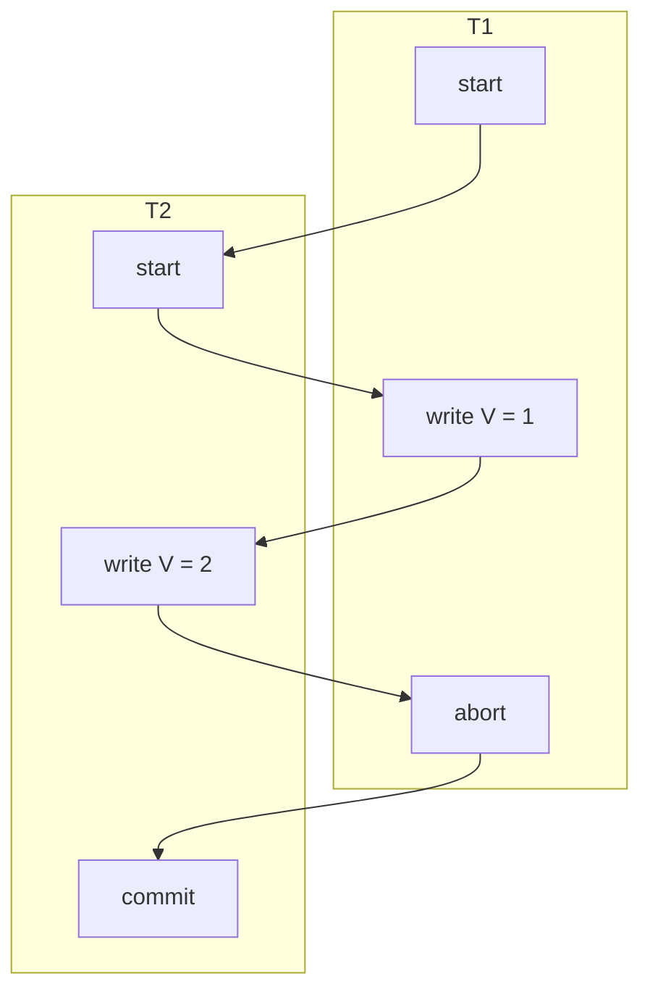

## Abstract

Study existing articles about consistency and isolation

## Articles

In the order of importance:

[CRIT]  [A Critique of ANSI SQL Isolation Levels, Jun 1995, Microsoft Research](https://arxiv.org/ftp/cs/papers/0701/0701157.pdf)
  - Science paper by Microsoft, Sybase, UMass

[COSMOS]   [Microsoft, Consistency levels in Azure Cosmos DB, 2022](https://learn.microsoft.com/en-us/azure/cosmos-db/consistency-levels)
  - microsoft.com: 
  - Very cool set of Consistency levels

[YB] [D. Yadav,  M. Butler, Rigorous Design of Fault-Tolerant Transactions for Replicated Database Systems using Event B, School of Electronics and Computer Science University of Southampton](https://eprints.soton.ac.uk/262096/1/reft.pdf)
- > (!!!) The One Copy Serializability [7] is the highest correctness criterion for
replica control protocols. It is achieved by coupling consistency criteria of one
copy equivalence and providing serializable execution of transactions. In order
to achieve this correctness criterion, it is required that interleaved execution of
transactions on replicas be equivalent to serial execution of those transactions
on one copy of a database.

[ABACAS] [D. Abadi, Correctness Anomalies Under Serializable Isolation, blogspot.com, June 2019](https://dbmsmusings.blogspot.com/2019/06/correctness-anomalies-under.html)
  - Daniel Abadi is the Darnell-Kanal Professor of Computer Science at University of Maryland, College Park.
  - (!!!) A third class of systems are "strong partition serializable" systems that guarantee strict serializability only on a per-partition basis. Data is divided into a number of disjoint partitions. Within each partition, transactions that access data within that partition are guaranteed to be strictly serializable

[ABAISO] [D. Abadi, Introduction to Transaction Isolation Levels, blogspot.com, May 2019](http://dbmsmusings.blogspot.com/2019/05/introduction-to-transaction-isolation.html)

[BD] [Ben Darnell, How to Talk about Consistency and Isolation in Distributed DBs, cockroachlabs.com, Feb 11, 2022](https://www.cockroachlabs.com/blog/db-consistency-isolation-terminology/)
  - cockroachlabs.com

[SEADIC] [Difference of Isolation and Consistency](https://seanhu93.medium.com/difference-of-isolation-and-consistency-cc9ddbfb88e0)
  - seanhu93.medium.com
  - Refers to dbmsmusings.blogspot.com

[SEARISO] [Revisit Database Isolation](https://seanhu93.medium.com/revisit-database-isolation-863b3ca06f5f)
  - (!!!) Nice pics
  - seanhu93.medium.com
  - Lost Update, Dirty Writes, Dirty Reads, Non-Repeatable Reads, Phantom Reads, Write Skew, 
  - I found the original blog from Prof. Daniel Abadi when I was googling some data consistency problems in distributed systems. It was astonishing to find such a great blog 

[SIT] [Ivan Prisyazhnyy, Transaction isolation anomalies, github.io, Jul 2019](https://sitano.github.io/theory/databases/2019/07/30/tx-isolation-anomalies/)
  - sitano.github.io, 
  - Strong math style

[HABR]  [К чему может привести ослабление уровня изоляции транзакций в базах данных](https://habr.com/ru/company/otus/blog/501294)
  - habr.com
  - (!!!) На русском

[FAU] [Demystifying Database Systems, Part 4: Isolation levels vs. Consistency levels](https://fauna.com/blog/demystifying-database-systems-part-4-isolation-levels-vs-consistency-levels)
  - fauna.com/blog
  - ???


## [ABAISO] D. Abadi, Introduction to Transaction Isolation Levels, blogspot.com, May 2019

http://dbmsmusings.blogspot.com/2019/05/introduction-to-transaction-isolation.html

> **Database isolation** refers to the ability of a database to allow a transaction to execute as if there are no other concurrently running transactions (even though in reality there can be a large number of concurrently running transactions). The overarching goal is to prevent reads and writes of temporary, aborted, or otherwise incorrect data written by concurrent transactions.

> The key point for our purposes is that we are defining **“perfect isolation”** as the ability of a system to run transactions in parallel, but in a way that is equivalent to as if they were running one after the other. In the SQL standard, this perfect isolation level is called **serializability**.

### Anomalies in Concurrent Systems

- lost-update anomaly
- dirty-write anomaly
- dirty-read anomaly
- non-repeatable read anomaly
- phantom read anomaly
- write skew anomaly

### Definitions in The ISO SQL Standard

 > There are many, many problems which how the SQL standard defines these isolation levels. Most of these problems were already pointed out in 1995, but inexplicably, revision after revision of the SQL standard have been released since that point without fixing these problems.

> A second (related) problem is that using anomalies to define isolation levels only gives the end user a guarantee of what specific types of concurrency bugs are impossible. It does not give a precise definition of the potential database states that are viewable by any particular transaction. 

> A third problem is that the standard does not define, nor provide correctness constraints on one of the most popular reduced isolation levels used in practice: snapshot isolation 

> A fourth problem is that the SQL standard seemingly gives two different definitions of the SERIALIZABLE isolation level. First, it defines SERIALIZABLE correctly: that the final result must be equivalent to a result that could have occured if there were no concurrency. But then, it presents the above table, which seems to imply that as long as an isolation level does not allow dirty reads, non-repeatable reads, or phantom reads, it may be called SERIALIZABLE. 

## [ABACAS] [D. Abadi, Correctness Anomalies Under Serializable Isolation, blogspot, 2019]

- https://dbmsmusings.blogspot.com/2019/06/correctness-anomalies-under.html
- https://fauna.com/blog/demystifying-database-systems-correctness-anomalies-under-serializable-isolation


> (!!!) As long as particular transaction code is correct in the sense that if nothing else is running at the same time, the transaction will take the current database state from one correct state to another correct state (where “correct” is defined as not violating any semantics of an application), then serializable isolation will guarantee that the presence of concurrently running transactions will not cause any kind of race conditions that could allow the database to get to an incorrect state.


> In the good old days of having a “database server” which is running on a single physical machine, serializable isolation was indeed sufficient, and database vendors never attempted to sell database software with stronger correctness guarantees than SERIALIZABLE. However, **as distributed and replicated database systems have started** to proliferate in the last few decades, anomalies and bugs have started to appear in applications even when running over a database system that guarantees serializable isolation. As a consequence, database system vendors started to release systems with **stronger correctness guarantees than serializable isolation**, which promise a lack of vulnerability to these newer anomalies. In this post, we will discuss several well known **bugs and anomalies in serializable distributed database systems**, and modern correctness guarantees that ensure avoidance of these anomalies. 

### What does “serializable” mean in a distributed/replicated system?


Rony Attar, Phil Bernstein, and Nathan Goodman expanded the concept of serializability in 1984 to define correctness in the context of replicated systems. The basic idea is that all the replicas of a data item behave like a single logical data item. When we say that a concurrent execution of transactions is “equivalent to processing them in a particular serial order”, this implies that whenever a data item is read, the value returned will be the most recent write to that data item by a previous transaction in the (equivalent) serial order --- no matter which copy was written by that write. In this context “most recent write” means the write by the closest (previous) transaction in that serial order. In our example above, either the withdrawal in Europe or the withdrawal in the US will be ordered first in the equivalent serial order. Whichever transaction is second --- when it reads the balance --- it must read the value written by the first transaction. Attar et. al. named this guarantee “one copy serializability” or “1SR”, because the isolation guarantee is equivalent to serializability in an unreplicated system with “one copy” of every data item.

NB: See also: [YB]

The next few sections describe some forms of time-travel anomalies that occur in distributed and/or replicated systems, and the types of application bugs that they may cause. 

### The immortal write (бессмертная запись)

Anomaly:
- History: w1[x=Daniel]...c1...w2[x=Danny]...c2...w3[x=Danger]...c3
- Equivalent serial order: w1[x=Daniel]...w3[x=Danger]...w2[x=Danny]
  - w3 goes back in time (time-travel, анахронизм, anachronism)

Notes:
- Can be caused by async replication AND Unsynchronized Clock problem
- System can decide to do that due to other reasons, since this does not violate serializability guarantee
- Side note: when the “Danny” transaction and/or the other name-change transactions also perform a read to the database as part of the same transaction as the write to the name, the ability to time-travel without violating serializability becomes much more difficult. But for “blind write” transactions such as these examples, time-travel is easy to accomplish.

### The stale read (несвежее чтение)

Anomaly:
- History: w1[x=50]...с1...w2[x=0]...c2...r3...c3
- Equivalent serial order: w1[x=50]...r3[x=50]...w2[x=0]
  - r3 goes back in time (time-travel)

Reasons:
1. Async replication (distributed)
2. Unsynchronized Clock problem (distributed)
3. Projection update delay (single node)
4. System can decide to do that due to other reasons

### The causal reverse (обратная причинность)

Anomaly (exchange x and y):
- History: [x=1000000, y=0]...r1[x, y]...c1...w2[x=0]...c2...w3[y=1000000]...c3
- Equivalent serial order: w3[y=1000000]...r1[x=1000000, y=1000000]...w2[x=0]

"Real-life" scenario:
  - User has 1000000 on accountx and 0 on accounty
  - User gets 1000000 cash from accountx
  - User puts 1000000 cash to accounty
  - This enables a read (in CockroachDB’s case, this read has to be sent to the system before the two write transactions) to potentially see the write of the later transaction, but not the earlier one

One example of a distributed database system that allows the causal reverse is CockroachDB (aka CRDB)
- CockroachDB partitions a database such that each partition commits writes and synchronously replicates data separately from other partitions
- Each write receives a timestamp based on the local clock on one of the servers within that partition
- In general, it is impossible to perfectly synchronize clocks across a large number of machines, so CockroachDB allows a maximum clock skew for which clocks across a deployment can differ
- It is possible in CockroachDB for a transaction to commit, and a later transaction to come along (that writes data to a different partition), that was caused by the earlier one (that started after the earlier one finished), and still receive an earlier timestamp than the earlier transaction.
- This enables a read (in CockroachDB’s case, this read has to be sent to the system before the two write transactions) to potentially see the write of the later transaction, but not the earlier one

### Avoiding time travel anomalies

 > In distributed and replicated database systems, this additional guarantee of “no time travel” on top of the other serializability guarantees is non-trivial, but has nonetheless been accomplished by several systems such as FaunaDB/Calvin, FoundationDB, and Spanner. This high level of correctness is called **strict serializability**. 

### Classification of serializable systems

**Strong session serializable** systems guarantee strict serializability of transactions within the same session, but otherwise only one-copy serializability
- Implementation example: "Sticky session", all requests routed to the same node

**Strong write serializable** systems guarantee strict serializability for all transactions that insert or update data, but only one-copy serializability for read-only transactions
- Implementation example: Read-only replica systems where all update transactions go to the master replica which processes them with strict serializability

**Strong partition serializable** systems guarantee strict serializability only on a per-partition basis
- Data is divided into a number of disjoint partitions
- Within each partition, transactions that access data within that partition are guaranteed to be strictly serializable
- (!!!) But otherwise, the system only guarantees one-copy serializability

|System Guarantee|Dirty read|Non-repeatable read|Phantom Read|Write Skew|Immortal write|Stale read|Causal reverse|
|--- |--- |--- |--- |--- |--- |--- |--- |
|READ UNCOMMITTED|Possible|Possible|Possible|Possible|Possible|Possible|Possible|
|READ COMMITTED|-|Possible|Possible|Possible|Possible|Possible|Possible|
|REPEATABLE READ|-|-|Possible|Possible|Possible|Possible|Possible|
|SNAPSHOT ISOLATION|-|-|-|Possible|Possible|Possible|Possible|
|SERIALIZABLE / ONE COPY SERIALIZABLE / STRONG SESSION SERIALIZABLE|-|-|-|-|Possible|Possible|Possible|
|STRONG WRITE SERIALIZABLE|-|-|-|-|-|**Possible**|-|
|STRONG PARTITION SERIALIZABLE|-|-|-|-|-|-|**Possible**|
|STRICT SERIALIZABLE|-|-|-|-|-|-|-|


## [CRIT]  A Critique of ANSI SQL Isolation Levels
- https://arxiv.org/ftp/cs/papers/0701/0701157.pdf

### 2. Isolation Definitions 

ANSI SQL Isolation designers sought a definition that  would admit many different implementations, not just locking. They defined isolation with the following three phenomena:

- **P1 (Dirty Read)**: Transaction T1 modifies a data item. Another transaction T2 then reads that data item before T1 performs a COMMIT or ROLLBACK. If T1 then performs a ROLLBACK, T2 has read a data item that was never committed and so never really existed. 
- **P2 (Non-repeatable or Fuzzy Read)**: Transaction T1 reads a data item. Another transaction T2 then modifies or deletes that data item and commits. If T1 then attempts to reread the data item, it receives a modified value or discovers that the data item has been deleted.
- **P3 (Phantom)**: Transaction T1 reads a set of data items satisfying some <search condition>. Transaction T2 then creates data items that satisfy T1’s <search condition> and commits. If T1 then repeats its read with the same <search condition>, it gets a set of data items different from the first read. 

> Histories consisting of reads, writes, commits, and aborts can be written in a shorthand notation: “w1[x]” means a write by transaction 1 on data item x (which is how a data item is “modified’), and “r2[x]” represents a read of x by transaction 2. Transaction 1 reading and writing a set of records satisfying predicate P is denoted by r1[P] and w1[P] respectively. Transaction 1’s commit and abort (ROLLBACK) are written “c1” and “a1”, respectively. 

Phenomenon P1 might be restated as disallowing the following scenario:

(2.1) w1[x]...r2[x]...(a1 and c2 in either order)

Some people reading P1 interpret it to mean:

(2.2) w1[x]...r2[x]...((c1 or a1) and (c2 or a2) in any order)

Interpretation (2.2) specifies a **phenomenon** that might lead to an **anomaly**, while (2.1) specifies an actual anomaly. Denote them as P1 and A1 respectively. Thus:

- P1: w1[x]...r2[x]...((c1 or a1) and (c2 or a2) in any order)
- A1: w1[x]...r2[x]...(a1 and c2 in any order)

Similarly, the English language phenomena P2 and P3 have strict and broad interpretations, and are denoted P2 and P3 for broad, and A2 and A3 for strict:

- P2: r1[x]...w2[x]...((c1 or a1) and (c2 or a2) in any order)
- A2: r1[x]...w2[x]...c2...r1[x]...c1
- P3: r1[P]...w2[y in P]...((c1 or a1) and (c2 or a2) any order)
- A3: r1[P]...w2[y in P]...c2...r1[P]...c1

> The fundamental serialization theorem is that well-formed two-phase locking guarantees serializability — each history arising under two-phase locking is equivalent to some

### 3. Analyzing ANSI SQL Isolation Levels 


- **P0 (Dirty Write)**: P0: w1[x]...w2[x]...((c1 or a1) and (c2 or a2) in any order)

> ANSI SQL isolation should be modified to require P0 for all isolation levels

We now argue that a broad interpretation of the three ANSI phenomena is required. Consider history H1, involving a $40 transfer between bank balance rows x and y:

By Table 1, histories under READ COMMITTED isolation forbid anomaly A1, REPEATABLE READ isolation forbids anomalies A1 and A2, and SERIALIZABLE isolation forbids anomalies A1, A2, and A3. Consider history H1, involving a $40 transfer between bank balance rows x and y:

`H1: r1[x=50]w1[x=10]r2[x=10]r2[y=50]c2 r1[y=50]w1[y=90]c1`
  - T2 gets value (x=10) which never existed in commited state
  - H1 is non-serializable  
  - None of A1, A2, A3 happen in H1

Consider instead taking the broad interpretation of A1, the phenomenon P1:

`P1: w1[x]...r2[x]...((c1 or a1) and (c2 or a2) in any order)`

H1 indeed violates P1. Thus, we should take the interpretation P1 for what was intended by ANSI rather than A1. 

- **P0 (Dirty Write)**: w1[x]...w2[x]...(c1 or a1)
- **P1 (Dirty Read)**: w1[x]...r2[x]...(c1 or a1)
  - Prevented by READ COMMITED
- **P2 (Fuzzy or  Non-Repeatable Read)**: r1[x]...w2[x]...(c1 or a1)
  - Prevented by REPEATABLE READ
- **P3 (Phantom)**: r1[P]...w2[y in P]...(c1 or a1)
  - Prevented by SERIALIZABLE


### 4. Other Isolation Types 

#### 4.1 Cursor Stability 

Cursor Stability is designed to prevent the lost update phenomenon.

- **P4 (Lost Update)**: r1[x]...w2[x]...w1[x]...c1
  - Prevented by REPEATABLE READ
- **P4C (Cursor Lost Update)**: rc1[x]...w2[x]...w1[x]...c1
  - Short lock
  - Prevented by CURSOR STABILITY

READ COMMITTED << Cursor Stability << REPEATABLE READ
  - `<<` means "weaker"

#### 4.2 Snapshot Isolation

> A transaction running in Snapshot Isolation is never blocked attempting a read as long as the snapshot data from its Start-Timestamp can be maintained. The transaction's writes (updates, inserts, and deletes) will also be reflected in this snapshot, to be read again if the transaction accesses (i.e., reads or updates) the data a second time. Updates by other transactions active after the transaction StartTimestamp are invisible to the  transaction.


Constraint violation is a generic and important type of concurrency anomaly.

- **A5A (Read Skew)**: r1[x]...w2[x]...w2[y]...c2...r1[y]...(c1 or a1) 
  - Incosistent pair x,y read by T1
- **A5B (Write Skew)**: r1[x]...r2[y]...w1[y]...w2[x]...(c1 and c2 occur)
  - Incosistent pair x,y written by T1 and T2

### 5. Summary and Conclusions 

> ANSI’s choice of the term Repeatable Read is doubly unfortunate: (1) repeatable reads do not give repeatable results, and (2) the industry had already used the term to mean exactly that: repeatable reads mean serializable in several products. We recommend that another term be found for this.


## `hdm-stuttgart.de`: Isolation and Consistency in Databases

- https://blog.mi.hdm-stuttgart.de/index.php/2020/03/06/isolation-and-consistency-in-databases/
- In fact this is a brief paraphrase of https://dbmsmusings.blogspot.com* articles (see the article References section)

### Difference between Isolation levels vs. Consistency levels

(!!!) Since consistency levels were only designed for single operation actions (read or write not a transaction which might combine both atomically)


### Isolation Level

- **Isolation**  is the separation of individual transactions with the database so that they can be processed in parallel. This is to prevent the temporary values of one transaction from being used in another transaction
- **Perfect isolation** means that we can process each transaction in parallel but the result is the same as the result of series of transactions that have happened in sequence
- In the SQL standard this behavior is known as **Serializability**

### Anomalies in Concurrent Systems

Various anomalies that can occur in databases where transactions are processed in parallel and do not have serializability as isolation level

#### lost-update anomaly
- Problem (T2 overwrites T1 data)
  - T1 and T2 read V
  - T1 increments V and commit
  - T2 increments V and commit
  - Result: 1 increment of V is lost
- Solution: ReadLock

```javascript
  T1                    T2                        V
  start                                           0
                        start                     0                  
  read  v = V           read v = V                0
  write V = v + 1                                 1
  commit                                          1
                        write V = v + 1           1
                        commit                    1 (expected 2)
```


#### dirty-write anomaly
- Problem (T2 overwrites dirty T1 data)
  - T1 writes V
  - T2 writes to V
  - T2 aborts
  - T1 commits
  - Result: T1 losts its write
- Solution: WriteLock

```javascript
  T1                    T2                        V
  start                                           0
                        start                     0                  
  write V = 1                                     1
                        write V = 2               2
  abort                                           0
                        commit                    0 (expected 2)
```

#### dirty-read anomaly
- Problem (read of the value which will be aborted)
  - T1 writes V
  - T2 reads V
  - T1 aborts
  - Result: T2 has a dirty V
- Solution
  - WriteLock, but it is expensive in perfomance terms
  - MVCC, cheap in perfomance but tricky

#### non-repeatable read anomaly

- Problem (second read of the same value gives different result)
  - T1 reads V.v1
  - T2 writes  V.v2 and commits
  - T1 reads V.v2
  - Result: T1 reads two different versions of V
- Solution: ReadLock, MVCC

#### phantom read anomaly

- Problem (second read of the same view gives new items)
  - T1 calculates max(V: [V1, V2, V3])
  - T2 writes V4
  - T1 calculates average(V: [V1, V2, V3, V4])
  - Result: max(V) can be less than average(V)
- Solution: No easy solution, MVCC expensive

#### write skew anomaly
- Problem (transactions changes values which are used in their preconditions)
  - V1 and V2 are both zero
  - Preconditions: At least one must be zero
  - T1 and T2 start
  - T1 checks preconditions - ok
  - T2 checks preconditions - ok
  - T1 changes V1 to one
  - T2 changes V1 to one
  - Result: both V1 and V2 are non-zero, which is forbidden state
- Solution: ReadLock

#### read skew anomaly
- From [habr.com](https://habr.com/ru/company/otus/blog/501294/)
- Problem (T1 reads inconsistent versions of values V1.v1, V2.v2)
  - V1.v1, V2.v1
  - T1 reads V1.v1
  - T2 changes V2.v2
  - T1 reads V2.v2
- Solution: MVCC

### Time-travel anomalies under serializability in distributed databases

#### immortal write

- Problem (two writes to the same value are processed by different database servers, in the global order the one transaction has travelled back in time)
  - User updates username Hans -> Peeeter
  - User updates username Hans -> Peter
  - User sees Peeter
  - Caused by unsynchronized clocks    

#### stale read (чтение протухшего значения)

- Problem (data comes from a database server that is not yet synchronized with the other database servers)
  - User has $2000 on his account
  - User transfers $1000
  - User still sees $2000 on his account
  - (!!!) Stale reads do not violate serializability. The system is simply time travelling the read transaction to a point in time in the equivalent serial order of transactions before the new writes to this data item occur. 

#### causal reverse (обратная причинность)

- Problem (two writes of two values are processed by different database servers, in the global order the one transaction has travelled back in time)
  - User has 1000 on account1 and 0 on account2
  - User gets 1000 cash from account1
  - User puts 1000 cash to account2
  - This enables a read (in CockroachDB’s case, this read has to be sent to the system before the two write transactions) to potentially see the write of the later transaction, but not the earlier one
    - https://dbmsmusings.blogspot.com/2019/06/correctness-anomalies-under.html 

## See also

https://rsdn.org/forum/dictionary/1087023.all
The strongest correctness criteria for a replicated system is 1-copy-serializability: despite the existence of multiple copies, an object appears as one logical copy (1-copy-equivalence) and the execution of concurrent transactions is coordinated so that it is equivalent to a serial execution over the logical copy (serializability).

Наиболее строгим критерием корректности в реплицируемой системе является упорядоченность операций над эквивалентом единственного экземпляра: несмотря на существование нескольких экземпляров, объект ведет себя как логически единственный экземпляр (эквивалентность единственному экземпляру), и одновременное исполнение транзакций коррдинируется таким образом, чтобы быть эквивалентным последовательному исполнению над логическим экземпляром (упорядоченность).


## Formatting experiments

| T1          | T2          | V           |
| ----------- | ----------- | ----------- |
| start       | start       | 0           |
| V = 1       |             | 1           |
|             | V = 2       | 2           |
| abort       |             | 0           |
|             | commit      | 0           |

