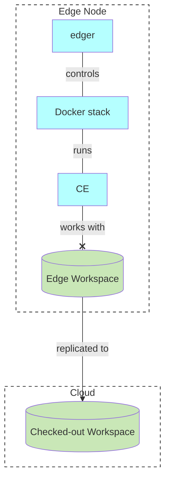
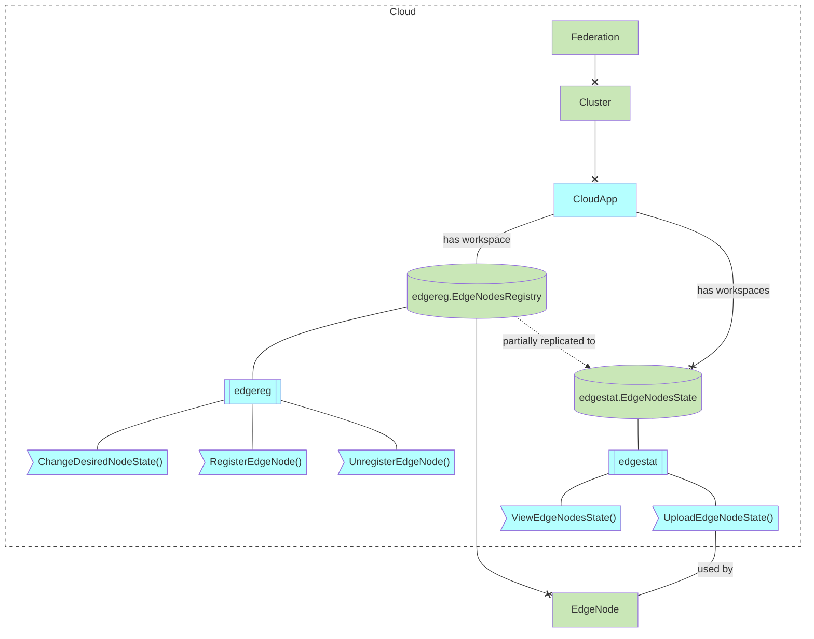
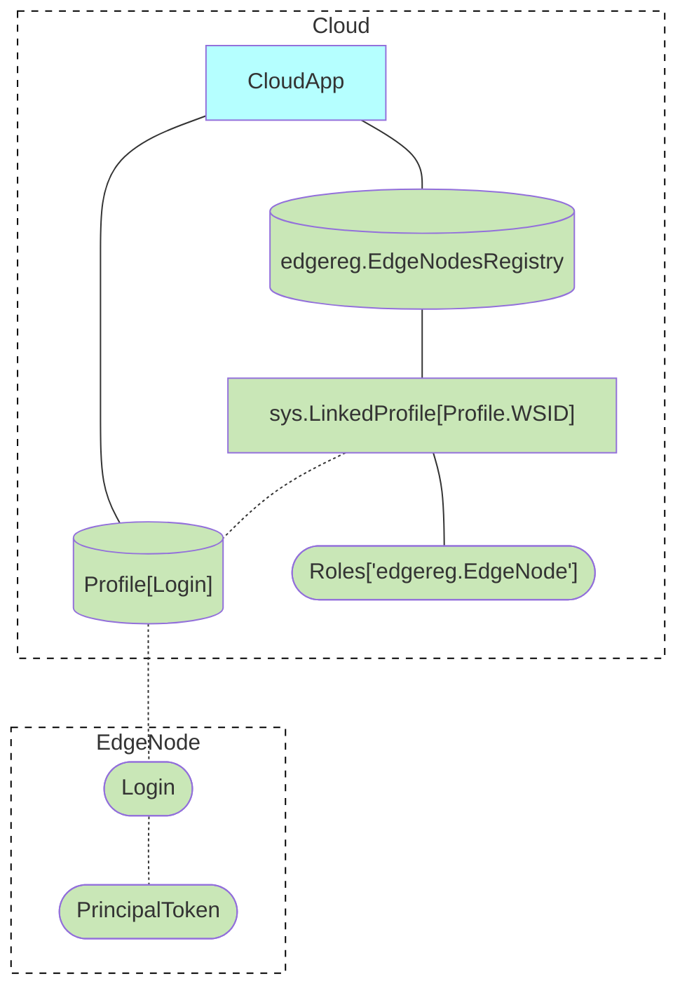
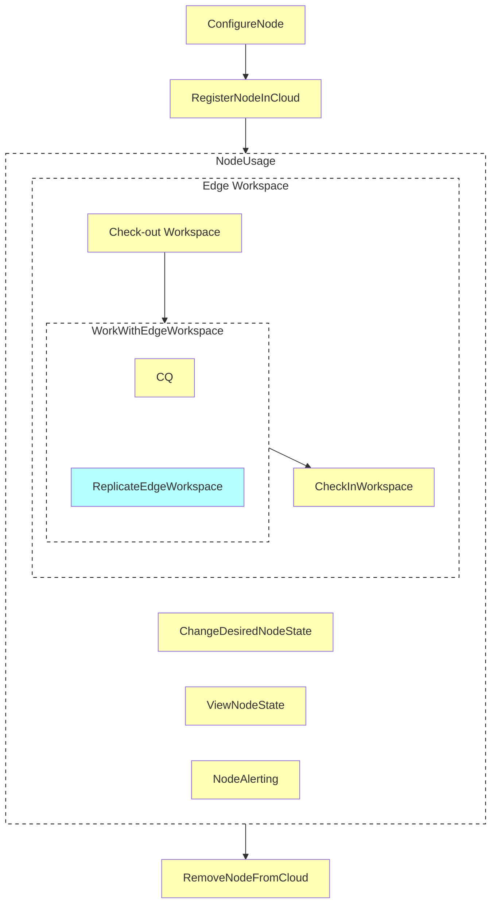
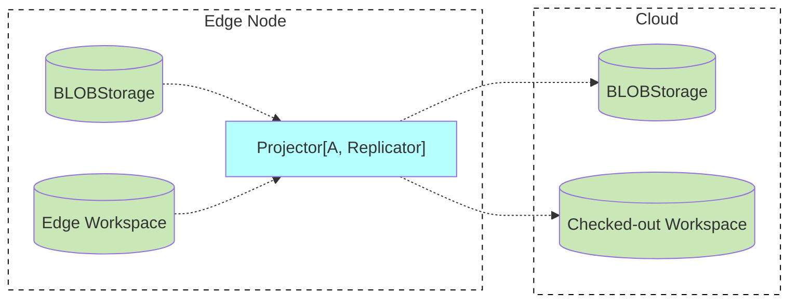
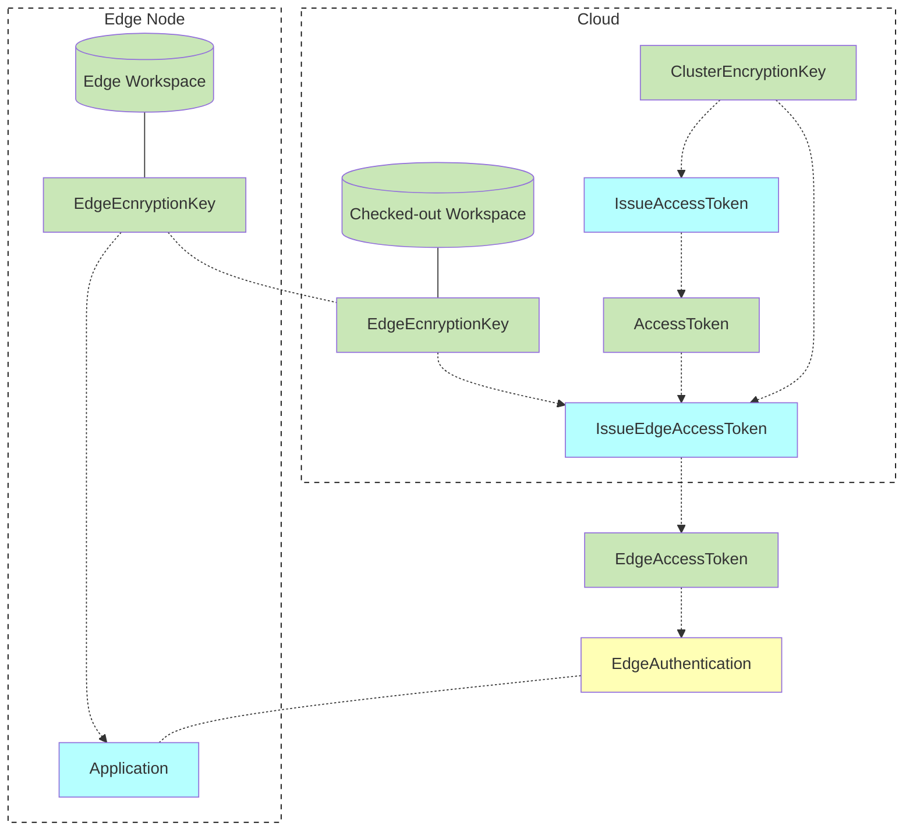
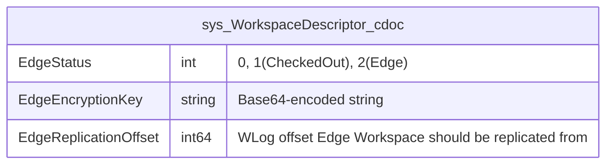
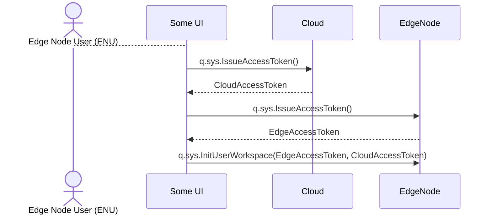
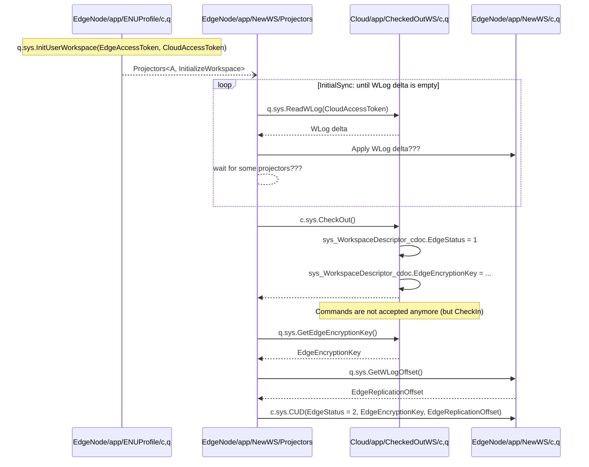
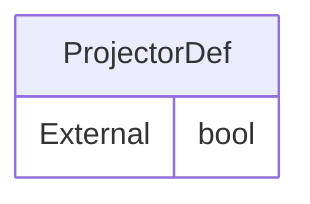

# Edge Computing Analysis & Design

Motivation

- [dev.untill.com: Local Box](https://dev.untill.com/projects/#!625849)
- [heeus.io/launchpad: Edge Computing](https://dev.heeus.io/launchpad/#!25305)
- [heeus.io/launchpad: cmd: edger](https://dev.heeus.io/launchpad/#!25307)

Concepts

- [Edge Node](#edge-node)
- [Edge Nodes Registry and Status](#edge-nodes-registry-and-status)
- [Edge Node Lifecycle](#edge-node-lifecycle)
- [Asymmetrical asynchronous replication](#asymmetrical-asynchronous-replication)
- [Edge Authentication](#edge-authentication)
- [sys_WorkspaceDescriptor_cdoc](#sys_workspacedescriptor_cdoc)
- [External Projectors](#external-projectors)
- [Synced Events](#synced-events)

Processes

- [Check-out Workspace](#check-out-workspace)
- [Replicate Edge Workspace](#replicate-edge-workspace)
- [Initial Sync](#initial-sync)
- [Process commands](#process-commands)

# Concepts

## Edge Node


- Edge Workspace: Перефирийная рабочая область
- Checked-out Workspace: Выписанная рабочая область

## Edge Nodes Registry and Status




ViewEdgeNodesState()

- Sorted by CPU usage as a percentage
- Sorted by Memory usage as a percentage
- Sorted by Error state (ones with errors first)
- // TODO: Merge results from all Edge State workspaces




## Edge Node Lifecycle



- **Check out Workspace**: Выписывание Рабочей Области
- **Check in Workspace**: Возврат Рабочей Области
- **Change Desired Node State** (software version, etc.)
- **View Node State**: Software version, etc.
- **Node Alerting**: Alerts about CPU, memory  exhaustion


## Asymmetrical asynchronous replication

- Data is replicated one direction
- Data is replicated asynchronously



## Edge Authentication



## sys_WorkspaceDescriptor_cdoc



## Synced Events

```go
type IAbsractEvent struct {
    Synced()  bool
}
```

# Processes

## Check-out Workspace

### Get tokens



### Check-out



## Actualize External Projection


- Like Mailer

Requirements
- Skip Synced Events in External Projectors
  - if Event.Synced() == true


## Replicate Edge Workspace

Requirements
- Resulting Events in Checked-out Workspace must be Synced Events

## Initial Sync

Requirements
- Resulting Events in Edge Workspace must be Synced Events

## Process commands

Requirements
- Error if EdgeStatus == CheckedOut

# ???

- User access Edge using browser which do not have a token yet
- Edge User wants to link New device to the workspace