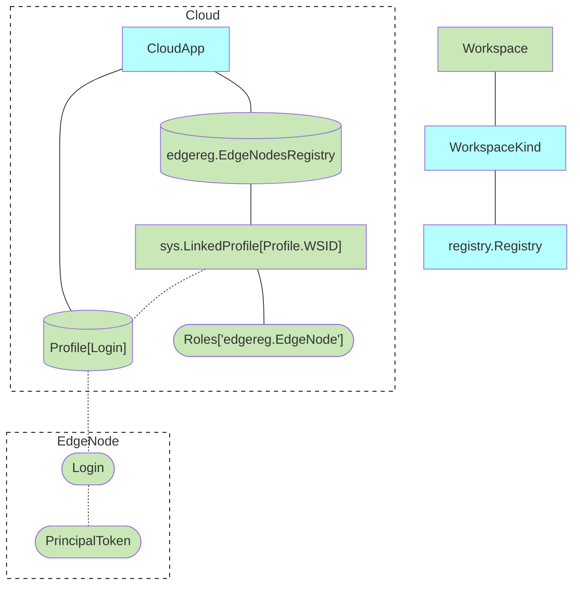

## Auth

### Devices

- Owner calls CreateWorkspaceDevice(name)
  - 6 digit code is generated
- Device calls JoinWorkspace(6 digit code)
  - Token is generated and returned
  - Can be called once

### Devices

- Device calls CreateWorkspaceDevice(token,)
- EdgeNode calls CreateWorkspaceLogin

