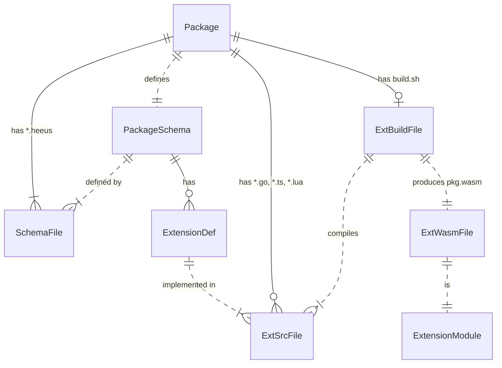
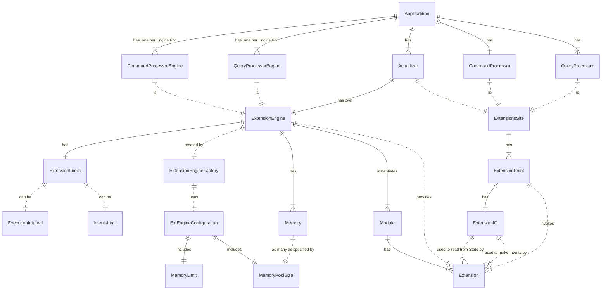

# Extensions

## Extensions in Packages

See also: 
- [Design: Extensions](https://github.com/heeus/heeus-design#extensions)

## Extension Engine Architecture

See Also:
- Current Diagram [Extension Engines](https://github.com/heeus/heeus-design/#extension-engines)

## Common Principles: Extension Programming 
- Extensions are [pure functions](https://en.wikipedia.org/wiki/Pure_function). No global variables allowed.
- Any kind of input/output is done using State and Intents ONLY.
- (?) package name must be the same that is declared in PackageSchema


## BuildIn Extensions, Principles

`IBuiltInExtensionModule` with method `Register(name String, func BuiltinExtensionProc)` allowing register built-in functions:
```go
func provideSomeExtensions(cfg *istructsmem.AppConfigType) {
    // "MyCommand" must match the name of the command in VQL
    cfg.ExtCmdProc.Pkg("sys").BuiltinModule().Register("MyCommand", MyCommandImpl)
}
```
 
 All builtin functions has the same arguments:
```go
func MyCommandImpl(state istructs.IState, intents istructs.IIntents) {
    // ...
}
```

Rename storage `CmdResult` -> `Result`. It can be used in both Commands and Queries. Example for queries:
```go
// Some query function extension    
ext.ReadValues(viewPartialKey, func(key ext.TKey, value ext.TValue) {
    /*
        In QueryProcessor "Result" storage works differently:
        NewValue, created in ext.Result, will be sent through bus: 
            - every time a new value is created over the old one;
            - when the execution is over.
    */
    result := ext.NewValue(ext.KeyBuilder(ext.Result))  
    result.PutString("name", value.AsString("FullName"))
    result.PutInt32("age", customer.AsInt32("Age"))
})
```


