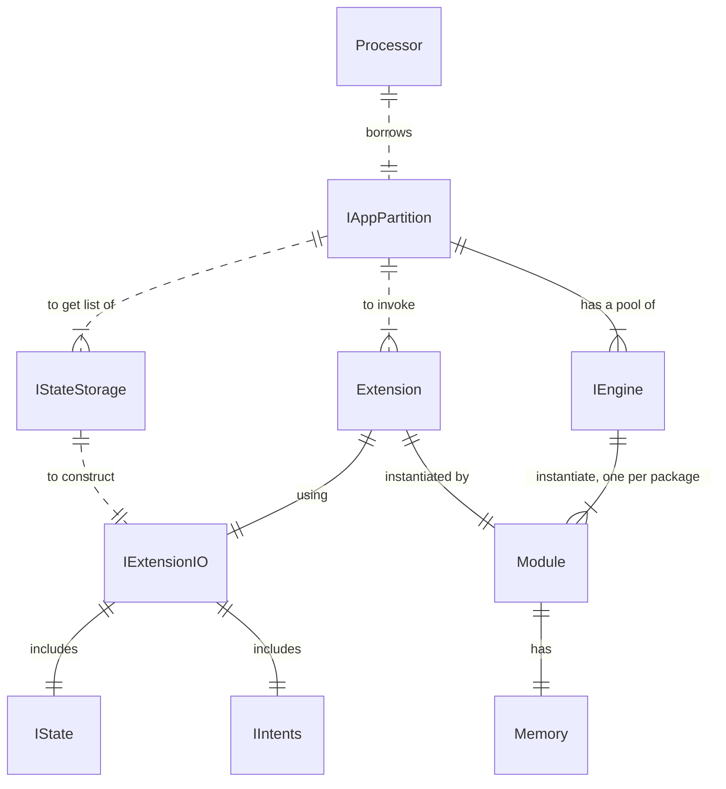

## Architecture


## Functional Design

### 1.1. Engine Factories (one per engine kind)

```go
func EngineFactory func() IEngine

func BuiltinEngineFactory(Funcs map[QName]BuiltinExtFunc) EngineFactory
func WasmEngineFactory(ModuleURLs map[string]string) EngineFactory

type BuiltinExtFunc func(io ExtensionIO) error

type IEngine interface {
    Invoke(Name QName, Io ExtensionIO) (err error)
}
```

BuiltinEngineFactory is provided as a param to apppartsctl.New()

### 1.2. IAppPartition interface

```go
type StorageOperations int32 // bit mask: GET, GETBATCH, READ, INSERT, UPDATE
type IAppPartition interface {
    ...
    InvokeExtension(name QName, io ExtensionIO) (err error)
    GetStorages(ProcessorKind int) map[QName]StorageOperations
}
```


## IEngine interface
- Invoke(Name QName, Io ExtensionIO) (err error)


## Questions
1. Engine parameters and limitations