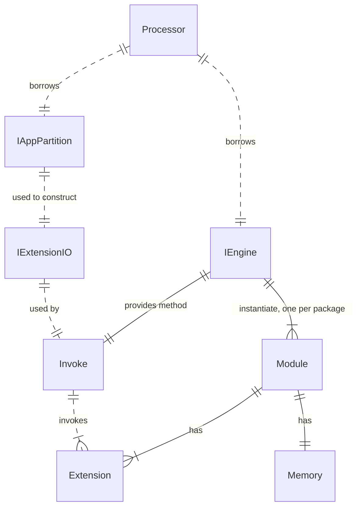
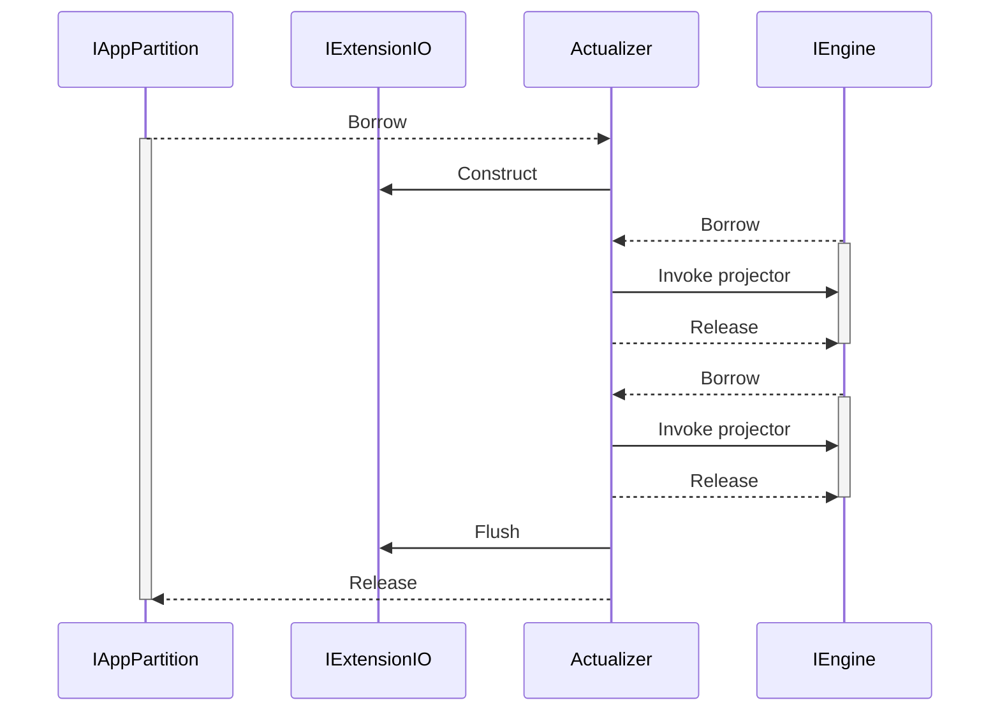

## Architecture

## IEngine interface
- Invoke(Name QName, Io ExtensionIO) (err error)

## Technical Issues
It seems `IAppPartition` and `IEngine` must be borrowed separately, because they have different lifetime in the Async Actualizer:
- `IExtensionIO` which is constructed from `IAppPartition` kept alive for multiple `Invoke` calls of the projector, until the Intents buffer is flushed.

