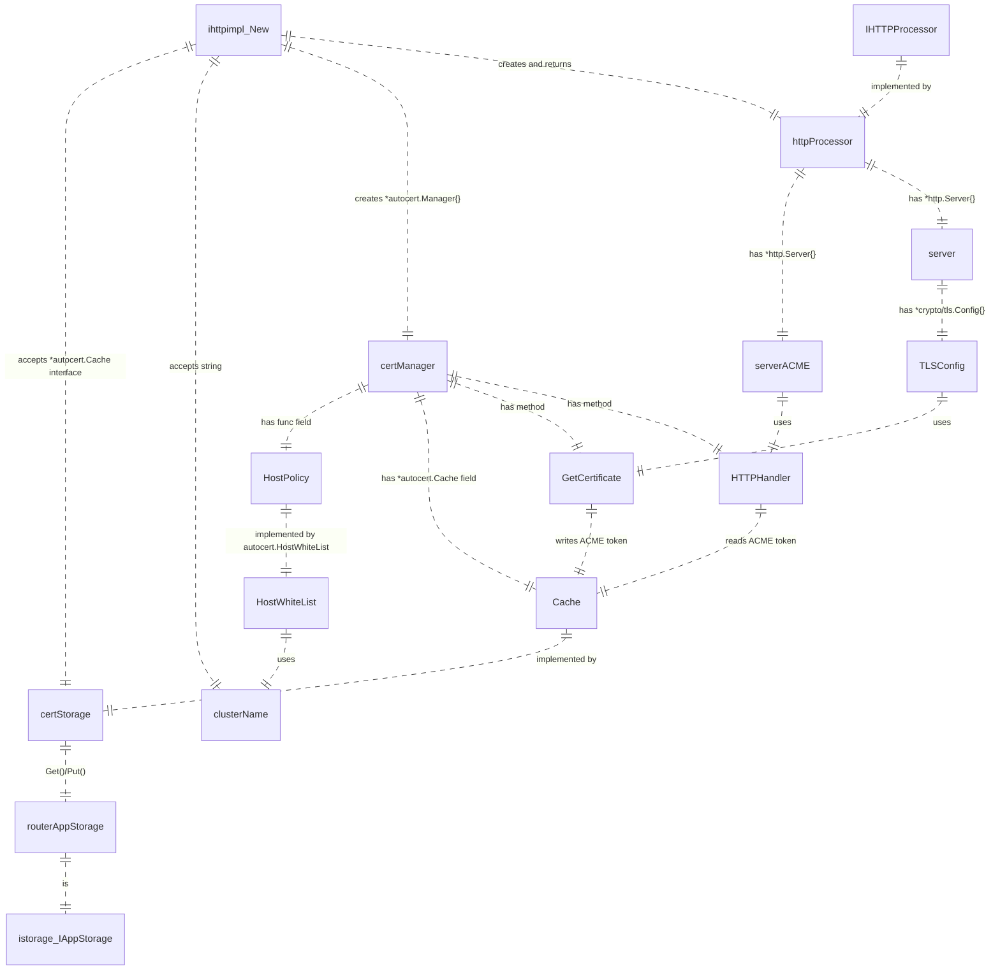
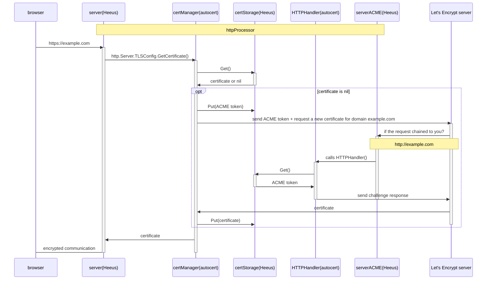

### Story
As a Heeus user I want my application to be requested using HTTPS

### Terms
- HTTPS hypertext protocol which uses TLS encryption protocol to encypt communications
- TLS - Transport Level Security
- SSL - Secure Sockets Layer. TLS was known as SSL a time ago. Currently `SSL` term is used instead of `TLS`

### Solution principles
- Request is always sent to a certain cluster (e.g. Main Cluster)
- Each cluster has its own domain
- We do NOT use Federation Domain/GEO-DNS
- ACME provider ([Let's Encrypt](https://letsencrypt.org/)) is used to get HTTPS certificates
  - Let's Encrypt currently does not support wildcard certficates (DNS records SOA)
  - one certificate covers all sites (DNS records A and CNAME) of the domain
  - certificate for `localhost` can not be issued
  - ACME v2 protocol version is used
- Certificate is obtained for each domain name. No wildcard certificates.

### Concepts
- Register a domain name for each cluster
- Open ports 443 and 80
- Launch `ce server --ihttp.Port=443 --ihttp.ACME=true --ihttp.ClusterDomainBase="<cluster domain name base>"`, e.g. `example.com`
  - `--ihttp.ClusterDomainBase` should contain the minimum accepted cluster domain name part. e.g. `example.com` specified -> `example.com`, `www.example.com`, `cluster1.example.com` etc are accepted
  - `--ihttp.ClusterDomainBase` is needed to Let's Encrypt's HTTP01 challenge only
  - `--ihttp.ACME=true` -> Let's Encrypt provider will be used. `--ihttp.Port` is 443 by default
  - `--ihttp.ACME=true` -> `--ihttp.Port` must not be 80 (since it will be used to handle ACME protocol)
  - `--ihttp.ACME` is not specified or `false` -> HTTP will be used instead of HTTPS, `--ihttp.Port` could be any: 80, 443 etc

### Subdomains vs subdirectories
- Google idexing algorhithms treats subdomains as standalone sites. Content of a subdomains is not taken is account when ranking the root domain.
- practical impact on the SEO should be checked to choose between subdomains and subfolders
- want web search over entites of your business be more relevant -> use subfolders
- have completely different parts of a business not related to each other (e.g. 2 enterprises in one main domain) -> use subdomains
- want technically spread features of the site over different machines -> use subdomains, each feature in own subdomain, e.g. blog.example.com, shop.example.com
- there are no technical restrictions, legal restrictions in different countries, etc. -> use subfolders

### Components

### Establishing the HTTPS communication
- A user opens a web page using https:// scheme
- Request is got by one of Heeus CE instances by its http server on a port number 443
- HTTP server obtains a certificate to encrypt the communication
  - Already has a certificate in the storage - use it
  - Missing\expired\broken etc certificate -> obtain a new certificate from Let's Encrypt
    - `autocert` library sends a request to Let's Encrypt server to issue a new certificate
    - Let's Encrypt sends request to the Cluster Domain on port 80 (handled by `autocert` library) to check if the server actually controls the domain
    - Reply from `autocert` is matched the initial request -> Let's Encrypt issues and returns a new certificate
    - Cetificate is written to the storage
- Further communication between client and Heeus CE is encrypted using the certificate

