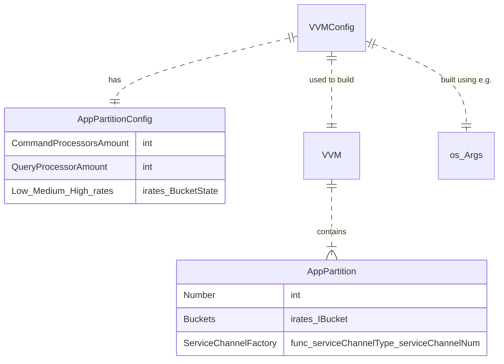
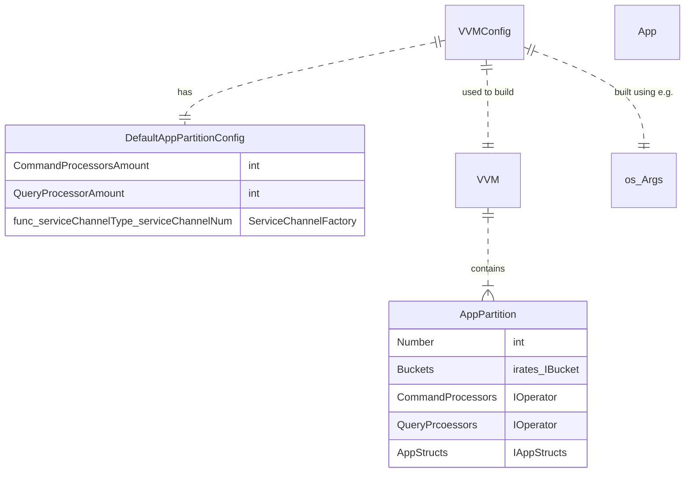
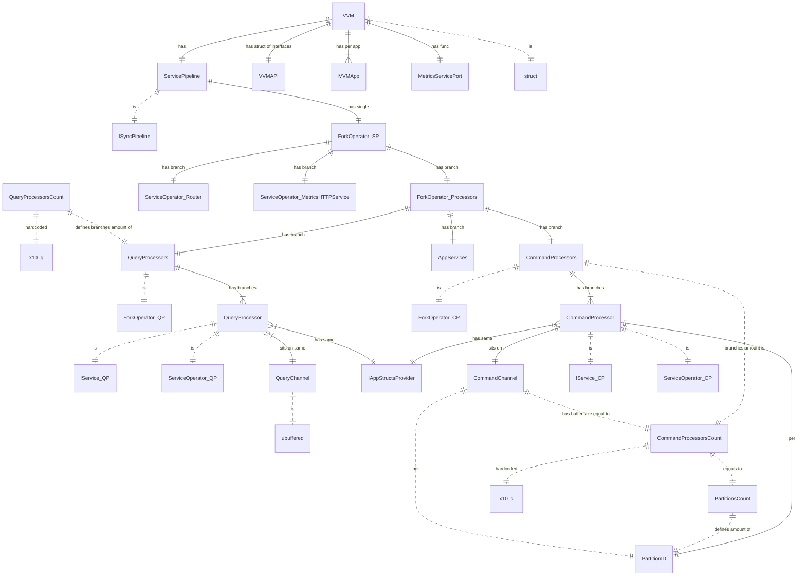

# Functional design
```go
pkgSys := DefinePackage().
	WithSchemas(...),
	WithFuncs(WithFunc(
		QName,
		...
		WithRate(...),
	))
appRegistry := DefineApp(appQName, WithPackages(
	pkgSys,
))
appAirsBP := DefineApp(appQName, WithPackages(
	pkgSys,
	pkgAirsBP,
	pkgUnTill,
))
ProvideCluster(WithApps(
	appAirsBP,
	appRegistry,
))
type Cluster struct {
	ServicePipeline
	VVMAPI

}
```
# Technical design





