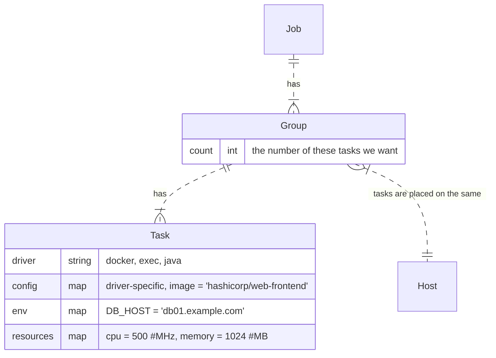

### Nomad.Job

https://www.nomadproject.io/docs/job-specification

### Nomad.Scheduling

https://www.nomadproject.io/docs/internals/scheduling/scheduling

- There are four primary "nouns" in Nomad; jobs, nodes, allocations, and evaluations. 
- **Jobs** are submitted by users and represent a desired state
  - A job is a declarative description of tasks to run which are bounded by constraints and require resources
  - Tasks can be scheduled on nodes in the cluster running the Nomad client
- The mapping of tasks in a job to clients is done using **allocations**
  - An allocation is used to declare that a set of tasks in a job should be run on a particular node. Scheduling is the process of determining the appropriate allocations and is done as part of an evaluation.
- An **evaluation** is created any time the external state, either desired or emergent, changes
  - The desired state is based on jobs, meaning the desired state changes if a new job is submitted, an existing job is updated, or a job is deregistered
  - The emergent state is based on the client nodes, and so we must handle the failure of any clients in the system.
  - These events trigger the creation of a new evaluation, as Nomad must evaluate the state of the world and reconcile it with the desired state.

Process:

### Nomad.Schedulers

> Nomad ships with a service scheduler that optimizes for long-lived services, a batch scheduler that is used for fast placement of batch jobs, system and sysbatch schedulers that are used to run jobs on every node, and a core scheduler which is used for internal maintenance.

### Concurrency Races

> Multiple schedulers are running in parallel without locking or reservations, making Nomad optimistically concurrent. As a result, schedulers might overlap work on the same node and cause resource over-subscription. The plan queue allows the leader node to protect against this and do partial or complete rejections of a plan.

