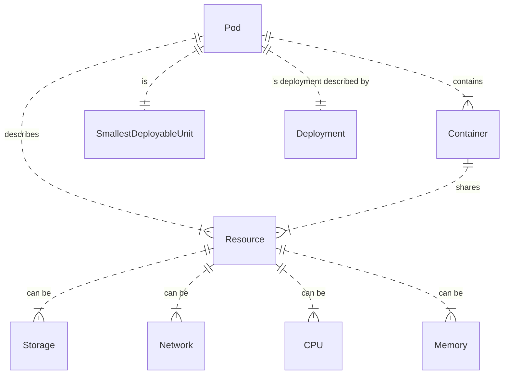
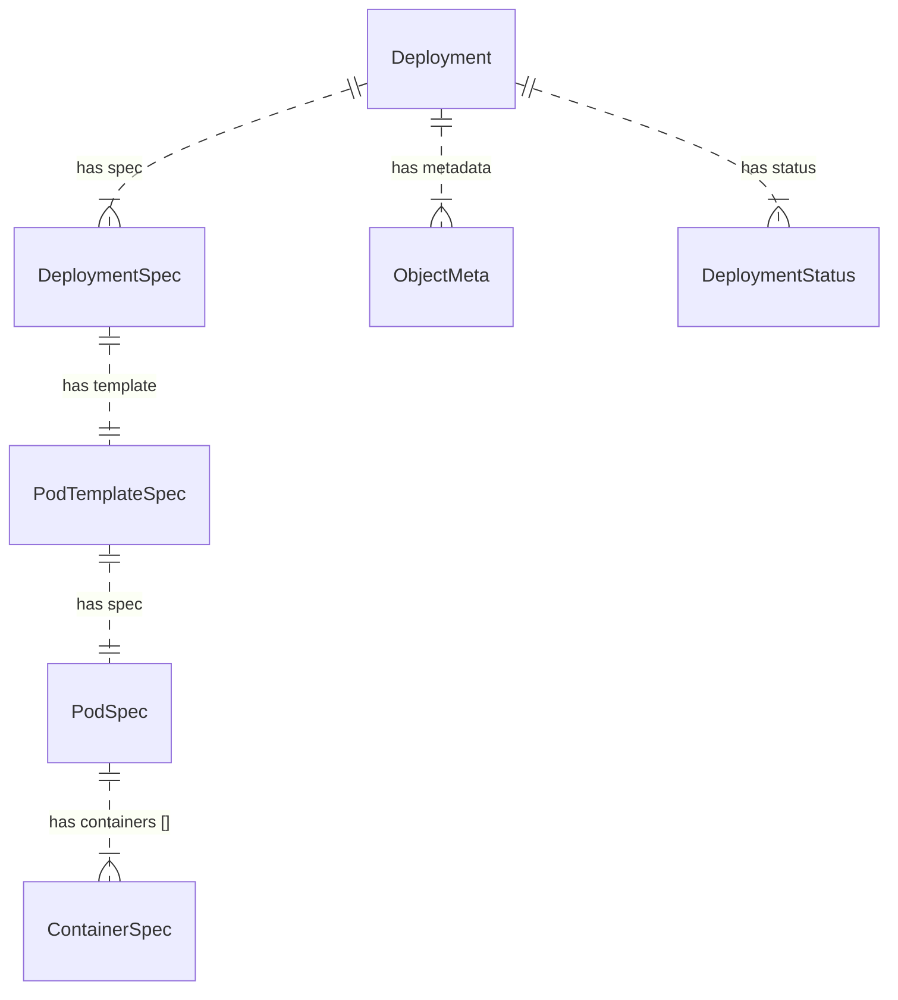
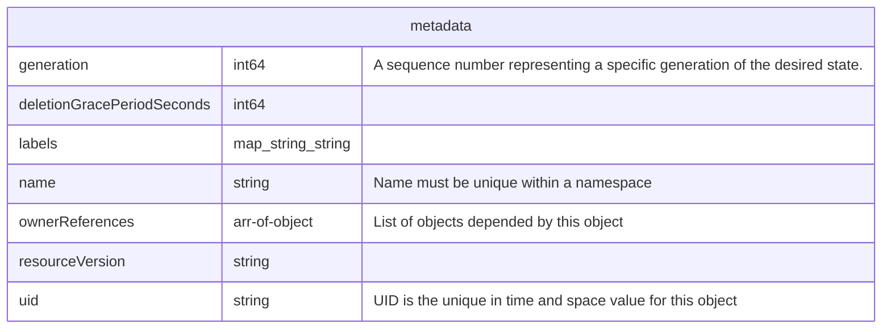
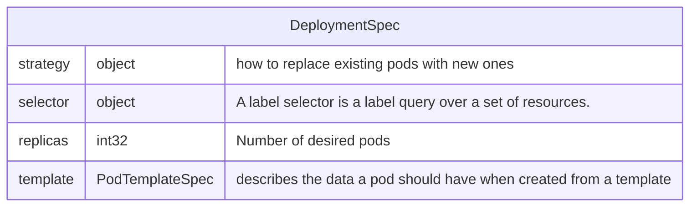
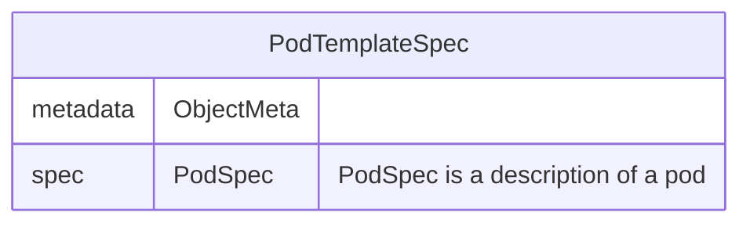
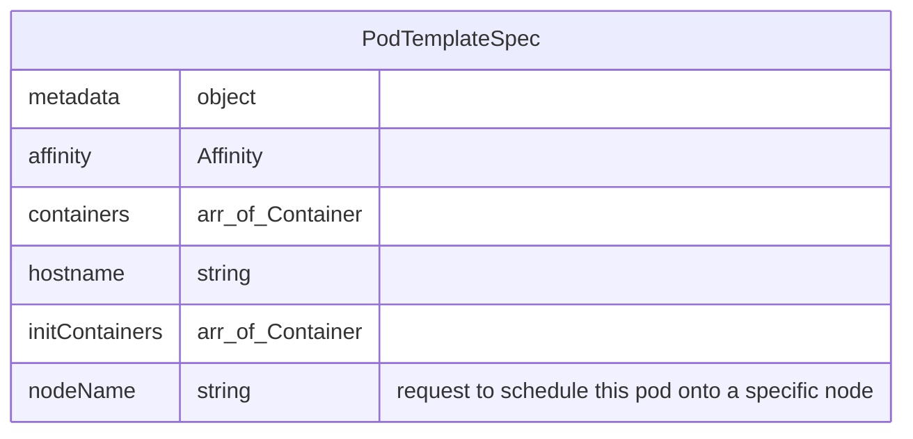
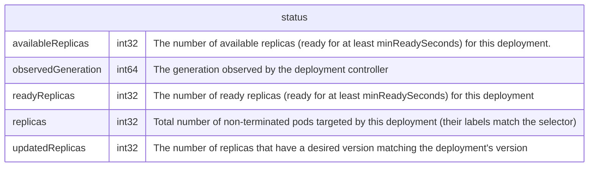

### Kubernetes.Pod

- https://cloud.google.com/kubernetes-engine/docs/concepts/pod
- https://kubernetes.io/docs/concepts/workloads/pods/



### Kubernetes.Deployment



>A Deployment provides declarative updates for Pods and ReplicaSets.
> You describe a desired state in a Deployment, and the Deployment Controller changes the actual state to the desired state at a controlled rate. You can define Deployments to create new ReplicaSets, or to remove existing Deployments and adopt all their resources with new Deployments.


[Creating a multiple pod Deployment](https://www.reddit.com/r/kubernetes/comments/ci4297/creating_a_multiple_pod_deployment/)
- I want to have a single deployment file that needs to run my containers in different pods. Right now, the deployment is creating a single pod with two containers inside. Is there a way i could deploy two pods, with different containers from the same deployment file?
- Deployment only support a single pod, a pod can have multiple containers
  - But you can put multiple deployments in a single file, use --- to separate multiple documents


#### Deployment

- [OpenAPI.Deployment](https://elements-demo.stoplight.io/?spec=https://raw.githubusercontent.com/kubernetes/kubernetes/master/api/openapi-spec/swagger.json#/schemas/io.k8s.api.apps.v1.Deployment)
- [Kubernetes Deployment spec example](https://www.tutorialworks.com/kubernetes-deployment-spec-examples/):
```yaml
apiVersion: apps/v1
kind: Deployment
metadata:
  name: nginx-rolling
  labels:
    app: nginx-rolling
spec:
  replicas: 1
  selector:
    matchLabels:
      app: nginx-rolling
  strategy:
    type: RollingUpdate   # Upgrade this application with a rolling strategy
    rollingUpdate:
      maxSurge: 1         # maximum number of pods that can be scheduled
                          # above the desired number of pods (replicas)
      maxUnavailable: 0   # the maximum number of pods that can be unavailable
                          # during the update
  template:
    metadata:
      labels:
        app: nginx-rolling
    spec:
      containers:
      - image: nginx
        name: nginx
        ports:
        - containerPort: 8080
```       


#### ObjectMeta

ObjectMeta is metadata that all persisted resources must have, which includes all objects users must create.


- ownerReferences. List of objects depended by this object. If ALL objects in the list have been deleted, this object will be garbage collected. If this object is managed by a controller, then an entry in this list will point to this controller, with the controller field set to true. There cannot be more than one managing controller.
- resourceVersion. An opaque value that represents the internal version of this object that can be used by clients to determine when objects have changed.

#### DeploymentSpec

#### PodTemplateSpec



#### PodSpec


- [Resource Management for Pods and Containers](https://kubernetes.io/docs/concepts/configuration/manage-resources-containers/)

```yaml
apiVersion: v1
kind: Pod
metadata:
  name: frontend
spec:
  containers:
  - name: app
    image: images.my-company.example/app:v4
    resources:
      requests:
        memory: "64Mi"
        cpu: "250m"
      limits:
        memory: "128Mi"
        cpu: "500m"
  - name: log-aggregator
    image: images.my-company.example/log-aggregator:v6
    resources:
      requests:
        memory: "64Mi"
        cpu: "250m"
      limits:
        memory: "128Mi"
        cpu: "500m"
```        
#### Deployment.status (DeploymentStatus)



