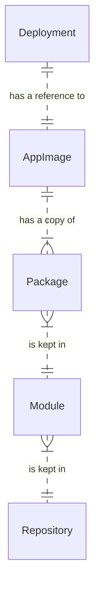
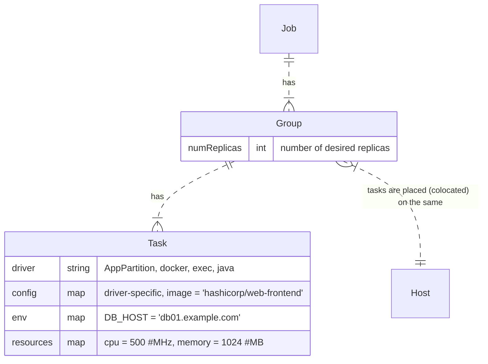
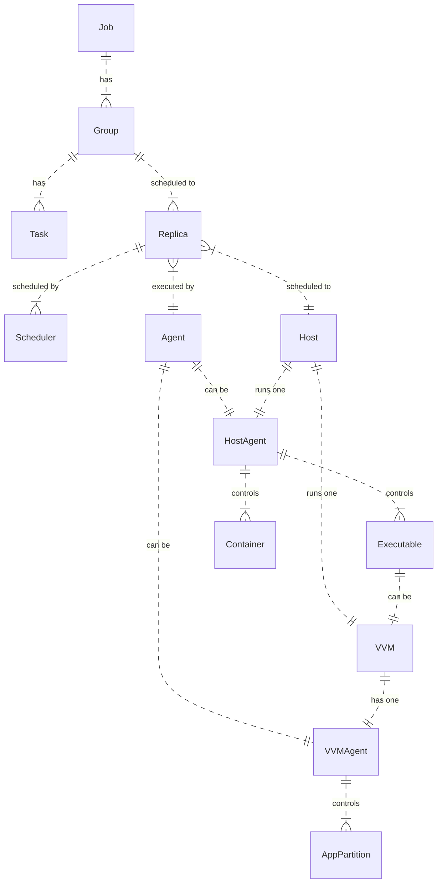

### Abstract

How to deploy Heeus application into some Heeus federation

### Principles

- No intermediate package managers like artifactory, jfrog etc.
- Application is deployed using Application Images (AppImage) + Deployment Descriptor (Deployment)
- AppImage presents on every server node (is downloaded by Agent)
- Application is executed by Application Partitions

### Best practices

- [Swarm](10-review-existing-1-swarm.md)
- [Nomad](10-review-existing-2-nomad.md)
- [K8s](10-review-existing-3-k8s.md)
- [Google: Borg, Omega, and Kubernetes](google/README.md)

### Concepts

- [Deployment Artifacts](#deployment-artifacts)
- [Deployment](#deployment)
- [Agents](#agents)

### Detailed design

- [Application Partition Deployment](app-deployment-2.md)

### Deployment Artifacts
- Deployment (Deployment Descriptor, Дескриптор развертывания)
- AppImage

### Job

### Agents

