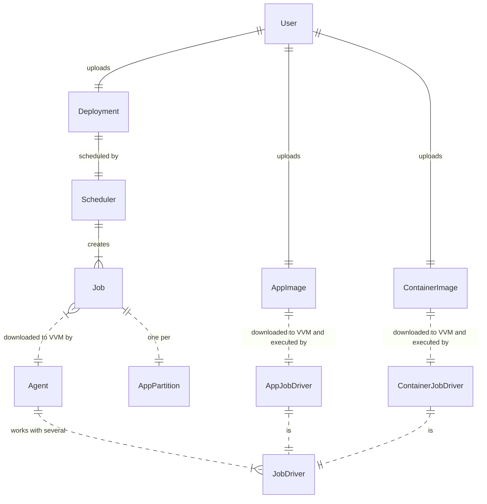

### Application Partition Deployment Process

- Процесс развертывания раздела приложения
- Upload (Загрузить), Download (Скачать)

### Job Drivers
- AppJobDriver (Драйвер заданий для приложений)
- ContainerJobDriver (Драйвер заданий для контейнеров)

### Deployment
- https://docs.oracle.com/cd/E19226-01/820-7627/bncbj/index.html
- Deployment Descriptor schema version
- Ref to App Image
  - Can be either local (same federation) or remote (other federation)
- Deployment Params
  - zones, limitations

### AppImage

???
- App Image (zip)
  - applicaton.json
  - package%-folder // arbitrary name
    - package.json // contains real package name, folder name is ignored
    - package.wasm %| container %| %[%]lua %| %[%]jar
    - template1%-folder
      - wstemplate.json // // contains real workspace template name, folder name is ignored
      - ??? wstemplatedata1.bin
      - ??? wstemplatedata2.bin
    - template2%-folder
      - wstemplate.json // // contains real workspace template name, folder name is ignored
      - data2
    - adminka%-folder
      - static.json // name: adminka
      - file1, file2
  - package2
    - ...
- App Repo (repo, kind of bp3.git)
  - Application Schema (json)
    - Package Repos List %| Package Images List
  - Zero or few folders which are local Package Repos
- Package Repo
  - build%-wasm.sh
    - Produces package.wasm %+ package.json (data schemas)
  - build%-wasm.sh from Heeus (скрипт из шаблона пакета для TypeScript, reference, рекомендованный, boilerplate, etalon, standart, origin)
    - Uses TypeScript builder to build package.json
    - Builds wasm from AssemblyScript sources

### User: Upload App Image2

- Developer changes something in App Repo
- Github triggers `UploadAppImage` action
  - Download all related Package Repos
  - For each package
    - run build.sh
      - ??? Skip validation of imports
  - Validate package.json's
    - Dependencies
    - ??? Imports
  - Zip App Image
  - Upload
- Optionally: Github triggers DeployAppImage action
  - App Deployment Descriptor is uploaded into particular federation
  - Profit

### User: Validate Package Repo

- Developer changes something in a Package Repo
- Github triggers ValidatePackage action
  - run build.sh

### System: Schedule and execute App Partition

App[cluster]

- numOfPartitions = 1

Process

- Upload AppImage: admin + App[cluster]
- Upload `AppDeployment.json`: admin + App[cluster]
- Create ODoc[AppDeployment]: App[cluster]
  - JobKind, JobKey, Scheduled.IsActive, Scheduled.AppDescrVersion, Scheduled.AppImage
- Create Jobs: Projector[A, JobActualizer]
- Schedule Jobs: App[cluster].Controller[Scheduler]
  - Update Job.Scheduled.Node
- Execute Jobs: Agent
  - Actualize WHERE Job.Scheduled.Node = Agent.Node OR Job.Current.Node = Agent.Node
  - Update Job.Current
  - Update Job.Status

 WDoc[Job]:
- pk
  - JobKind // AppPartition | Container | Executable
  - JobKey // owner, app, appPartNo
- Scheduled
  - IsActive
  - AppDescrVersion // WLogOffset
  - AppImage
  - Node
- Current
  - Node
  - IsActive
  - AppDescrVersion // WLogOffset
  - AppImage
  - Error
- Status (string)

### Discussion

- Few possible deployment policies:
  - Deploy app images (our choice)
  - Deploy package images which are further referenced by app images
    - cons: Need intermediate package manager (e.g. one implemented by Heeus)
    - cons: Application Deployment Descriptor must track package images, not package sources
    - cons: Extra complexity for developers