## Тезисы
Современные монолитные архитектуры кластерного планировщика плохо удовлетворяют увеличению масштаба и потребности в быстром реагировании на меняющиеся требования. Это ограничивает скорость развертывания новых функций, снижает эффективность и использование и в конечном итоге ограничивает рост кластера. Мы представляем новый подход к удовлетворению этих потребностей с использованием параллелизма, общего состояния и управления оптимистичным параллелизмом без блокировок. Мы сравниваем этот подход с существующими конструкциями кластерных планировщиков, оцениваем, насколько велика взаимосвязь между планировщиками и насколько она важна на практике, представляем некоторые методы для ее устранения и, наконец, обсуждаем вариант использования, подчеркивая преимущества нашего подхода — все это основано на анализе реальных жизненных рабочих нагрузок кластеров Google.

## 1. Введение
Крупномасштабные вычислительные кластеры дороги, поэтому важно правильно их использовать. Использование и эффективность можно повысить, выполняя на одних и тех же машинах различные рабочие нагрузки: задания с интенсивным использованием ЦП и памяти, малые и большие задания, а также сочетание пакетных заданий и заданий с малой задержкой, которые обслуживают запросы конечных пользователей или предоставляют инфраструктурные услуги, как хранение, присвоение имен или блокировка. Эта консолидация уменьшает количество аппаратного обеспечения, необходимого для рабочей нагрузки, но усложняет задачу планирования (назначение заданий машинам): необходимо учитывать более широкий спектр требований и политик. Тем временем кластеры и их рабочие нагрузки продолжают расти, и, поскольку рабочая нагрузка планировщика примерно пропорциональна размеру кластера, планировщик рискует стать узким местом масштабируемости.

Планировщик производственных заданий Google испытал все это. С годами она превратилась в сложную изощренную систему, которую трудно изменить. В рамках переработки этого планировщика мы искали лучший подход.

###### Рисунок 1
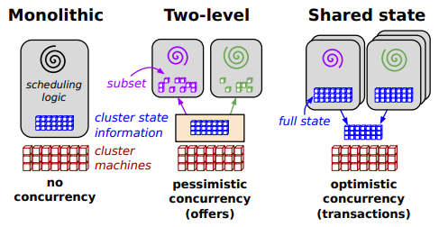
*Схематический обзор архитектур планирования, рассмотренных в этой статье*

Мы выявили две наиболее распространенные архитектуры планировщика, показанные на [рисунке 1](#рисунок-1). Монолитные планировщики используют единый централизованный алгоритм планирования для всех заданий (наш существующий планировщик — один из них). Двухуровневые планировщики имеют один активный диспетчер ресурсов, который предлагает вычислительные ресурсы нескольким параллельным независимым «средам планировщика», как в [Mesos][Mesos] и [Hadoop-on-Demand][h-o-d].

Ни одна из этих моделей не удовлетворяла нашим требованиям. Монолитные планировщики не упрощают добавление новых политик и специализированных реализаций и могут не масштабироваться до размеров кластера, которые мы планируем. Двухуровневые архитектуры планирования, кажется, обеспечивают гибкость и параллелизм, но на практике их консервативные алгоритмы видимости ресурсов и блокировки ограничивают и то, и другое, и затрудняют размещение трудных для планирования «привередливых» заданий или принятие решений, требующих доступа к состоянию всего кластера.

Наше решение представляет собой новую архитектуру параллельного планировщика, построенную на основе общего состояния, и использующую оптимистичный контроль параллелизма без блокировки для достижения как расширяемости реализации, так и масштабируемости производительности. Эта архитектура используется в *Omega*, системе управления кластерами нового поколения от Google.

### 1.1 Вклад

Вклад этой статьи заключается в следующем:
1. Предоставление упрощенной таксономии пространства опций для разработки кластерного планировщика ([§3](#3-таксономия));
2. Создание новой архитектуры планировщика, использующей совместное состояние и оптимистичный контроль параллелизма без блокировок ([§3.4](#34-планирование-с-общим-состоянием));
3. Сравнение производительности монолитного двухуровневого планирования и планирования с общим состоянием с использованием моделирования и синтетических рабочих нагрузок ([§4](#4-сравнение-архитектур));
4. Изучение поведения подхода с общим состоянием более подробно, с использованием кода, основанного на производственном планировщике и управляемого трассировкой реальных рабочих нагрузок ([§5](#));
5. Демонстрация гибкости подхода с общим состоянием с помощью варианта использования на примере добавляя планировщика, который использует информацию о глобальном использовании кластера для настройки ресурсов, выделяемых для выполнения заданий [MapReduce][map-reduce] ([§6](#)).

Мы обнаружили, что архитектура с общим состоянием Omega может обеспечить производительность, конкурентоспособную или превосходящую другие архитектуры, и что *конфликты* для этой архитектуры в реальных условиях малы. Возможность доступа ко всему состоянию кластера в планировщике этой архитектуры дает и другие преимущества, которые мы демонстрируем на примере ускорения заданий MapReduce за счет использования запасных ресурсов.

## 2. Требования
Планировщики кластеров должны одновременно решать несколько задач: высокая степень использования ресурсов, ограничения по размещению, устанавливаемые пользователями, быстрое принятие решений, а также различные степени «справедливости» и важности для бизнеса.

При этом они должны быть надежными и всегда доступными. Эти требования со временем меняются, и, по нашему опыту, становится все труднее добавлять новые политики в единый монолитный планировщик. Это происходит не только из-за накопления кода по мере роста функциональности с течением времени, но и потому, что некоторые из наших пользователей стали полагаться на детальное понимание внутреннего поведения системы для выполнения своей работы, что делает ее функциональность и структуру трудно изменяемой.

### 2.1 Неоднородность рабочей нагрузки
Одним из важных факторов сложности является неоднородность аппаратного обеспечения и рабочей нагрузки, что является обычным явлением в больших вычислительных кластерах.

Чтобы продемонстрировать это, мы изучили сочетание рабочих нагрузок на трех производственных вычислительных кластерах Google, которые мы считаем репрезентативными. Кластер A среднего размера, довольно загруженный, в то время как кластер B — один из самых крупных кластеров, используемых в настоящее время в Google, а кластер C — тот, для которого недавно была опубликована трассировка рабочей нагрузки планировщика ([трассировка][trace], [анализ][trace-analysis]). Рабочие нагрузки относятся к маю 2011 года. Все кластеры выполняют самые разные задания; некоторые настраиваются вручную; некоторые с помощью автоматизированных систем, таких как MapReduce, [Pregel][Pregel] и [Percolator][percolator].

##### Рисунок 2
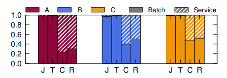
*Пакетные и сервисные рабочие нагрузки для кластеров A, B и C: нормализованное количество заданий (J) и задач (T), а также совокупные запросы на CPU-core-seconds (C) и RAM-гигабайты в секундах (R). На этом и последующих графиках сплошные полосы и линии описывают пакетные задания, а пунктирные — сервисные задания.*

##### Рисунок 3
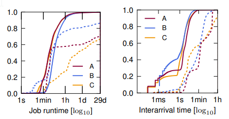
*Функция распределения времени выполнения задания и времени между поступлениями заданий для кластеров A, B и C. Некоторые графики не достигают  значения 1.0, т.к. некоторые задания выполнялись дольше, чем 30 дней (и/или выполнялись реже 1 раза в 30 дней).*

Существует множество способов разделения рабочей нагрузки кластера между разными планировщиками. Здесь мы выбираем простое двустороннее разделение между длительными сервисными заданиями, которые обеспечивают операции конечного пользователя (например, веб-сервисы) и внутренние инфраструктурные сервисы (например, [BigTable][big-table]), и пакетными заданиями, которые выполняют вычисления, а затем завершают работу. Хотя возможны многие другие разделения, для простоты мы помещаем: 
- все низкоприоритетные задания [^1] и те, которые помечены как «максимальные усилия» или «пакеты», в категорию *пакетных*, а 
- остальные — в категорию *сервисных*. 

Задание состоит из одной или нескольких задач, иногда из тысяч задач. Большинство (> 80%) заданий представляют собой пакетные задания, но большая часть ресурсов (55–80%) выделяется для сервисных заданий [рисунок 2](#рисунок-2); сервисные обычно выполняются гораздо дольше [рисунок 3](#рисунок-3) и содержат меньше задач, чем пакетные задания ([рисунок 4](#рисунок-4)). Эти результаты в целом аналогичны другим анализам кластерных логов от Yahoo, Facebook и Google ([анализ][trace])).

[^1]: В [трассировке рабочей нагрузки][trace] планировщика C, это приоритеты с 0–8.

###### Рисунок 4 
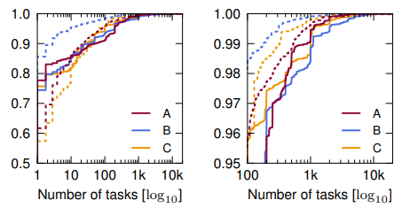
*Распределение количества задач в задании для кластеров A, B и C. Правый график представляет собой расширение хвоста левого графика с учетом ≥ 95-го процента, ≥ 100 задач.*

Почему это важно? Многие пакетные задания короткие, и важно быстрое выполнение, поэтому легковесный, некачественный подход к размещению работает отлично. Но длительные высокоприоритетные сервисные задания (20–40 % из них выполняются более месяца) должны соответствовать строгим целевым показателям доступности и производительности, а это означает, что для обеспечения максимальной устойчивости к сбоям и обеспечения хорошей производительности требуется тщательное размещение их задач. Действительно, планировщик службы Omega будет пытаться размещать задачи так, чтобы противостоять как независимым, так и скоординированным сбоям, что представляет собой NP-сложную задачу оптимизации с ограничениями на шансы с десятками областей сбоев, которые вложены друг в друга и перекрываются. В нашей предыдущей реализации это могло занять десятки секунд. Хотя вполне разумно потратить несколько секунд на принятие решения, действие которого длится несколько недель, могут быть проблемы, если интерактивное пакетное задание должно ждать такого расчета. Эту проблему обычно называют «[блокировкой начала очереди][HOL-block]», и ее можно избежать, внедрив параллелизм.

Таким образом, нам нужна архитектура планировщика, которая может поддерживать оба типа заданий, гибко поддерживать политики для конкретных заданий, а также масштабироваться в соответствии с постоянно растущим объемом работы по планированию. В следующем разделе более подробно рассматриваются некоторые из этих требований, а также некоторые подходы к их выполнению.

## 3. Таксономия
Мы начнем с краткого обзора проблем проектирования, которые должны решать кластерные планировщики, а затем рассмотрим некоторые различные архитектуры планировщиков, которые могут им соответствовать.

##### Разделение работы по планированию
Работа может быть распределена между планировщиками с помощью (1) балансировки нагрузки, которая не учитывает тип рабочей нагрузки; (2) выделение специализированных планировщиков для различных частей рабочей нагрузки; или (3) комбинация этих двух. Некоторые системы используют несколько очередей заданий для хранения запросов заданий (например, для разных приоритетов), но это не влияет на параллелизм планирования: нас больше интересует, сколько и каких планировщиков назначено для обработки этих очередей.

##### Выбор ресурсов 
Планировщикам можно разрешить выбирать из всех ресурсов кластера или ограничить их подмножеством для упрощения принятия решений. Первое увеличивает возможность принятия более взвешенных решений и важно, когда «привередливые» задания необходимо разместить в почти заполненном кластере или когда решения зависят от общего состояния, например общего объема свободных ресурсов. Планировщики могут работать более гибко, если они могут *вытеснять* существующие назначения, а не просто учитывать свободные ресурсы, но это приводит за к потере части проделанной работы в вытесненных назначениях.

##### Конфликты
Если планировщики конкурируют за ресурсы, несколько планировщиков могут одновременно пытаться претендовать на один и тот же ресурс. *Пессимистический* подход, основанный на блокировании, позволяет избежать этой проблемы конфликтов, гарантируя, что конкретный ресурс доступен только одному планировщику в каждый момент планирования; *оптимистичный*, не требующий блокировки при планировании, обнаруживает конфликты (как ожидается, редкие) уже после готовности плана и отменяет одно или несколько противоречивых планирований. 

Оптимистичный подход увеличивает параллелизм, но потенциально увеличивает количество ненужной работы по планированию, если конфликты возникают слишком часто.

##### Детализация распределения
Поскольку задания обычно содержат много задач, у планировщиков могут быть разные политики их планирования: с одной стороны — атомарное [групповое планирование][gang-schedule] задач в задании по принципу «все или ничего», с другой — поэтапное размещение задач по мере нахождения ресурсов для их выполнения. Политика «все или ничего» может быть аппроксимирована путем постепенного приобретения ресурсов и накопления их до тех пор, пока задание не будет запущено, за счет потери этих ресурсов в то же время.

Все имеет обратную сторону: групповое планирование может потребоваться для некоторых заданий (например, [программ MPI][MPI-API]), но может излишне задержать запуск других, которые могут выполняться только с частью запрошенных ресурсов (например, задания [MapReduce][map-reduce]). Инкрементное получение ресурсов может привести к тупиковой ситуации, если не предусмотрен механизм отсрочки, в то время как накопление снижает использование кластера и также может вызвать тупиковую ситуацию.

##### Поведение в масштабе кластера
Некоторые варианты поведения охватывают несколько планировщиков. Примеры включают достижение различных типов справедливости и общее соглашение об относительной важности работы, особенно если один планировщик может опережать другие задачи. Строгое соблюдение этого поведения может быть достигнуто с помощью централизованного контроля, но также можно полагаться на [эмерджентное][emergent] поведение, чтобы приблизиться к желаемому поведению. Такие методы, как ограничение диапазона приоритетов, которые может использовать планировщик, могут обеспечить частичное соблюдение желаемого поведения, а соответствие политикам всего кластера может быть проверено постфактум, чтобы исключить необходимость критических проверок кода планировщика.

Однако, этот вопрос, очевидно, больше, чем можно исследовать в одной статье; мы сосредоточимся на комбинациях, которые приведены в [таблице 1](#таблица-1) и более подробно описаны в следующих нескольких разделах.

###### Таблица 1 
| Подход | Выбор ресурсов | Конфликты | Детализация распределения | Поведение в кластере |
| ------ | -------------- | --------- | ------------------------- | -------------------- |
| Монолит | все доступные | нет (последовательно) | глобальные правила | строгие приоритеты (вытеснение) |
| Статическое партиционирование | фиксированные куски | нет (партиционирование) | правила по партициям | зависит от планировщика |
| Двухуровневое планирование (Mesos) | динамические куски | нет (пессимистический) | накопление | примитивная справедливость |
| Общее состояние (Omega) | все доступные | возможны (оптимистический) | для каждого планировщика | полная свобода, вытеснение по приоритетам |
*Сравнение подходов к написанию планировщиков кластеров.*

### 3.1 Монолит
Наша основа для сравнения — это монолитный планировщик, который имеет только один экземпляр, не имеет параллелизма и должен реализовывать все варианты политики в единой базе кода. Этот подход распространен в мире высокопроизводительных вычислений ([HPC][HPC]), где монолитный планировщик обычно выполняет один экземпляр кода планирования и применяет один и тот же алгоритм для всех входящих заданий. Планировщики высокопроизводительных вычислений, такие как [Maui][Maui]) и его преемник Moab, а также [Platform LSF][IBM-LSF], поддерживают различные политики посредством сложных расчетов, включающих несколько весовых коэффициентов для расчета общего приоритета, после чего планировщик достигает цели, запуская задания в приоритетном порядке.

Еще один способ поддержки различных политик планирования — предоставить несколько путей кода в планировщике, запуская отдельную логику планирования для разных типов заданий. Но это сложнее, чем может показаться. Нынешний кластерный планировщик Google фактически является монолитным, хотя за прошедшие годы в него было внесено множество оптимизаций, обеспечивающих внутренний параллелизм и многопоточность для решения задач блокировки и масштабируемости. Это усложняет и без того сложную работу: планировщик должен свести к минимуму время, которое задание тратит на ожидание, прежде чем оно начнет выполняться, при этом соблюдая приоритеты, ограничения для каждого задания и ряд других целей политики, таких как отказоустойчивость и масштабирование до рабочих нагрузок, которые заполняют многие тысячи машин. Несмотря на то, что он был чрезвычайно успешным, наш планировщик пережил несколько лет эволюции и органического роста программного обеспечения, и мы обнаружили, что на удивление сложно поддерживать широкий спектр политик устойчивым образом, используя реализацию одного алгоритма. В конце концов, такой подход к программной инженерии, а не масштабируемость производительности, был нашим основным мотивом для перехода к архитектуре, поддерживающей параллельные независимые компоненты планирования.

### 3.2 Статически разделенные планировщики
Большинство планировщиков «облачных вычислений» (например, [Hadoop][h-o-d] и [Dryad’s Quincy][dryad]) предполагают, что они имеют полный контроль над набором ресурсов, поскольку они обычно развернуты на выделенных, статически разделенных кластерах машин; или путем разделения одного кластера на разные части, поддерживающие разное поведение. Это приводит к фрагментации и неоптимальному использованию, что для нас неприемлемо, поэтому мы больше не рассматривали этот вариант.

### 3.3 Двухуровневое планирование
Очевидным решением проблемы статического разделения является динамическая настройка распределения ресурсов для каждого планировщика с использованием центрального координатора для решения, сколько ресурсов может иметь каждая часть кластера. Этот двухуровневый подход к планированию используется рядом систем, включая [Mesos][Mesos] и [Hadoop-on-Demand][h-o-d].

В Mesos централизованный распределитель ресурсов динамически разделяет кластер, распределяя ресурсы между различными *фреймворками* планировщика[^2]. Ресурсы распределяются по *фреймворкам* в виде предложений, которые содержат только «доступные» ресурсы — те, которые в данный момент не используются. Распределитель избегает конфликтов, предлагая данный ресурс только одному *фреймворку* за раз, и пытается достичь «справедливого распределения доминирующих ресурсов» [DRF][DRF], выбирая порядок и размеры своих предложений [^3]. Поскольку только один *фреймворк* исследует ресурс за один раз, он эффективно удерживает блокировку этого ресурса на время решения о планировании. Другими словами, в части *разрешения конфликтов*, в Mesos управление параллелизмом пессимистично.

В части *выбора ресурсов*: хотя платформа Mesos может использовать «фильтры» для описания видов ресурсов, которые она хотела бы предложить, эта платформа не предоставляет *фреймворкам* планировщика доступа к представлению общего состояния кластера — только к ресурсам, которые были им предложены. В результате *фреймворки* планировщика не могут поддерживать вытеснения запланированных заданий или реализовать политики, требующие доступа ко всему состоянию кластера: они просто не знают о ресурсах, которые были выделены другим *фреймворкам*. 

В части *детализации распределения*: Mesos использует накопление ресурсов для достижения успеха [группового планирования][gang-schedule] задач одного задания («всё или ничего») и в результате может зайти в тупик.

В качестве отличительной особенности *поведения в кластере* Mesos можно отметить, что лучшие результаты достигаются, когда задачи недолговечны и часто освобождают ресурсы, а также когда размеры заданий малы по сравнению с размером кластера. Как мы объяснили в [§2.1](#21-неоднородность-рабочей-нагрузки), наши кластерные задания не обладают этими свойствами, особенно в случае сервисных заданий, и в [§4.2](#42-двухуровневый-планировщик-mesos) будет показано, что это ограничение делает двухуровневый подход к планированию на основе предложений непригодным для наших нужд.

[^2]: Мы описываем самую последнюю версию Mesos, выпущенную на момент выполнения этой работы: `0.9.0` — от 8 мая 2012 года.
[^3]: «Простой распределитель» Mesos предлагает фреймворку планировщика все доступные ресурсы каждый раз, когда он делает предложение, и не ограничивает количество ресурсов, которые может принять фреймворк. Это негативно влияет на Mesos, так как время принятия решения о структуре увеличивается; см. §[4.2](#42-двухуровневый-планировщик-mesos).

Может показаться, что [YARN][yarn] также является двухуровневым планировщиком. В YARN запросы ресурсов от мастеров приложений для каждого задания отправляются в один глобальный планировщик в мастере ресурсов, который распределяет ресурсы на различных машинах в соответствии с ограничениями, указанными приложением. Но главные приложения предоставляют услуги управления заданиями, а не планирования, поэтому YARN фактически представляет собой монолитную архитектуру планировщика. На момент написания YARN поддерживает только один тип ресурсов (фрагменты памяти фиксированного размера). Наш опыт показывает, что в конечном итоге потребуется богатый API для мастера ресурсов, чтобы удовлетворить различные требования приложений, включая несколько размеров ресурсов, ограничений и вариантов размещения для отказоустойчивости. Хотя мастера приложений YARN могут запрашивать ресурсы на определенных машинах, неясно, как они получают и поддерживают состояние, необходимое для принятия таких решений о размещении.

### 3.4 Планирование с общим состоянием
Альтернативой, используемой Omega, является подход с общим состоянием: мы предоставляем каждому планировщику полный доступ ко всему кластеру, позволяем им конкурировать бесплатно для всех и используем оптимистичный контроль параллелизма для разрешения конфликтов при обновлении состояния кластера. Это сразу же устраняет две проблемы подхода двухуровневого планировщика — ограниченный параллелизм из-за пессимистического управления параллелизмом и ограниченную видимость ресурсов в структуре планировщика — за счет потенциальных затрат на повторение работы, когда оптимистичные предположения о параллелизме неверны. Изучение этого компромисса является основной целью данной статьи.

В Omega нет центрального распределителя ресурсов; все решения о распределении ресурсов принимаются планировщиками. Мы поддерживаем отказоустойчивую главную копию распределения ресурсов в кластере, которую мы называем *состоянием ячейки*[^4]. Каждому планировщику предоставляется частная, локальная, часто обновляемая копия состояния ячейки, которую он использует для принятия решений по планированию. Планировщик может видеть все состояние ячейки и имеет полную свободу претендовать на любые доступные ресурсы кластера при условии, что у него есть соответствующие разрешения и приоритет — даже те, которые уже получены другим планировщиком. Как только планировщик принимает решение о размещении, он обновляет общую копию состояния ячейки в атомарной фиксации. В случае [конфликта](#конфликты) будет успешна не более чем одна из конфликтующих фиксаций: по сути, время от синхронизации состояния до попытки фиксации является *транзакцией*. Независимо от того, успешна транзакция или нет, планировщик впоследствии повторно синхронизирует свою локальную копию состояния ячейки и, при необходимости, повторно запускает свой алгоритм планирования, пытаясь снова выработать решение о размещении.

[^4]: Ячейка — это единица управления частью физического кластера; кластер может поддерживать более одной ячейки. Ячейки не пересекаются.

Планировщики Omega работают полностью параллельно, и им не нужно ждать окончания планирования заданий в других планировщиках, потому проблема «[блокировки начала очереди][HOL-block]» между планировщиками отсутствует. Чтобы конфликты не приводили к голоданию, планировщики Omega обычно предпочитают использовать для заданий последовательности небольших транзакций над составляющими задание задачами; эти транзакции принимают все изменения, кроме конфликтующих, т. е. обеспечивают атомарность, но не изолированность. Однако для некоторых заданий планировщик может использовать транзакцию «все или ничего» для [группового планирования][gang-schedule]: либо все задачи задания планируются вместе, либо ни одно из них, и тогда планировщик должен попытаться снова запланировать всё задание. Второй подход помогает избежать накопления ресурсов, поскольку групповое задание может вытеснить задачи с более низким приоритетом, как только будет доступно достаточно ресурсов и его транзакция будет зафиксирована, а до тех пор планировщикам других заданиям будет позволено использовать ресурсы.

Разные планировщики Omega могут реализовывать разные политики, но все они должны согласовать общие правила допустимости распределение ресурсов (например, общее понятие о том, заполнена ли машина) и общую шкалу для выражения относительной важности заданий, называемую *первенством*. Эти общие правила намеренно сведены к минимуму. Таким образом, сложный компонент централизованного распределителя ресурсов [двухуровневой схемы](#33-двухуровневое-планирование) упрощается до хранилища данных с кодом проверки, обеспечивающим соблюдение этих общих правил. Поскольку не существует центрального механизма обеспечения соблюдения политик для высокоуровневых целей всего кластера, мы полагаемся на то, что эти цели будут достигнуты в результате [эмерджентного][emergent] поведения, являющегося результатом решений отдельных планировщиков. Этому помогает то, что [справедливость][DRF] не является главной задачей в нашей среде: мы больше руководствуемся необходимостью соответствовать бизнес-требованиям. Для приведения кластера как целого к высокоуровневым целям мы предоставляем отдельным планировщикам параметры конфигурации, например, чтобы ограничить общий объем ресурсов, которые они могут требовать, или ограничить количество допускаемых заданий. Ну и, наконец, мы также полагаемся на контроль постфактум, так как мы все равно отслеживаем поведение системы.

Жизнеспособность подхода с общим состоянием в конечном итоге определяется частотой сбоев транзакций и стоимостью таких сбоев. В оставшейся части этого документа эти проблемы рассматриваются для типичных рабочих нагрузок кластера в Google.

## 4. Сравнение архитектур
Чтобы сравнить различные подходы к архитектуре планировщика, описанные ранее (монолитный, двухуровневый планировщик и планировщик с общим состоянием), мы создали два симулятора:
1. **Облегченный симулятор**, управляемый синтетическими рабочими нагрузками с использованием параметров, полученных из эмпирических распределений рабочих нагрузок. Мы используем этот симулятор для сравнения поведения всех трех архитектур в одинаковых условиях и с одинаковыми рабочими нагрузками. Благодаря некоторым упрощениям этот легкий симулятор позволяет нам охватить широкий диапазон рабочих точек за разумное время выполнения. Облегченный симулятор также не содержит проприетарного кода Google и доступен как программное обеспечение с открытым исходным кодом[^5].

[^5]: Cluster scheduler simulator: на [code.google.com][sources-google] или на [github.com][sources-git]

2. **Высокоточный симулятор**, который воспроизводит исторические трассировки рабочей нагрузки из производственных кластеров Google и повторно использует большую часть кода производственного планировщика Google. Это дает нам поведение, близкое к реальной системе, однако не бесплатно:
- мы поддержали высокоточную симуляцию только для тестирования архитектуры Omega, 
- высокоточный симулятор работает намного медленнее, чем облегченный: один запуск может занять несколько дней.

Остальная часть этого раздела описывает симуляторы и нашу экспериментальную установку.

##### Упрощения в облегченном симуляторе
В облегченном симуляторе мы жертвуем скоростью и гибкостью ради точности, делая некоторые упрощающие допущения, обобщенные в [таблице 2](#таблица-2).

Симулятор управляется рабочей нагрузкой, полученной из реальных рабочих нагрузок, которые выполнялись на тех же кластерах и в те же периоды времени, которые обсуждались в §[2.1](#21-неоднородность-рабочей-нагрузки). В то время как высокоточный симулятор управляется фактическими трассировками рабочей нагрузки, для легкого симулятора мы проанализировали рабочие нагрузки, чтобы получить распределения значений параметров, таких как количество задач на задание, продолжительность задачи, ресурсы для каждой задачи, интервал между заданиями, время поступления, а затем синтезировать задания с задачами, соответствующие этим распределениям.

В начале симуляции облегченный симулятор инициализирует состояние кластера, используя данные о размере задачи, извлеченные из соответствующей трассировки, и создает только то количество задач, которое обеспечит использование около 60% ресурсов кластера, что сравнимо с уровнем использования, взятом из [анализа трассировки][trace-analysis]. Любой стартовый уровень строго не обосновать, т.к. в реальной производственной среде Google присутствует спекулятивное выделение ресурсов, а реальные механизмы и политики слишком сложны, чтобы их можно было воспроизвести в облегченном симуляторе.

###### Таблица 2
|        | *Облегченный ([§4](#4-сравнение-архитектур))* | *Выскоточный (§5)* |
| -------| --------------------------------------------- | ------------------ |
| Машины                             | усредненные       | фактические данные |
| Величины запрашиваемых ресурсов    | расчетные         | фактические данные |
| Начальное состояние ячеек кластера | расчетное         | фактические данные |
| кол-во *Задач на задание*          | расчетное         | фактические данные |
| λ~job~                             | расчетное         | фактические данные |
| Продолжительность задач            | расчетная         | фактические данные |
| Ограничения планировщику           | игнорируются      | соблюдаются        |
| Алгоритм планирования              | задается случайно | алгоритм Google    |
| Время работы                       | Быстро (24ч. <u>≈</u> 5мин.) | Медленно (24ч. <u>≈</u> 2часа.) |
*Сравнение двух симуляторов; «фактические данные» относятся к использованию информации, найденной в подробной трассировке выполнения рабочей нагрузки, взятой из [производственного кластера][trace].*

Симулятор может поддерживать несколько типов планировщика, но изначально мы рассматриваем только два: пакетный и сервисный. Два типа заданий имеют разные распределения параметров, кратко изложенные в §[2.1](#21-неоднородность-рабочей-нагрузки).
Чтобы лучше смоделировать поведение в патологических ситуациях, мы ограничиваем любое отдельное задание 1’000 попыток планирования; если после этого некоторые задачи задания все еще не запланированы, то симулятор отменяет это задание. На практике такое поведение актуально только для двухуровневого планировщика (см. §4.2), т.к. редко допускается другими планировщиками.

##### Параметры
Мы моделируем время принятия решения планировщиком как линейную функцию вида t~decision~ = t~job~ + t~task~ × `количество задач на задание`, где:
- t~job~ — накладные расходы на задание, а 
- t~task~ — дополнительные затраты на размещение каждой задачи. 
Это оказывается разумным приближением к текущей логике кластерного планирования Google, потому что большинство рабочих мест в наших реальных рабочих нагрузках имеют задачи с одинаковыми требованиями ([анализ][trace-analysis]). Наши значения t~job~ и t~task~ основаны на несколько консервативных[^6] оценках, полученных на основе измерений поведения нашей текущей производственной системы: t~job~ = 0,1 Сек и t~task~ = 5 мСек. 

Многие из наших экспериментов исследуют влияние изменения t~decision~(задания) для планировщика обслуживания, потому что нам интересно изучить, как Omega зависит от более длительного времени принятия решения, необходимого для сложных алгоритмов размещения. Мы также изменяем скорость поступления заданий, λ~jobs~, чтобы смоделировать изменения уровня рабочей нагрузки кластера.

[^6]: В том смысле, что они являются приближениями, наименее благоприятными для архитектуры Omega.

##### Метрики
Как правило, пользователи оценивают воспринимаемое качество планирования кластера, учитывая время до начала выполнения их заданий, а также время их выполнения до завершения. Мы называем первую метрику *временем ожидания задания*, которое мы определяем как разницу между временем отправки задания и началом первой попытки планирования задания. Наши планировщики обрабатывают по одному запросу за раз, поэтому занятый планировщик вызовет задержку поставленных в очередь заданий. Таким образом, время ожидания задания измеряет глубину очередей планировщика и будет увеличиваться по мере того, как планировщик дольше занят — либо потому, что он получает больше заданий, либо потому, что для их планирования требуется больше времени. Обычно в целевом уровне обслуживания ([SLO][SLO]) значение времени ожидания задания составляет 30 секунд.

Время ожидания задания зависит от *занятости планировщика*: доля времени, в течение которой планировщик занят принятием решений по планированию. Оно увеличивается со временем принятия решения по заданию, а в подходе с общим состоянием, еще и если запланированная работа должна быть переделана из-за [конфликтов](#конфликты). Чтобы оценить, сколько же последних происходит, мы измеряем *долю конфликтов*, которая обозначает среднее количество конфликтов на одну успешную транзакцию. Значение `0` означает отсутствие конфликтов; значение `3` указывает, что среднее задание сталкивается с тремя конфликтами и, следовательно, требует четырех попыток планирования.

Наши значения занятости планировщика и доли конфликтов являются медианами ежедневных значений, а значения времени ожидания — общими средними значениями. Столбики погрешностей (там, где они присутствуют) показывают, насколько сильно варьируются результаты эксперимента по дням: они показывают медианное абсолютное отклонение ([MAD][MAD]) от медианного значения среднесуточных значений. Все эксперименты имитируют семь дней работы кластера, за исключением экспериментов Mesos, которые имитируют только один день, поскольку их выполнение занимает гораздо больше времени из-за неудачных попыток планирования из-за нехватки доступных ресурсов (см. §[4.2](#42-двухуровневый-планировщик-mesos)).

###### Рисунок 5
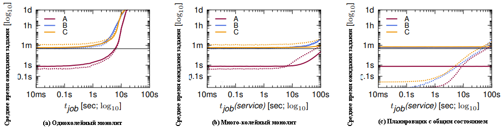
*Время ожидания задания в зависимости от t~job~ в однопутном монолитном планировщике, t~job~(service) в много-путном монолитном и в планировщике Omega с общим состоянием. [SLO][SLO] (горизонтальная полоса) составляет 30 секунд.*

###### Рисунок 6
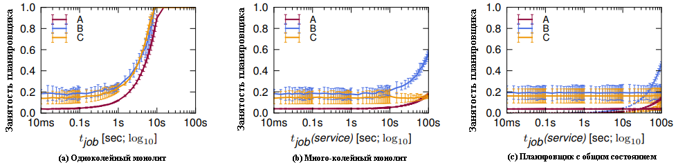
*Занятость планировщиков как функция от t~job~ в однопутном монолитном, t~job~(service) в много-путном монолитном и в Omega с общим состоянием. Значение представляет собой медианную ежедневную занятость в течение 7-дневного эксперимента, а планки погрешностей обрамляют [MAD][MAD]-окрестность значения для оценки типичной дисперсии значений.*

### 4.1 Монолит
Мы приняли в качестве базовой модели для сравнения последовательный монолитный планировщик с одинаковым временем принятия решения и для пакетных заданий и для заданий обслуживания. Такая модель должна отражать выполнение одного и того же кода для большинства заданий, не зависимо от их типа — монолитный *однопутный* планировщик. Мы также рассматриваем монолитный планировщик с более быстрым временем планирования для пакетных заданий — *много-путный* монолитный, монолитный, поскольку он по-прежнему планирует только одно задание за раз. В текущем кластере Google планировщик находится где-то посередине между этими двумя чистыми конструкциями: он монолитен, он в основном применяет одинаковую логику планирования для всех заданий, хотя и выполняет некоторую логику, специфичную для задания.

В случае базовой модели (однопутный монолит) мы изменяем время принятия решения планировщиком по оси X, изменяя время планирования t~job~. В случае много-путного монолита мы разделяем рабочую нагрузку на пакетную и сервисную и фиксируем время планирования для пакетных заданий на значении по умолчанию, в то время как изменяем время планирования для сервисных заданий t~job~(service).

Результаты неудивительны: в случае монолита с моно-кодом занятость планировщика невелика, пока планирование выполняется быстро, но масштабируется линейно с увеличением t~job~ (рис. [6](#рисунок-6)a). Как следствие, время ожидания задания увеличивается с той же скоростью, пока планировщик не будет перегружен, после чего он больше не сможет справляться с поступающей рабочей нагрузкой. Кривые времени ожидания для сервисных заданий точно соответствуют кривым для пакетных заданий, поскольку для всех заданий требуется одинаковое время для планирования (рис. [5](#рисунок-5)a).

При наличии отдельного кода, реализующего быстрый путь для пакетных заданий (в случае много-путного планировщика), как среднее время ожидания задания, так и занятость планировщика значительно уменьшаются даже при длительном времени принятия решения для сервисных заданий, поскольку большинство заданий являются пакетными. Но пакетные задания по-прежнему могут застрять в очереди за медленными в планировании служебными заданиями, и происходит [блокировка начала очереди][HOL-block], т.о. масштабируемость по-прежнему ограничена вычислительной мощностью одного планировщика (рис. [5](#рисунок-5)b и [6](#рисунок-6)b). Чтобы избежать этого, нам нужна некоторая форма параллельной обработки.

### 4.2 Двухуровневый планировщик: Mesos
Наши эксперименты с двухуровневым планировщиком основаны на дизайне [Mesos][Mesos], основанном на предложениях централизованным распределителем ресурсов планировщикам. Мы моделируем один распределитель ресурсов и две структуры планировщика, одна из которых обрабатывает пакетные задания, а другая — сервисные. Для простоты мы предполагаем, что планировщик просматривает набор доступных ему ресурсов только тогда, когда начинает попытку планирования задания; любые предложения, поступающие от распределителя во время попытки планирования, планировщик игнорирует. Ресурсы, не использованные в конце планирования задания, планировщик возвращает распределителю; они могут быть повторно предложены снова, если фреймворк сочтет, что требования [справедливости][DRF] ниже определенной доли. Алгоритм [DRF][DRF], используемый централизованным распределителем ресурсов Mesos, довольно быстр, поэтому мы предполагаем, что для предложения ресурсов требуется всего 1 мСек.

Поскольку теперь у нас есть два планировщика, мы оставляем время принятия решения для пакетного планировщика постоянным и изменяем время принятия решения для планировщика сервисных заданий t~job~(service).
Однако занятость пакетного планировщика (рис. [7](#рисунок-7)b) оказывается намного выше, чем в случае монолитного много-путного планировщика. Это является следствием сочетания модели предложения Mesos с длительным временем принятия решений планировщиком сервисных заданий. Mesos достигает справедливости, поочередно предлагая все доступные ресурсы кластера разным планировщикам, исходя из предположения, что ресурсы становятся доступными часто, а решения планировщика принимаются быстро. Если же время принятия решения планировщика (в нашем случае сервисных заданий) увеличивается, то оказывается, что почти все ресурсы кластера заблокированы на это долгое время и недоступны для других планировщиков (в нашем случае — пакетному планировщику). Единственными ресурсами, доступными для других планировщиков в этой ситуации, являются те немногие, которые становятся доступными, пока медленный планировщик занят. Их часто бывает недостаточно для планирования пакетного задания размера выше среднего, а это означает, что пакетный планировщик не может выполнять работу, пока планировщик сервисных заданий удерживает предложение большой пачки ресурсов. Тем не менее, система продолжает попытки предложений, и, как следствие, мы обнаруживаем, что несколько заданий были вовсе прекращены, потому что они не завершили планирование своих задач к моменту исчерпания лимита повторных попыток (1’000 попыток в случае Mesos) (рис. [7](#рисунок-7)c).

Эта патология возникает из-за предположения Mesos о быстрых решениях по планированию, о небольших заданиях, из которых вытекает высокая скорость возвращения ресурсов, но эти предположения не верны для наших сервисных заданий. Mesos можно было бы улучшить, чтобы распределитель ресурсов делал только справедливые предложения, хотя это сильно усложнило бы его логику, и качество решений о размещении для больших заданий (или заданий, помеченных как «максимальные усилия»), вероятно, ухудшилось бы, поскольку каждый планировщик видел бы только меньшую часть доступных ресурсов. Мы обсуждали этот вопрос с командой Mesos; они согласны с этим ограничением и рассматривают возможность его устранения в будущей работе.

###### Рисунок 7
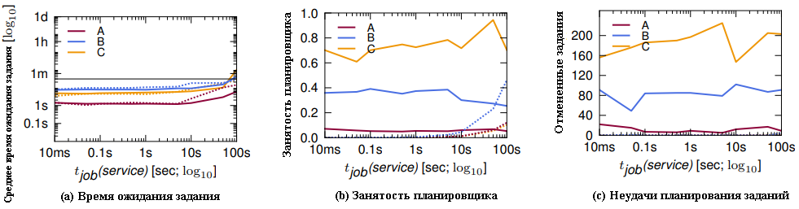
*Двухуровневый планировщик Mesos: Зависимость метрик от времени планирования сервисных заданий t~job~(service)*

### 4.3 Планировщик с общим состоянием: Omega
Планировщик с общим состоянием Omega — последний, для которого мы используем облегченный симулятор. Мы снова моделируем два планировщика: один обрабатывает пакетные задания, другой — сервисные. Оба планировщика обновляют свою локальную копию состояния ячейки, синхронизируя ее с общей, перед тем, как начинают просматривать очередное задание, и работают со своей локальной копией в течение времени принятия решения. После завершения планирования, если хотя бы одна задача из задания запланирована, планировщик выдает транзакцию для обновления состояния общей ячейки. Если конфликтов нет, то вся транзакция принимается; в противном случае принимаются только те изменения, которые не приводят к конфликтам (т.е. превышению ресурсов ячейки).

Из рис. [5](#рисунок-5)c видно, что среднее время ожидания задания для подхода Omega сравнимо со средним временем ожидания для многоканального монолитного (рис. [5](#рисунок-5)b). Это говорит о том, что конфликты и отмены противоречивых планирований относительно редки; это же подтверждается и графиком занятости планировщика (рис. [6](#рисунок-6)c). В отличие от Mesos (рис. [7](#рисунок-7)c), планировщик Omega позволяет планировать все задания в рабочей нагрузке. В отличие от монолитной реализации с несколькими путями, Omega не страдает от [блокировки начала очереди][HOL-block], т.к. пути обработки пакетных и служебных заданий независимы.

Мы также изучаем, как подход Omega масштабируется под изменения рабочей нагрузки. Для этого мы увеличиваем скорость поступления заданий пакетного планировщика, λ~jobs~(batch). На рис. [8](#рисунок-8) показано, что увеличиваются и время ожидания задания, и занятость планировщика. Для пакетных заданий это связано с более высокой скоростью поступления заданий, а для сервисных — с увеличивающийся частотой конфликтов. Как показано пунктирными вертикальными линиями, кластер A масштабируется примерно в 2,5× раза по сравнению с исходной рабочей нагрузкой, прежде чем не успевает за ней, в то время как кластеры B и C масштабируются до 6× и 9,5× раз соответственно.

###### Рисунок 8
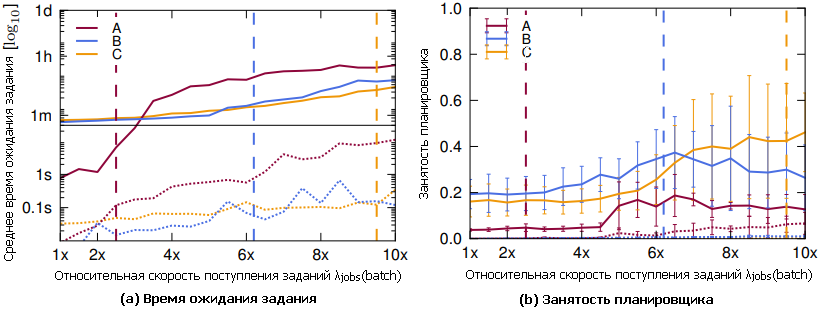
*Планировщик Omega: изменение скорости поступления для пакетной рабочей нагрузки, λ~jobs~(batch). Вертикальные пунктирные линии указывают точки насыщения планировщика; т. е. справа от них вовремя планируется лишь часть рабочей нагрузки.*

Поскольку именно планировщик пакетных заданий является основным узким местом масштабируемости, мы повторяем тот же эксперимент по масштабированию, но уже с *несколькими* пакетными планировщиками, чтобы проверить способность модели Omega масштабироваться до больших нагрузок. Работа по планированию пакетных заданий распределяется между планировщиками с помощью простой функции хеширования. Как и ожидалось, доля конфликтов увеличивается с увеличением количества планировщиков, поскольку существует больше возможностей для конфликтов (рис. [9](#рисунок-9)a), но это компенсируется — по крайней мере, до 32-х пакетных планировщиков — большей занятостью планировщика при большем количестве планировщиков (рис. [9](#рисунок-9)b). Аналогичные результаты видны для времени ожидания задания (нет рисунка). Это обнадеживающий результат: модель Omega может масштабироваться до высокой пакетной рабочей нагрузки, продолжая при этом обеспечивать хорошее поведение для сервисных заданий.

###### Рисунок 9
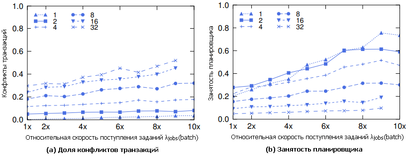
*Планировщик Omega: изменение скорости поступления для пакетной рабочей нагрузки, λ~jobs~(batch). Каждая строка представляет разное количество пакетных планировщиков.*

### 4.4 Выводы
Облегченный симулятор — полезный инструмент для сравнения различных архитектур планировщика. На [рис. 10](#рисунок-10) графически представлены результаты с учетом влияния масштабирования t~task~ как дополнительного измерения.

###### Рисунок 10

*Облегченный симулятор: влияние t~job~(service) (правая ось) и t~task~(service) (левая ось) на занятость планировщика (ось z) в различных схемах планирования, на кластере B. Красное затенение трехмерного графика означает, что часть заданий оставалась незапланированной.*

Короче говоря, монолитный планировщик не масштабируется. Несмотря на то, что добавление много-путевой функции сокращает среднее время принятия решения о планировании, [блокировка начала очереди][HOL-block] по-прежнему является проблемой для пакетных заданий и означает, что эта модель не сможет масштабироваться до рабочих нагрузок, которые мы планируем для больших кластеров. Двухуровневая модель Mesos может поддерживать независимые реализации планировщика, но ей мешает пессимистическая блокировка, она плохо справляется с длительным временем принятия решений и не может планировать большую часть гетерогенной нагрузки, которую мы ей предлагали.

Подход с общим состоянием Omega, по-видимому, предлагает конкурентоспособную, масштабируемую производительность с нечастыми конфликтами в реалистичных рабочих диапазонах, поддерживает независимые реализации планировщика и предоставляет планировщику все состояние распределения. Мы покажем, как полезно последнее, в §6. Наши результаты показывают, что Omega может масштабироваться для многих планировщиков, а также для сложных рабочих нагрузок.

## 5. Высокоточный симулятор
Сравнив различные архитектуры планировщика с помощью упрощенного симулятора, мы используем высокоточный симулятор для более подробного изучения некоторых свойств подхода Omega с общим состоянием без упрощающих предположений, сделанных упрощенным симулятором. Ядром высокоточного симулятора является код, используемый в системе планирования производства Google. В нем учитываются ограничения на размещение задач, используются те же алгоритмы, что и в производственной версии, и ему могут быть предоставлены начальные состояния ячеек кластера и подробные трассировки рабочей нагрузки, полученные из действующих кластеров. Это позволяет нам с высокой степенью достоверности оценить дизайн с общим состоянием в реальных рабочих нагрузках. Мы используем его, чтобы ответить на следующие вопросы:
1. Насколько часты конфликты в планировании при реальных рабочих нагрузках и какое время принятия решений планировщиком мы можем себе позволить в производственной среде (§5.1)?
2. Каково влияние различных методов обнаружения и разрешения конфликтов на реальные рабочие нагрузки (§5.2)?
2. Есть ли выгода от возможности доступа ко всему состоянию ячейки в планировщике? (§6)

Крупномасштабные производственные системы чрезвычайно сложны, и поэтому даже высокоточный симулятор использует несколько упрощений. Он не моделирует сбои машины (поскольку они создают лишь небольшую нагрузку на планировщик); он не моделирует несоответствие между запросами ресурсов и фактическим использованием этих ресурсов в трассировках (более подробно обсуждается в [другом месте][trace-analysis]); он фиксирует выделения в первоначально запрошенных размерах (следствие ограничений в данных трассировки); и он отключает вытеснения, потому что мы обнаружили, что они мало влияют на результаты, но значительно замедляют моделирование.

Как и ожидалось, результаты двух симуляторов в целом совпадают. Основное отличие заключается в том, что при работе облегченного симулятора обнаруживается меньше конфликтов за ресурсы, что, вероятно, является результатом отсутствия в нем поддержки ограничений по размещению (из-за чего «привередливые» задания в нем легче планируются, чем на самом деле), и его более простого представления о том, когда машина считается заполненной (что означает, что он не видит некоторые мелкие конфликты, см. §5.2).

Тем не менее, используя высокоточный симулятор для модели с общим состоянием Omega, мы можем подтвердить все тенденции, которые демонстрирует нам облегченный симулятор. Мы считаем, что это подтверждает, что эксперименты с облегченным симулятором обеспечивают правдоподобные сравнения между различными архитектурами планирования при общем наборе предположений.

## 5.1 Производительность планировщика
На [рис. 11](#рисунок-11) показано, как ззанятость планировщика изменяется в зависимости от t~job~(service) и t~task~(service) для месячной трассировки кластера C (охватывающей ту же рабочую нагрузку, что и [общедоступная трассировка][trace]). Обнадеживает тот факт, что занятость планировщика остается низкой почти во всем диапазоне для обоих вариантов, а это означает, что архитектура Omega хорошо масштабируется при увеличении времени планирования сервисных заданий.

###### Рисунок 11
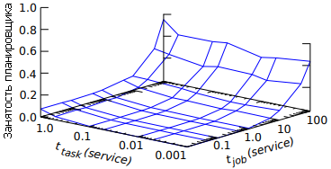
*Планировщик Omega: влияние на работу планировщика времени t~job~ (service) и t~task~ (service) с использованием высокоточного симулятора; данные 29-дневной трассировки кластера C.*

**Масштабирование рабочей нагрузки.** Мы также исследовали производительность архитектуры с общим состоянием, используя 7-дневную трассировку из кластера B, который является одним из самых больших и загруженных кластеров Google. Опять же, мы меняем время t~job~(service). На рис. [12](#рисунок-12)b видно, как только t~job~(service) достигает примерно 10 секунд, доля конфликтов возрастает выше 1,0, поэтому для планирования задания службы в среднем требуется по крайней мере одна повторная попытка.

###### Рисунок 12
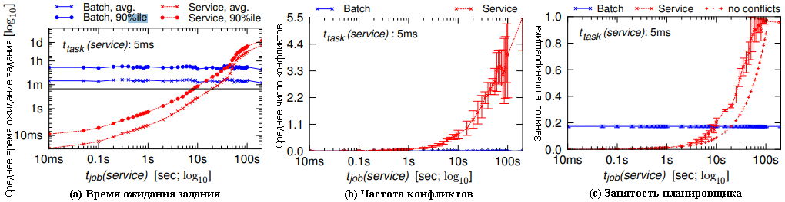
*Планировщик Omega: влияние на метрики планировщика времени t~job~ (service) с использованием высокоточного симулятора; данные 7-дневной трассировки кластера B.*

Примерно в тот же момент (t~job~(service) ≈ 10 секунд) нам не удалось уложиться в 30-секундное [SLO][SLO] времени ожидания задания (рис. [12](#рисунок-12)a), хотя сам планировщик еще не достиг высокой занятости: дополнительное время ожидания вызвано исключительно влиянием конфликтов. Чтобы подтвердить это, мы аппроксимировали время, которое потребовалось бы планировщику, если бы он не сталкивался с конфликтами или повторными попытками (случай «нет конфликта» на рис. [12](#рисунок-12)c), и обнаружили, что загруженность планировщика служб с конфликтами примерно на 40 % выше, чем в случае бесконфликтного допущения. Отметим, что уровень помех в кластере B гораздо выше, чем в кластере C, скорее всего, из-за гораздо более высокой пакетной нагрузки в кластере B.

Несмотря на относительно высокий уровень конфликтов, наши эксперименты показывают, что архитектура Omega с общим состоянием может поддерживать планировщики сервисов, которым требуется несколько секунд для принятия решения. Мы также исследовали масштабирование времени решения для каждой задачи и обнаружили, что можем поддерживать t~task~(service) в 1 секунду (при t~job~(service) 0,1 с), что приводит к доле конфликта ≤ 0,2. Это означает, что мы можем поддерживать планировщики с большим временем принятия решения и для одного задания, и для каждой задачи.

**Балансировка нагрузки планировщика пакетов.** При использовании монолитного однопутного планировщика (§[4.1](#41-монолит)) высокая скорость поступления пакетных заданий требует использования тривиальных, простых алгоритмов планирования: просто невозможно использовать более умные, требующие больше времени алгоритмы планирования для этих заданий, поскольку мы уже упускаем из-за высокой нагрузки [SLO][SLO], например, на кластере B. Хотелось бы, чтобы пакетные задания тоже могли пережить сбои, и качество размещения, несомненно, улучшится, если планировщику будет предоставлено немного больше времени для принятия решения. К счастью, архитектура Omega может легко достичь этого за счет балансировки нагрузки при планировании пакетных заданий между несколькими пакетными планировщиками.

Чтобы проверить это, мы запускаем эксперимент с тремя параллельными пакетными планировщиками, распределяя между ними рабочую нагрузку, используя хэш идентификаторов заданий, аналогично предыдущему эксперименту с простым симулятором. Мы достигаем увеличения масштабируемости в 3 раза, перемещая точку насыщения с t~job~(batch) примерно c 4 секунд до 15-ти (рис. [13](#рисунок-13)а). В то же время уровень конфликтов остается низким (около 0,1), и все планировщики соответствуют 30-секундному [SLO][SLO] времени ожидания задания до точки насыщения (рис. [13](#рисунок-13)b).

###### Рисунок 13
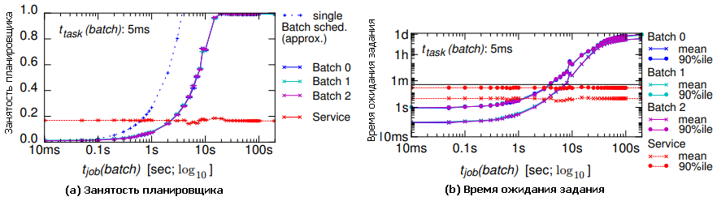
*Планировщик Omega: эффект распараллеливания пакетных планировщиков на быстродействие, варьируется время t~job~(batch); данные 24-часовой трассировки кластера C.*

Короче говоря, балансировка нагрузки между несколькими планировщиками может повысить масштабируемость при увеличивающейся скорости поступления заданий. Конечно, масштабирование не будет линейным из-за накладных расходов на обновление локальных копий состояния ячейки, и при таком подходе не будет легко обрабатывать сотни планировщиков. Однако нашей точкой сравнения является единый монолитный планировщик, поэтому ускорение даже в пределах одного порядка полезно.

Таким образом, архитектура Omega хорошо масштабируется и допускает длительное время принятия решений при реальных рабочих нагрузках кластера.

## 5.2 Работа с конфликтами
Мы также используем высокоточный симулятор для изучения двух интересных альтернатив, с которыми мы столкнулись на этапе реализации.

Первая альтернатива заключалась в соблазне использовать *грубый метод обнаружении конфликтов*: выбор размещения планировщиком будет отклонен, если были внесены *какие-либо* изменения в целевую машину с момента синхронизации локальной копии состояния ячейки в начале транзакции. Этот подход можно было бы реализовать с помощью простого порядкового номера в объекте состояния машины.

Вторая альтернатива — в возможности планирования по принципу *все или ничего*: вся транзакция состояния ячейки будет отклонена, если это вызовет недостаток ресурсов какой-либо машины. Такая альтернатива может понадобиться для заданий, которые требуют группового планирования или которые не могут выполнять какую-либо полезную работу, пока не будут выполнены все их задачи[^7].

[^7]: Эта альтернатива поддерживается текущим планировщиком Google, но используется редко, т.к. предпочтительнее произвести планирование и дождаться сбоя, который в любом случае прервет работу задания.

###### Рисунок 14
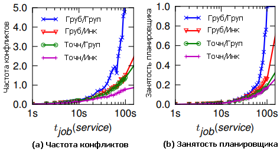
*Планировщик Omega: влияние грубого обнаружения конфликтов и группового планирования на частоту конфликтов, варьируется время  t~job~(service); усредненные данные 29-дневной трассировки кластера C.*

Неудивительно, что следование обеим альтернативам приводит к дополнительным конфликтам и к увеличению занятости планировщика (рис. [14](#рисунок-14)). Хотя включение планирования «все или ничего» для всех заданий приводит лишь к незначительному увеличению занятости планировщика при условии использовании детального обнаружения конфликтов (рис. [14](#рисунок-14)a), оно увеличивает долю конфликтов примерно в 2 раза. Поскольку теперь повторные попытки должны заменить все задачи, что увеличивает вероятность повторного отказа. Таким образом, эту альтернативу («все или ничего») следует использовать только для детализации на уровне *отдельного* задания. Если же еще следовать и грубому обнаружению конфликтов, то все становится еще хуже: ложные конфликты приводят к увеличению частоты конфликтов и, следовательно, к увеличению занятости планировщика в 2–3 раза. Очевидно, что по умолчанию должны использоваться инкрементные транзакции.

[big-table]: https://research.google/pubs/pub27898/
[DRF]: https://cs.stanford.edu/~matei/papers/2011/nsdi_drf.pdf
[dryad]: https://www.microsoft.com/en-us/research/project/dryad/
[emergent]: https://en.wikipedia.org/wiki/Emergence
[gang-schedule]: https://en.wikipedia.org/wiki/Gang_scheduling
[h-o-d]: https://svn.apache.org/repos/asf/hadoop/common/tags/release-0.17.1/docs/hod.html 
[HOL-block]: https://en.wikipedia.org/wiki/Head-of-line_blocking
[HPC]: https://en.wikipedia.org/wiki/Computer_cluster
[IBM-LSF]: https://en.wikipedia.org/wiki/IBM_Spectrum_LSF
[MAD]: https://en.wikipedia.org/wiki/Median_absolute_deviation
[map-reduce]: https://research.google/pubs/pub62/
[Maui]: https://en.wikipedia.org/wiki/Maui_Cluster_Scheduler
[Mesos]: https://mesos.apache.org/
[MPI-API]: https://www.mpi-forum.org/docs/
[percolator]: https://research.google/pubs/pub36726/
[Pregel]: https://research.google/pubs/pub37252/
[SLO]: https://en.wikipedia.org/wiki/Service-level_objective
[sources-google]: https://code.google.com/p/cluster-scheduler-simulator/
[sources-git]: https://github.com/google/cluster-scheduler-simulator/
[trace]: http://goo.gl/9B7PA/
[trace-analysis]: https://www.pdl.cmu.edu/PDL-FTP/CloudComputing/googletrace-socc2012.pdf
[yarn]: https://blog.cloudera.com/yarn-capacity-scheduler/