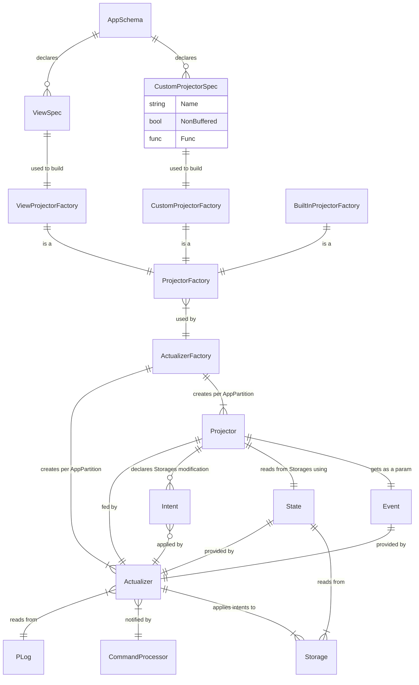

### Abstract

Projectors design

### Terms
- Projector (Проектор)
  - Common: Describes the way how events are applied to projection
  - Heeus: Provides a function which generates *Intents* based on the information from *Event* and current *State*
- State (состояние)
  - Provides reading from Storages
- Intents (намерения)
  - A declaration of Create or Update modifications in Storage that will be applied in the result of projector execution
  - Modifications declared by Intents are not applied before the extension function ends
- Storage
  - Provides I/O access for extensions (to e.g. Views, Records, WLog, HTTP, Mailer, etc)
- Projection (Проекция, Read Model, Query Model)
  - Common: Projection is about deriving current state from the stream of events. [(c)](https://abdullin.com/post/event-sourcing-projections/)
    - Состояние, вычисленное на основе анализа потока событий
  - Common: "Projection is a left-fold over the sequence of events" [(c)](https://domaincentric.net/blog/event-sourcing-projections) [Greg Young](https://cqrs.files.wordpress.com/2010/11/cqrs_documents.pdf)
    - [Левоассоциативная свертка](https://ru.wikipedia.org/wiki/%D0%A1%D0%B2%D1%91%D1%80%D1%82%D0%BA%D0%B0_%D1%81%D0%BF%D0%B8%D1%81%D0%BA%D0%B0) списка
  - In terms of Heeus: cumulative result of *all applied intents* of the projector.
  - Example: one projector may generate one or more Views. A *combination of these views* is a projection
- Internal Projection
  - A projection which is kept in the AppStorage;
  - WLog, Table, View;
  - Read Model is the set of internal projectors;
- External Projection
  - A projection which is kept outside of the AppStorage;
- Actualizer (Feeder, Актуализатор, Кормилец)
  - A component which *feeds Projector* with events from PLog
  - Applies intents to storages
- Async Actualizer
  - Feeds projectors asynchronously with Command Processor: no guarantee that projection is updated before CP finishes handling the event.
  - Each Projector fed by it's own Async Actualizer
- Sync Actualizer
  - Feeds projectors within Command Processor => projection is updated before event handling is finished
  - This type of actualizer will be soon eliminated
- Actualizer Factory (Фабрика Актуализатора)
  - A function which creates actualizer instance for the app partition for certain projector
- Actualizer Offset (Смещение проектора)
  - The number of the last PLog event which is guaranteed fed to the projector and applied to storages

### Concepts

### Principles
- As we don't use "Prepare" function, Projector is *not an IOperator anymore*, but a function with three arguments: *workpiece*, *State* and *Intents*
- Async Actualizers (AA):
  - State 1:
    - Changes to storage applied immediately after every event
  - State 2.0:
    - AA Buffers changes to storages and applies them by timer or when the buffer is full
    - there is a possibility to set projection as "non%-buffered". In this case changes applied after every event
- Sync Actualizers (SA):
  - State 1:
    - SA handle single event in a Fork. Every SA applies it's changes independently
  - State 2.0:
    - SA handle single event in a Fork. Changes to storages applied when all projectors for the event are handled with no errors

### Detailed design

- [Async Actualizers](./async-act.md)
- [Sync Actualizers](./sync-act.md)
- [Idempotency](./idempotency.md)

### References
- [State 2.0](./README.md)
- [Extension Engines / WASM ABI](./ext-engines.md)
- [Lazy Projections](./lazy-projections.md)

