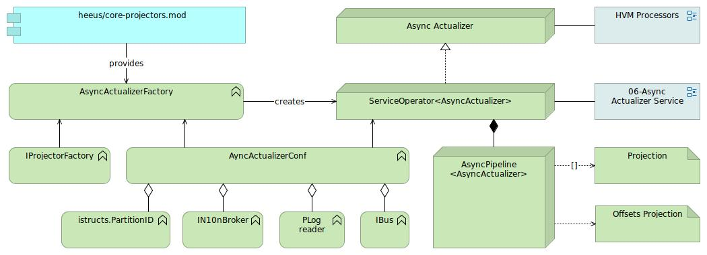
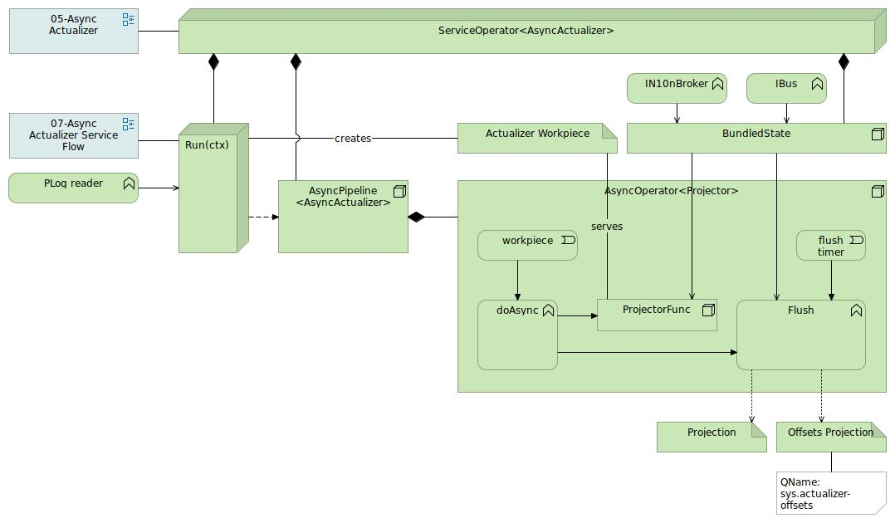
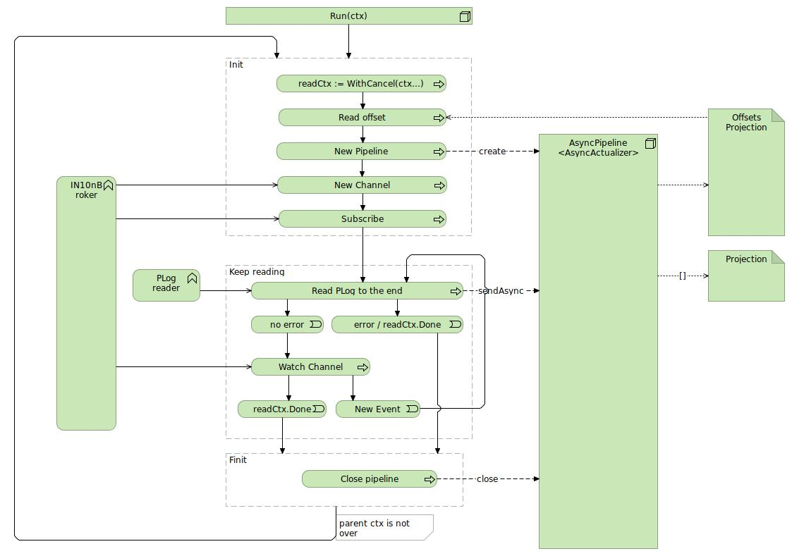

### Principles
- [Async actualizers]($15196)
  - Async projector is a `func(IAsyncActualizerWork, IState) error`, not IOperator
  - Async actualizer creates state and flushes intents it by either output buffer size or flush interval
  - Actualizer offset are flushed together with the bundle
  - Non%-buffered async projectors (see [Async Projectors: external projection failures]($20000))
    - AsyncProjector provides "non%-buffered projector" option.
    - Async Actualizer flushes it's state after every event for non%-buffered projector. 

### Async Actualizer

### Async Actualizer Service

### Service Flow
