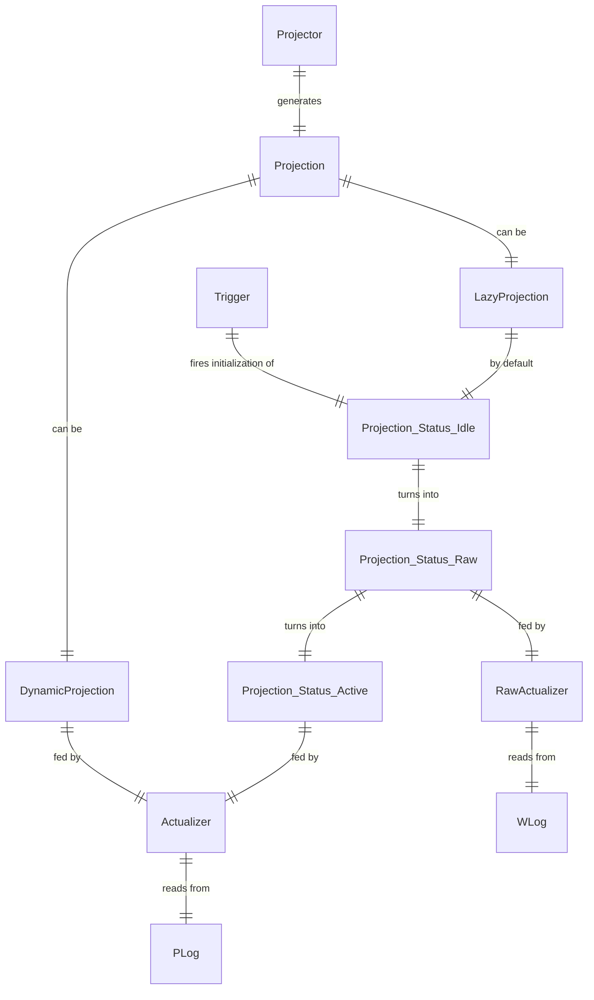

# Terms
- Lazy Projection - a projection which is kept non-generated upon request. When requested, the projection is initialized using WLog, and then kept updated from PLog.
- Dynamic Projection - a projection which is updated with every PLog event (e.g. Table).

# Projections

# Principles
- Lazy projection initialization triggered by:
  - querying View which belongs to Lazy Projection from:
    - QueryProcessor
    - Actualizer
- Command processor can only read from the Views which are the part of Dynamic Projections;

# Implementation
- ProjectionKind is a part of projector specification:
  - Dynamic (always active)
  - ??? DynamicBuffered (always active, buffered intents)
  - Lazy (initialized by request, buffered intents)
- CommandProcessor cannot read from Lazy projections, which throws error.
- UpdatedViews is a part of projector specification: [View1, View2, ...]
- Projection statuses kept by workspace: IDLE, RAW, ACTIVE
- Actualizer feeds event to projector:
  - For Dynamic Projections - always;
  - For Lazy Projections - only when projections for current workspace has status ACTIVE;
- When trigger activates idle projection initialization:
  - projection status is set to RAW;
  - a separate RawActualizer is created which reads from WLog and initializes raw projection (a pool of RawActualizer per AppPartition);
  - when the raw projection is initialized, it's status set to ACTIVE:
    - ??? synchronization between RawActualizer and Actualizer.
- In Actualizer and QueryProecssor:
    - For [Lazy projections](./lazy-projections.md) check status:
        - IDLE
            - Send to initialization;
            - Wait for some time;
            - Return 503 if non initialzied;
        - RAW:
            - Wait for some time;
            - Return 503 if non initialzied;
        - ACTIVE:
            - check consistency offset if specified; throw 503 if non consistent (some waiting is possible);

# See Also
- [Async Projections](https://dev.heeus.io/launchpad/#!17900)