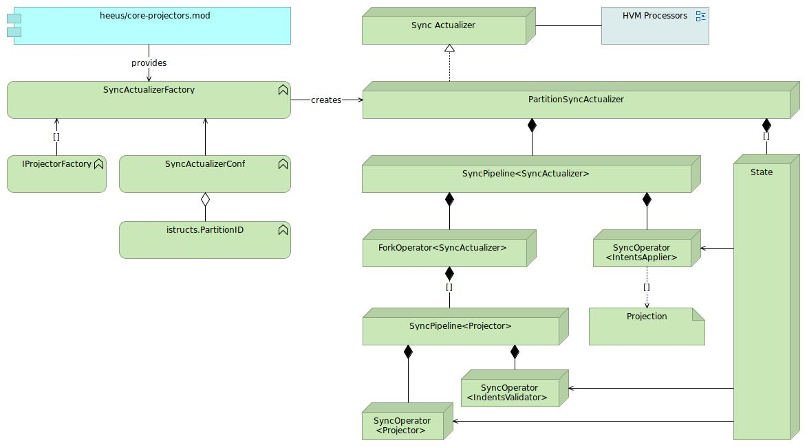

### Sync Actualizers
  - Sync projector is a func, not IOperator
  - All projectors use separate IState instances:
    - Each fork branch executes projector and then [validates intents]($21606)
  - Sync actualizer flushes intents in all States when all branches has been finished with no errors

