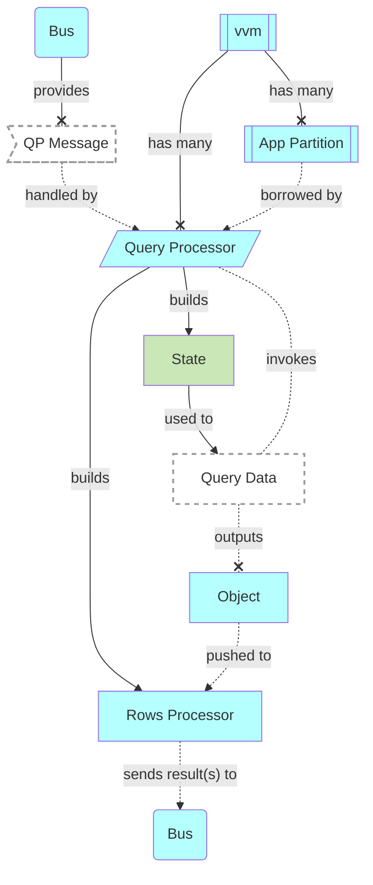
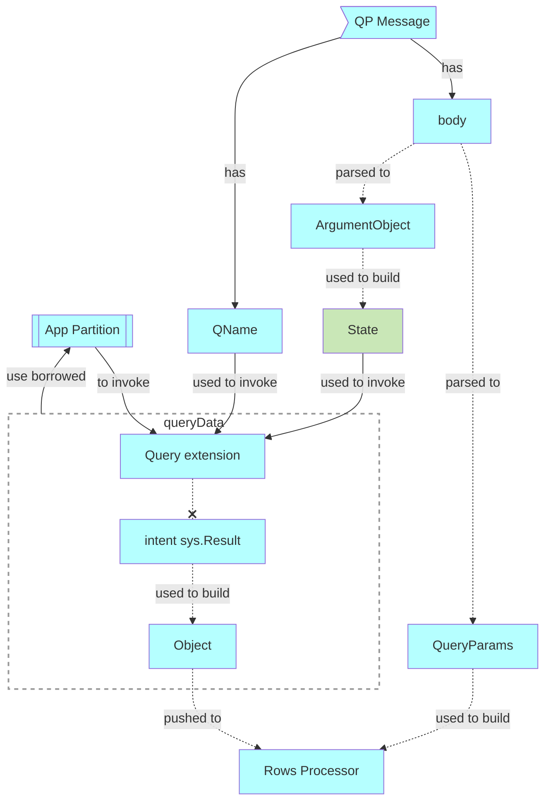
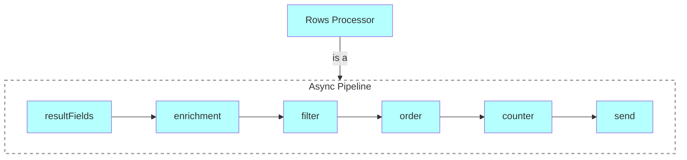
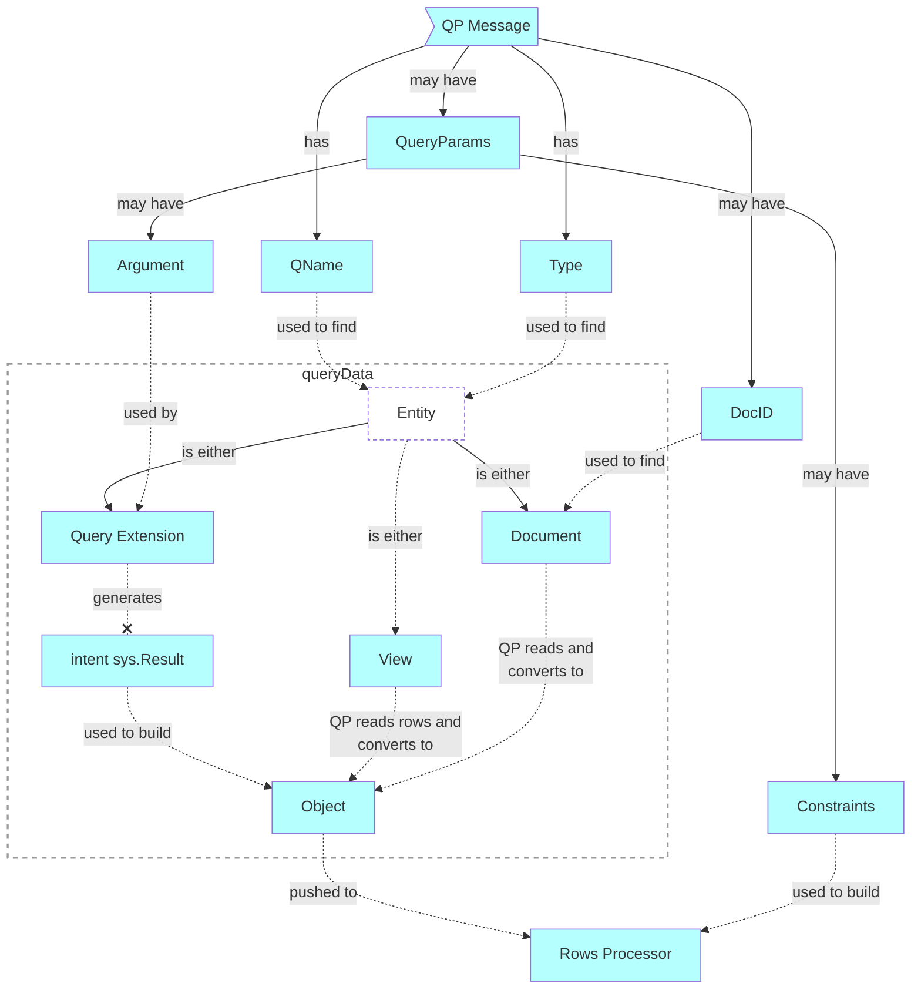
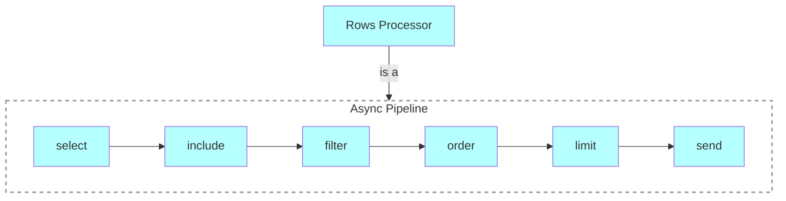

# Query Processor
A component used to query data and return it to client

# Context

# Components
## Query Processor v1 (/api/)
### Principles
- Only reads from query functions
- handled with HTTP POST

### QP Message & Query data

### Rows processor

## Query Processor v2 (/api/v2/)
### Principles
- Reads from query functions, documents, views
- handled with HTTP GET
- supports query constraints in ParseAPI syntax
- see also: https://github.com/voedger/voedger/issues/1162 

### QP Message & Query data

### Rows Processor

