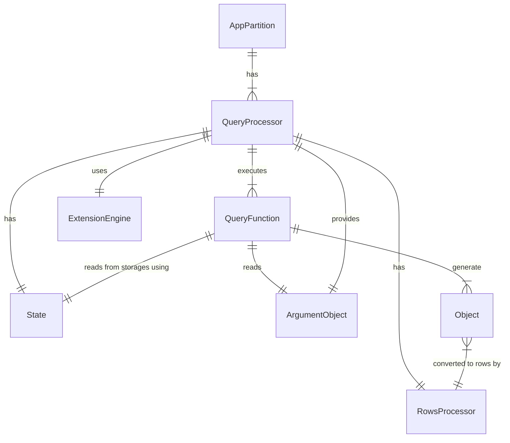
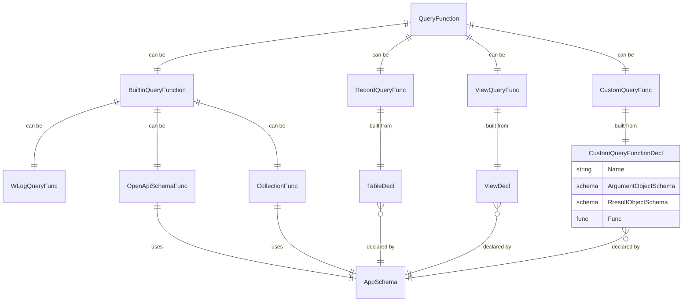

# Query Processor
A component which executes QueryFunctions and returns result to client

# User Stories
- Different types of results expected:
  - many objects (Collection, ViewQueryFunc, WLogQueryFunc)
  - single object (RecordQueryFunc)
  - custom data (OpenApiSchemaFunc)

# Architecture

# Query Functions

# Principles
- QueryFunction 
  - Reads from Storages using State
  - Not able to make any changes in Storages
  - Three kinds of QueryFunction:
    - Returning single object
    - Generating many objects. 
    - Returning custom data. Content-type is defined by QueryFuntion declaration.

# Concepts
- QueryProcessor2 for using in API2
- Works with QueryFunctions of different types:
  - Returning single object: result is a JSON object;
  - Generating many objects. Function returns them to QueryProcessor via callback. QueryProcessor combines them in rows using RowsProcessor. Result is an JSON array of objects with optionally embedded objects (containers): [example](./request.md)
  - Returning custom data. Results data with content-type defined by QueryFunction.

# See Also
- [Describe Heeus Functions in OpenAPI](https://dev.heeus.io/launchpad/#!19069)
- [A&D Query Processor](https://dev.heeus.io/launchpad/#!22705)
- [Consistency](../consistency/README.md)