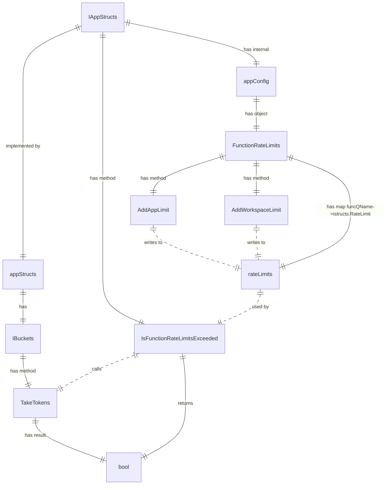

# Motivation

[Verifiable Fields with Rate Limits](https://dev.heeus.io/launchpad/#!24713)

# Functional design
Declare func with rate limit:
```go
AppConfig.FunctionRateLimits.AddAppLimit(
	QName("sys.InitiateEmailVerification"), istructs.RateLimit{
		Period:                24*time.Hour,
		MaxAllowedPerDuration: 3,
	}
)
AppConfig.FunctionRateLimits.AddWorkspaceLimit(
	QName("sys.InitiateEmailVerification"), istructs.RateLimit{
		Period:                time.Hour,
		MaxAllowedPerDuration: 3,
	}
)
```

Check rate limit:
```go
if IAppStructs.IsFunctionRateLimitsExceeded(funcQName, WSID) {
	return utils.NewHTTPErrorf(http.StatusTooManyRequests)
}
```

# Technical design

# Limitations
- IBuckets are per-app for now
