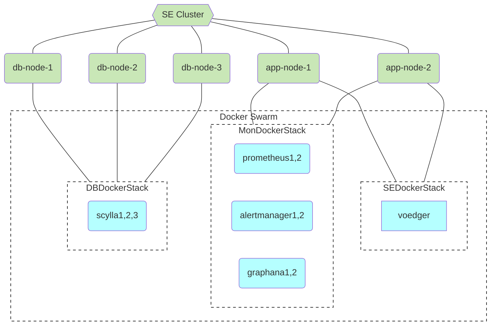
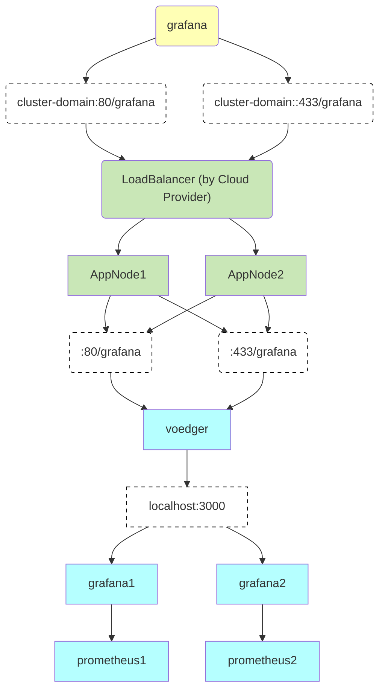

# Standart Edition (SE)

TOC

- [Principles](#principles)
- [Nodes & Swarm Services](#nodes--swarm-services)
- [grafana Service](#grafana-service)

## Principles

- Node must be a clean Ubuntu node
  - Reason: We believe it will avoid possible conflicts between installed software and reduce operation costs
- Balancer (e.g.  https://www.hetzner.com/cloud/load-balancer) should be used for redirecting traffic to the voedger containers
- Edger is not used (though its functionality is similar to what we need to maintain cluster nodes)
  - Reason: Edger requires connection to working Application which does not exist yet
- Orchestrator: swarm
  - Every node is a manager

## Nodes & Swarm Services

## grafana Service

Principles

- User: grafana
- Password: generated by ctool
  `ctool grafana getpwd`
  `ctool grafana newpwd`

