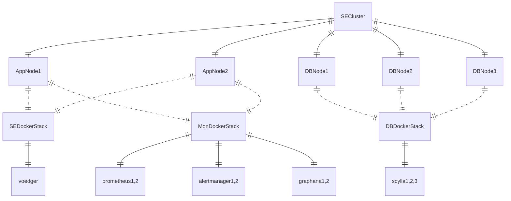

# Standart Edition (SE)

Principles

- Node must be clean Ubuntu node
  - Reason: We believe it will avoid possible conflicts between installed software and reduce operation costs
- Balancer (e.g.  https://www.hetzner.com/cloud/load-balancer) should be used for redirecting traffic to the voedger containers
- Edger is not used (though its functionality is similar to what we need to maintain cluster nodes)
  - Reason: Edger requires connection to working Application which does not exist yet
- Orchestrator: swarm
  - Every node is manager

## Nodes

## Using grafana

