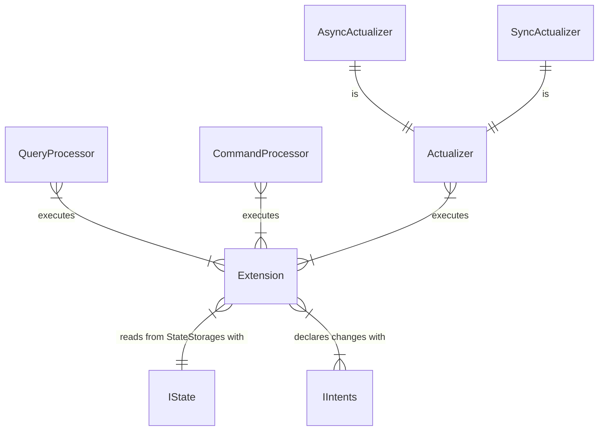
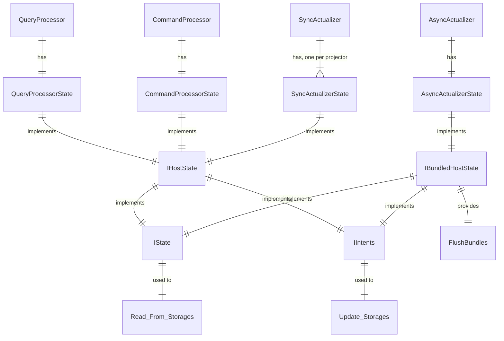

# State 2.0
State 2.0 is a mechanism which provides I/O to [extensions](./ext-engines.md)

## Principles

- CommandProcessor (CP), QueryProcessor (QP), SyncActualizer (SA) and AsyncActualizer (AA) uses States with different set of IStateStorages (see table below);
- By making Insert- and Update- operations extension create *intents*. Intents applied when the extensions function ends and core calls `ApplyIntents` method. Get- and Read- operations do not see changes made in the intents.
- CP and QP calls `ApplyIntents` after every command function execution (QP doesn't have any registered storages which is able to insert or update atm)
- AA uses slightly different implementation of IState. When `ApplyIntents` called, the intents are stored in an internal buffer (*bundles*) and doesn't applied to internal storage immediately. There is separate method `FlushBundles` which is called:
  - by timer from actualizer
  - when bundles size is big enough
  - when the Read operation wants to read from the entity and there are key(s) for this entity in any bundle

## Architecture

## Different IState Implementations

## Limitations
- It should not be allowed to update the same view from two different projectors, otherwise conflicts may happen.

## State Storage Availability
- CRUG: Create, Read, Update, Get
- CP - Command Processor, QP - Query Processor, AA - Async Actualizer, SA - Sync Actualizer

| Storage             |  CP  |  SA  |  QP  |  AA  | 
| ------------------- | ---- | ---- | ---- | ---- |
| AppSecretsStorageID |  G   |  G   |  G   |  G   |
| PLogStorageID       |  G   |  G   |  RG  |  RG  |
| WLogStorageID       |  G   |  G   |  RG  |  RG  |
| RecordStorageID     | CUG  |  G   |  G   | CUG* |
| ViewStorageID       |  G   |  G   |  RG  | CRUG |
| HTTPStorageID       |      |      |  R   |  R   |
| MailStorageID       |      |      |      |  C   |

* CU operations in Async Actualizers are done using commands (so called "federation post")

## Implementation
- A new IState replaces old components:
  - old IQueryState components (provide to request data and apply modifications)
  - old IState (provides a way to access requested data)\\
  - old IStorages (working with different types of storages)
  - See [IState example](https://github.com/heeus/inv-wasm/blob/master/20220326-projector-api/src/state.go)
- Instead of constructing PipelineStorages, a components (Command processor, Query processor, Actualizers) will construct new State and provide IState to ICommandFunction, IQueryFunction or IProjector

## See Also
- [Exttension Engines / WASM ABI](./ext-engines.md)
- [Projectors & Actualizers](../projectors/README.md)
- [Query Processor](../queryprocessor/README.md)