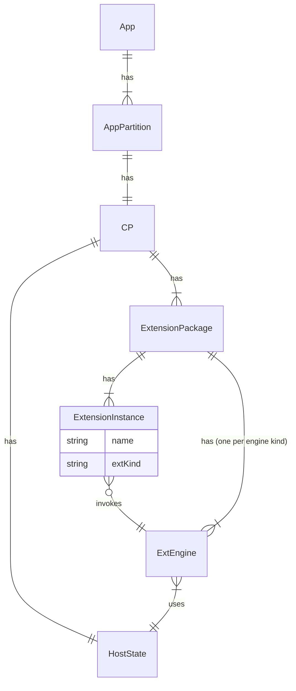
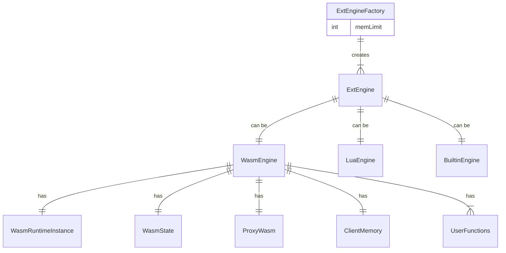
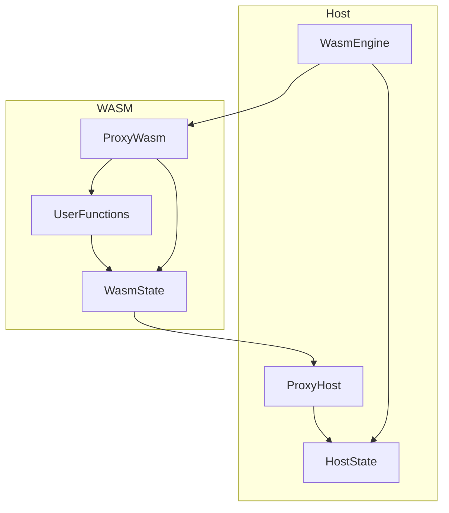
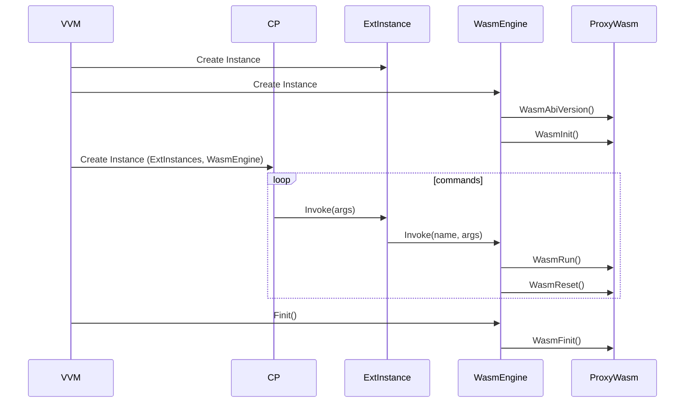
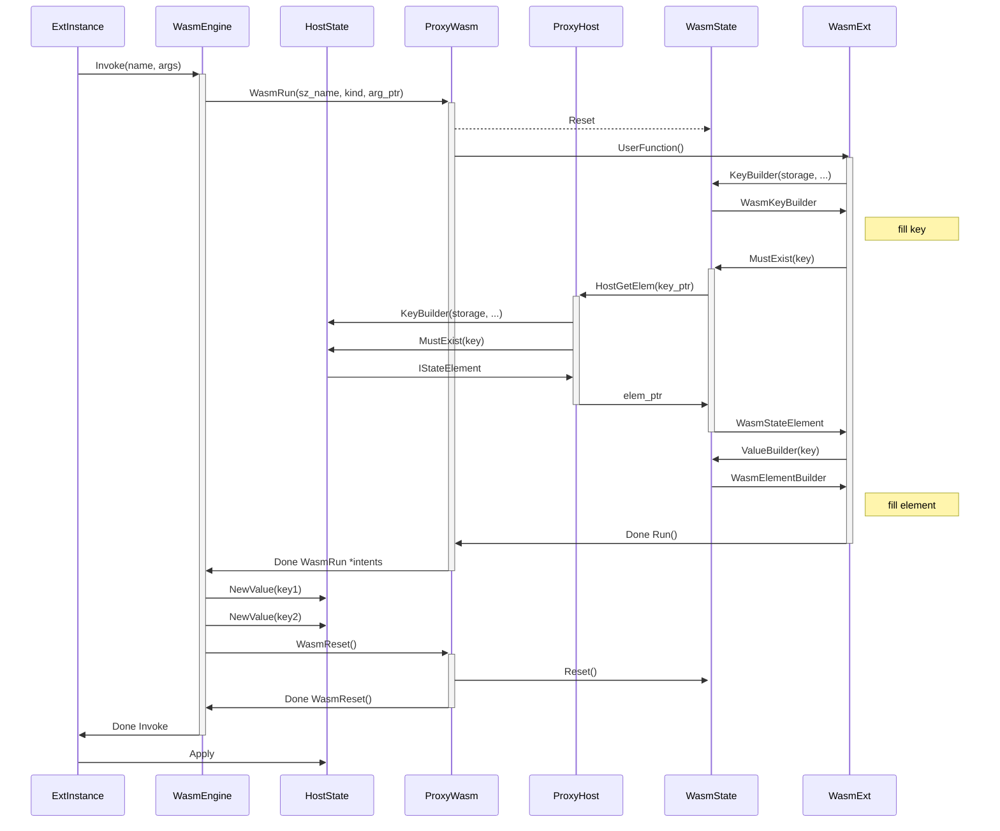
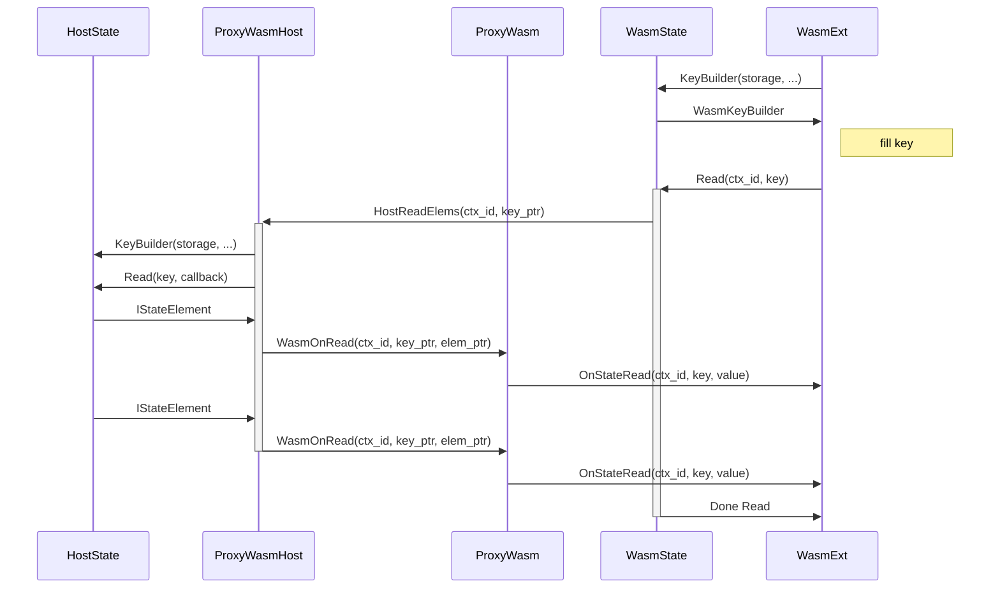

# Extension Engines
## Principles
- Extension engine is the component which invokes extensions
- Partition Processor has:
  - Extension engine instance(s)
  - Extension instance(s)
  - Host State (aka State 2.0)
## Overview


## Extension Engine Kinds
Principles:
- Heeus supports different extension engines (Builtin, WASM, LUA)
- Extension engine is constructed with the factory on partition processor initialization stage




# WasmEngine

Principles:
- WasmEngine communicates with User Functions and WasmState through number of functions exported by WASM module (ProxyWasm)
- To communicate with HostState, WasmState uses number of functions implemented by Host and imported by WASM module (ProxyHost)



# WasmEngine: Lifecycle


# ProxyWasm ABI: Detailed


# ProxyWasm ABI: Read Detailed



# Wasm ABI
The list of functions to be exported by WASM:
```go
    WasmAbiVersion_X_Y()

    // Called by host when client is initialized
    WasmInit()

    // Called by host to run the extension
    // sz_name and arg_ptr must be released by host when ClientRun is finished
    // ext_kind: CmdFunction, QueryFunction, Validator, Projector, Etc
    WasmRun(sz_name int32, ext_kind int32 arg_ptr int32) (result int32)

    // Called by host to allocate memory on client
    WasmMalloc(size int32) (ptr int32)

    // Called by host after Run
    WasmReset()

    // Called by host when client is finalized
    // Must cleanup the resources
    WasmFinit()

    // Called by HostReadElems
    WasmOnRead(ctx_id int32, key_ptr int32, element_ptr int32)
```

The list of functions to be imported by WASM:
```go
    // Gets element.
    // Host calls ClientMalloc to allocate memory in WASM VM
    // Host returns elem_ptr which must be released by client
    // Returns:
    //   0 - ok, element exists
    //   1 - ok, element not exists
    //   2 - key validation issue
    //   3 - i/o error
    //   4 - memory allocation issue
    HostGetElem(key_ptr int32, elem_ptr* int32) (result int32)


    // Read elements and calls ClientOnRead for every element read
    // Returns:
    //   0 - ok
    //   2 - key validation issue
    //   3 - i/o error
    HostReadElems(ctx_id int32, key_ptr int32) (result int32)
```


# References
- [WebAssembly объединит их всех](https://habr.com/ru/post/671048/)
