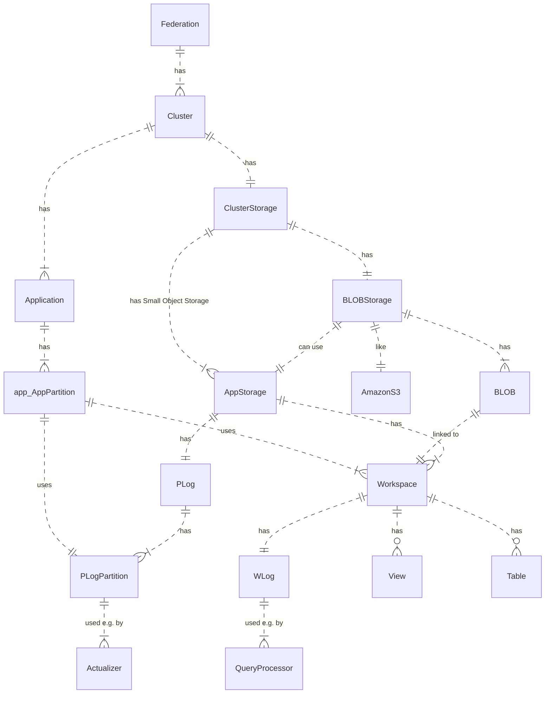
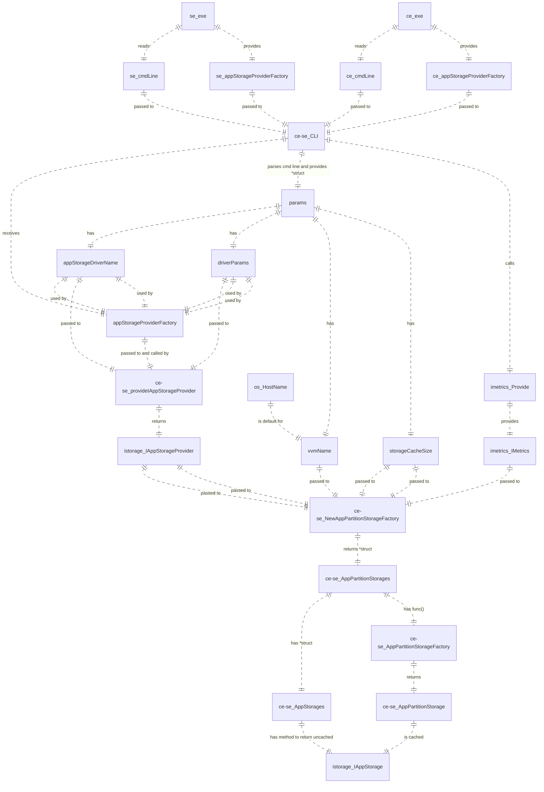
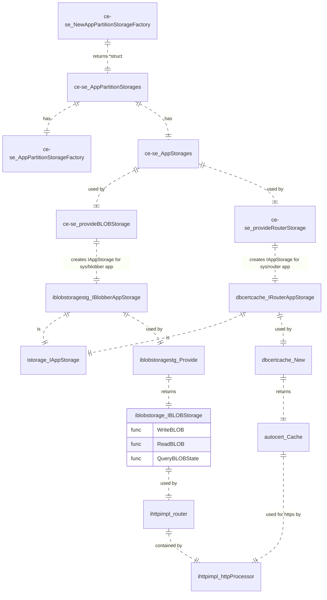
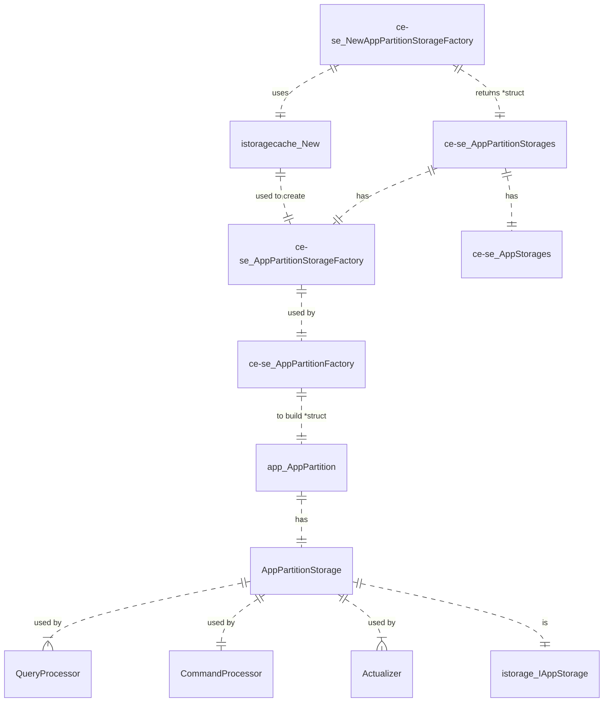

### Story
As a Heeus Architect I want to have a description where and how the data is stored in the Federation

### Solution Principles
- current solution is actual for Heeus CE and SE only
- Storage could be:
  - `AppPartitionStorage`
    - cached
    - created\released per each app partition deploy\undeploy
    - used by processors, actualizers
  - `AppStorages`
    - uncached
    - created\released per app deploy\undeploy
    - used by router to manage BLOBs and certificates
- storage driver name and its params are configured via cmd line
- cache principles
  - select by an exact id -> cached always
  - `IAppStorage.Get()` and `.GetBatch()` cached, `.Read()` - not

### Concepts

### Components
#### Heeus CE and SE executables

#### ce-se package
##### AppStorages

##### AppPartitionStorage

