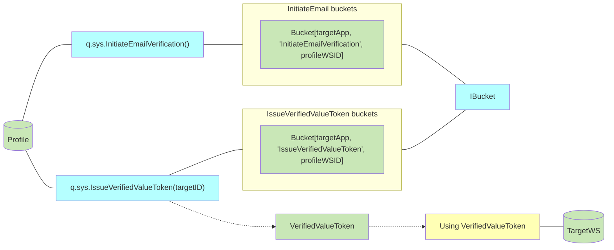
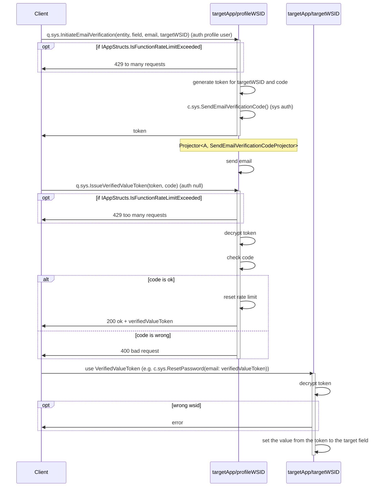
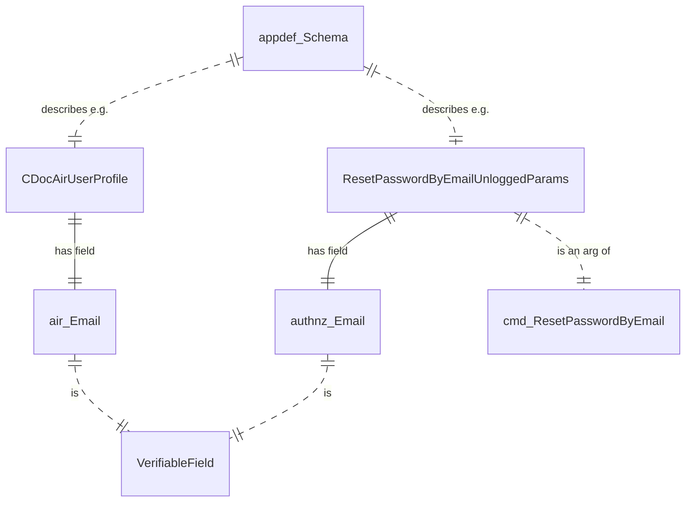
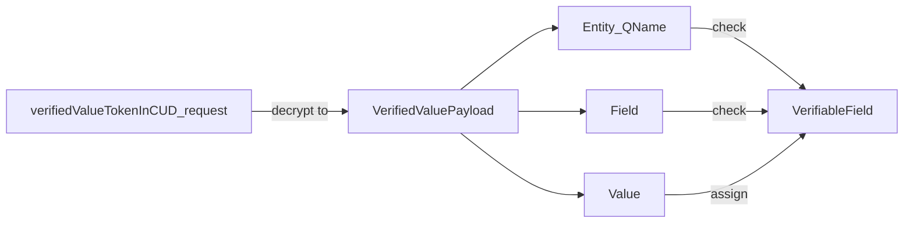
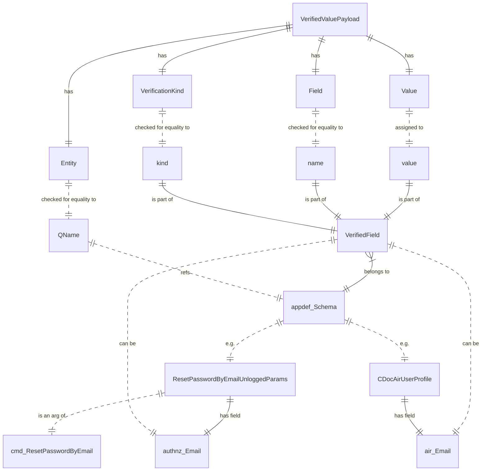

## Story
- As a Heeus app developer I want to declare fields like Email and phone numbers that must be verified
- As a Heeus app developer I want to verification be limited by tries amount or whatever to eliminate security holes

## Solution principles
- verifiable fields are verified by 6-digit code got by crypto-safe randomize algorhythm
- case with a link sent via email instead of code is bad because it could cause e.g. multiple payments after multiple opening the link
- deny Token usage in a wrong WSID
- Rate Limiter API is used to limit rates:
  - `q.sys.InitiateEmailVerification` calls - not often than 100 times per hour per workspace (profile)
  - `q.sys.IssueVerifiedValueToken` calls - not often than 3 times per hour per workspace (profile)
	- code verification passed -> counter is reset to zero
- `q.sys.InitiateEmailVerification` and `q.sys.IssuerVerifiedValueToken` are called at targetApp/profileWSID - to protect against unauthenticated users
  - to e.g. reset password these funcs should be called with sys auth via helper funcs like `q.sys.InitiateResetPasswordByEmail`

## Rates



## Limitations
- it is unclear how to control the rate per ID when a doc is created
- once obtained Verified Value could be used an ulimited number of times during the token validity time (10 minutes).
  - not a problem, ok to reset password for the login many times during 10 minutes

## Functional design
Declare a schema with a verified field:
```go
AppConfigType.AppDef.Add(QName, e.g. appdef.TypeKind_CDoc).
	AddVerifiedField(name, kind, false, e.g. appdef.VerificationKind_EMail)
```

Issue verification token and code:
```go
token, code, err := verifier.NewVerificationToken(entity, field, email, e.g. appdef.VerificationKind_EMail, targetWSID, ITokens, IAppTokens)
```

Issue verified value token:
```go
verifiedValueToken, err := verifier.IssueVerifiedValueToken(token, code)
```

## Technical design


### Verifiable fields in application schema


### Using Verified Value Token to set the value of the Verifiable field



