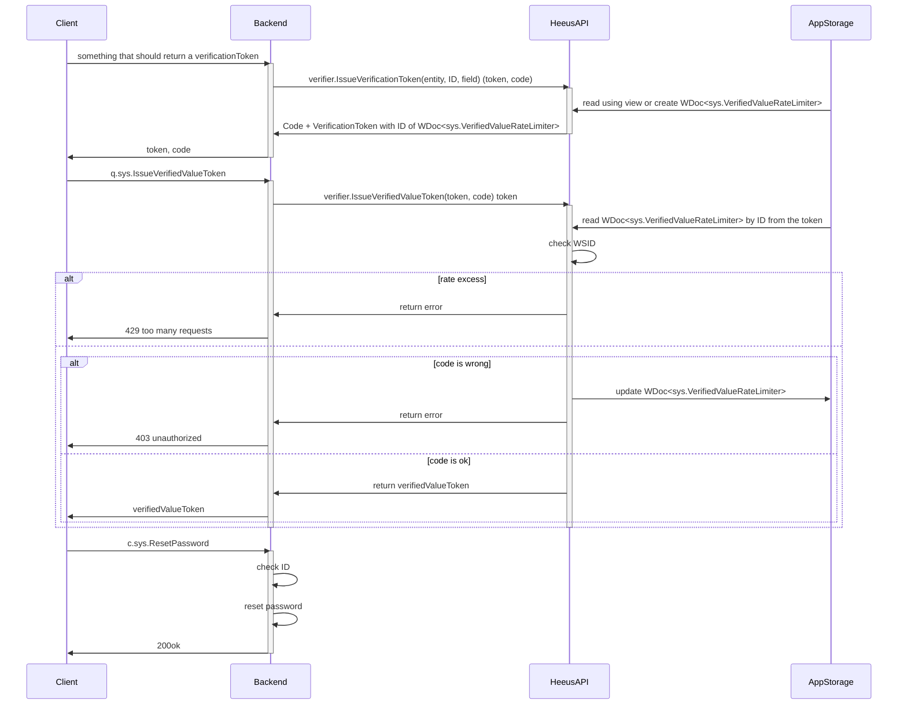

## Story
- As a Heeus app developer I want to declare fields like Email and phone numbers that must be verified
- As a Heeus app developer I want to verification be limited by tries amount or whatever to eliminate security holes

## Solution principles
- verifiable fields are verified by 6-digit code got by crypto-safe randomize algorhythm
- case with a link sent via email instead of code is bad because it could cause e.g. multiple payments after multiple opening the link
- deny Token usage in a wrong WSID
- limit rate of failured `q.sys.IssueVerifiedValueToken` (if a wrong code is provided)
  - match rates by the key (entity, ID, field)
- additional authentication factor is the only way to secure the payment well enough

## Solution
```go
WDoc<sys.VerifiedValueRateLimiter> {
	failuresBatchStartMS int64
	failuresBatchSize int64
}
// нужен для того, чтобы использовать существующий WDoc при создании нового токена с кодом
View<sys.VerifiedValues> {
	PK:    entity, ID, field
	Value: WDoc<sys.VerifiedValueRateLimiter>.ID
}
```

```go
// не подходит, т.к. мы VerifiedValue используем в `c.sys.ResetPassword`, а там нет никакого ID
// подходит, т.к. ResetPassword будет проверять только ID из токена, а частота уже проверена
// ID должны проверяться по месту, т.к. c.sys.ResetPassword - это функция, там нет никакого ID -> на уровне движка ID не проверить
```

<!-- ```mermaid
sequenceDiagram
	participant c as Client
	participant b as Backend
	participant h as HeeusAPI
	participant s as AppStorage
	c->>b: something that should return a verificationToken
	activate b
		b->>h: verifier.IssueVerificationToken(entity, ID, field) (token, code)
		activate h
			s->>h: read or create WDoc<sys.VerifiedValueRateLimiter>
			h->>b: Code + VerifieficationToken with ID of WDoc<sys.VerifiedValueRateLimiter>
		deactivate h
		b->>c: token, code
	deactivate b

	c->>b: c.sys.ResetPassword(login, token, code)
	activate b
		b->>b: check ID
		b->>h: verifier.GetVerifiedValue(token, code)
		activate h
			s->>h: WDoc<sys.VerifiedValueRateLimiter> by ID from the token
			h->>h: check WSID
			alt rate excess
				h->>b: return error
				b->>c: 429 too many requests
			else
				alt code is wrong
					b->>s: update WDoc<sys.VerifiedValueRateLimiter>
					h->>b: return error
					b->>c: 403 unauthorized
				else code is ok
					h->>b: verified value
					b->>b: reset password
				end
			end
		deactivate h
	deactivate b
``` -->




<!-- ```mermaid
sequenceDiagram
	participant c as Client
	participant b as Backend
	participant s as AppStorage
	c->>b: q.sys.IssueVerifiedValueToken
	activate b
		s->>b: read or create WDoc<sys.VerifiedValueRateLimiter> by key (entity, ID, field)
		alt rate excess
			b->>c: 429 too many requests
		else
			alt code is wrong
				b->>s: update WDoc<sys.VerifiedValueRateLimiter>
				b->>c: 403 unauthorized
			else code is ok
				b->>c: verifiedValueToken
			end
		end
	deactivate b
``` -->