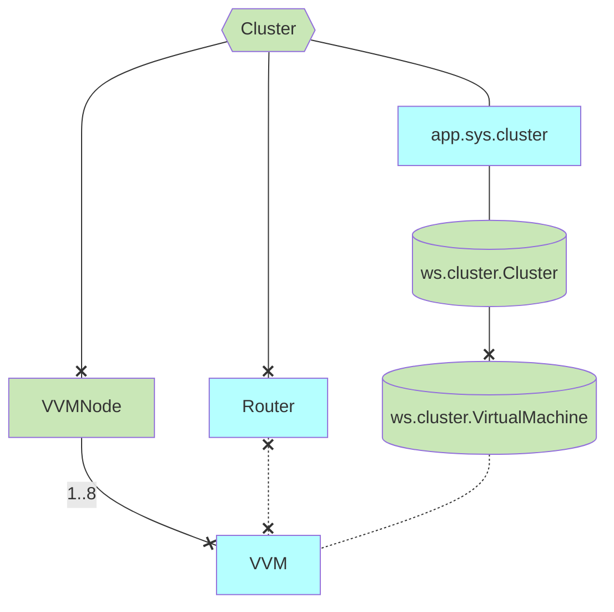
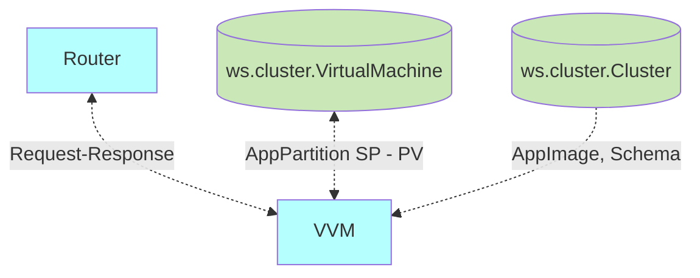
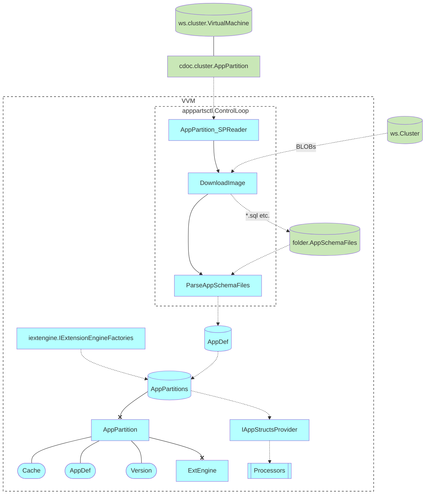

# Voedger Virtual Machine

## Motivation

- [VVM: Draft design](https://dev.heeus.io/launchpad/#!26720)
- [VVM: Design & Plan](https://dev.heeus.io/launchpad/#!26771)

## VVM Relations

## VVM Dataflow

## apppartsctl.ControlLoop

