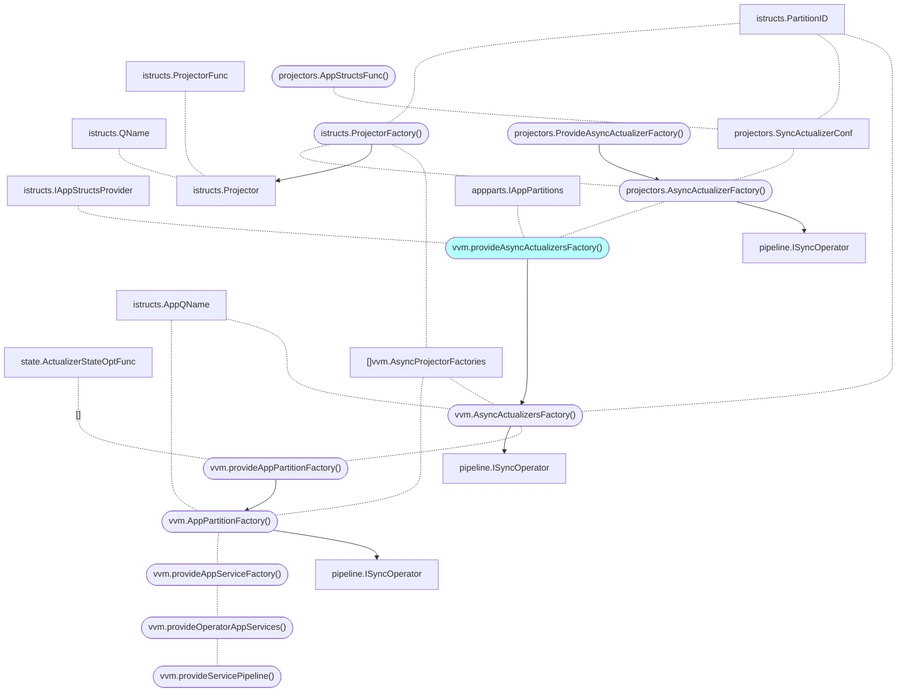

# Design partition + async actualizers 

https://github.com/voedger/voedger/issues/1464

## Current design

- [vvm.provideAsyncActualizersFactory()](https://github.com/voedger/voedger/blob/43469aef2ed4878dfa3cb7dca304c87350547a8d/pkg/vvm/wire_gen.go#L518)
- vvm.provideOperatorAppServices()
  - forks appServices per apps
  - [appsAmount]appServices

## Analysis

- ??? projectors.SyncActualizerConf - ProjectorFactory

## Proposal

